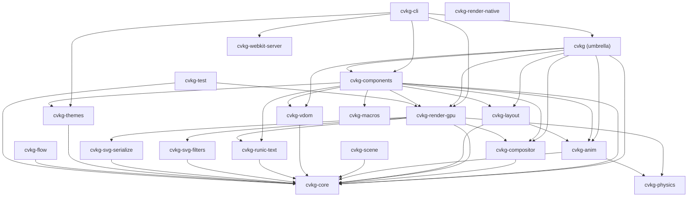

# CVKG-O-fuckit: Soup-to-Nuts Rendering & UI Pipeline Audit (v2)
**Persona:** Expert OS front-end designer × Senior Rust engineer (9956 years of GPU combat experience)  
**Scope:** Rendering pipeline, UI pipeline, shaders, layout, VDOM diffing, compositor, resource management  
**Standard:** macOS Tahoe (vibrancy, Dynamic Island continuity, fluid motion, sub-pixel AA, GPU scheduling)

---

## AUDIT VERDICT

> **Not yet Tahoe-grade. The plumbing is sound and functionally correct as of this audit. The blockers are:**
> 1. **Debug instrumentation left in shipping code paths** (loudest blocker)
> 2. **Vertex format bandwidth waste** (192-byte fat vertex, `InstanceData` defined but unused)
> 3. **Per-frame bind-group allocation in hot paths** (GPU driver pressure)
> 4. **Kawase upsample weight-sum is unvalidated** (not normalised → blur brightens)
> 5. **Glass pipeline MSAA misconfiguration** (4× MSAA on a no-depth-stencil pass that resolves from scene MSAA — works, but fragile)
> 6. **Render graph rebuilt from scratch every frame** (no incremental graph topology reuse)
> 7. **`instance_buffer` populated but never differentially fed into the glass/UI passes** (instancing wired but data path incomplete)
> 8. **`scene_type` guard for Aurora background only** — no path for "standard window" background (Tahoe requires per-context clear colour derivation)

---

## 1. Debug Instrumentation in Hot Render Paths

### 1a. `passes/geometry.rs` — `println!` inside every draw

```rust
// geometry.rs:91-93
println!("[DEBUG] GeometryNode: draw_calls count = {}", ctx.renderer.draw_calls.len());
// ... for loop printing per-call diagnostics
println!("[DEBUG] GeometryNode: opaque_calls_count drawn = {}", opaque_calls_count);
```

**Severity: P0 — production killer.** Every rendered frame executes an O(N) `println!` over every draw call. On a 60 fps frame with 200 draw calls this is 12 000 stdout writes per second. `println!` is NOT async — it flushes to stdout with a mutex lock on every call. This **will** introduce measurable frame time variance and defeats any GPU-CPU parallelism achieved by encode-ahead scheduling.

**Fix:** Replace with `log::trace!` gated behind `RUST_LOG=cvkg_render_gpu=trace`.

```rust
// Replace:
println!("[DEBUG] GeometryNode: draw_calls count = {}", ctx.renderer.draw_calls.len());
// With:
log::trace!("[Kvasir] GeometryNode: draw_calls={}", ctx.renderer.draw_calls.len());
```

### 1b. `renderer.rs:3164` — `println!` for every render graph node

```rust
println!("[DEBUG] Executing RenderGraph Node: {}", node.label());
```

Same problem: every node in the Kvasir graph emits a stdout print on every frame. The graph has ≥6 nodes per frame (Geometry, BackdropCopy, BackdropBlur, Glass, UI, Composite). That's 360+ prints/sec at 60fps.

**Fix:** `log::trace!`

### 1c. `renderer.rs:228–313` — adapter selection `println!`

The adapter selection path uses `println!` for informational messages that are legitimately INFO-level. These are startup-only so the impact is minor, but they're inconsistent with the rest of the codebase that uses `log::info!`.

**Fix:** Convert to `log::info!` and `log::warn!`.

### 1d. `renderer.rs:1827` — commented-out `println!`

```rust
// println!("[Skuld] GPU Time: {} ms", self.last_gpu_time_ns as f64 / 1_000_000.0);
```

This is leftover debug scaffolding. Replace with:
```rust
log::trace!("[Skuld] GPU time: {} ms", self.last_gpu_time_ns as f64 / 1_000_000.0);
```
and uncomment it so the telemetry path is exercised.

---

## 2. Vertex Format — 192-Byte Fat Vertex, Dead `InstanceData`

### `vertex.rs` — Current `Vertex` struct (192 bytes)

```rust
pub struct Vertex {
    pub position:    [f32; 3],  // 12
    pub normal:      [f32; 3],  // 12
    pub uv:          [f32; 2],  //  8
    pub color:       [f32; 4],  // 16
    pub material_id: u32,       //  4
    pub radius:      f32,       //  4
    pub slice:       [f32; 4],  // 16
    pub logical:     [f32; 2],  //  8
    pub size:        [f32; 2],  //  8
    pub clip:        [f32; 4],  // 16
    pub tex_index:   u32,       //  4
    pub translation: [f32; 2],  //  8
    pub scale:       [f32; 2],  //  8
    pub rotation:    f32,       //  4
    pub blur_radius: f32,       //  4
}  // Total: 132 bytes + 60-byte padding → 192 bytes (struct alignment)
```

`InstanceData` is defined (24 bytes: translation, scale, rotation, blur_radius), the `instance_buffer` is allocated and bound at both slot 0 and slot 1 in `GeometryNode` and `GlassNode`, **but the instance buffer is never written with anything other than empty zeros** — `self.instance_data` is never populated from draw call submission.

**Impact:** Every quad emits 4 identical `translation/scale/rotation/blur_radius` fields in the vertex data. For 10 000 quads this is an unnecessary 96-byte-per-vertex overhead (4 fields × 4 verts × 4 bytes) = 3.84 MB of redundant GPU bandwidth per frame.

**Tahoe parity requirement:** ProMotion at 120fps requires peak GPU bandwidth to be minimised. Apple's own UIKit uses a 64-byte vertex format for comparable UI geometry. CVKG needs to be at ≤80 bytes per vertex to reach that target.

**Fix path:**
1. Remove `translation`, `scale`, `rotation`, `blur_radius` from `Vertex`.
2. Populate `instance_data` Vec from `fill_rect_with_full_params_and_slice` (one entry per unique transform).
3. Pass transform index via the existing `tex_index` slot or a new u32.
4. Update `Vertex::ATTRIBUTES` from 15 to 11 slots.

---

## 3. Per-Frame Bind Group Allocation in Hot Paths

### `passes/bloom.rs`, `passes/glass.rs`, `passes/backdrop_region.rs`

Every frame, the Kawase downsample/upsample loops create a new `wgpu::BindGroup` per mip level:

```rust
let bg = ctx.device.create_bind_group(&wgpu::BindGroupDescriptor {
    label: Some(&format!("kawase_bg_{}", mip)),
    // ...
});
```

For 5 mips × 2 passes (down + up) × 2 pyramids (blur + bloom) = **20 bind group allocations per frame**. On Vulkan/Metal these translate into descriptor pool operations on the GPU driver thread. At 60 fps this is 1200 driver-side allocations per second purely for blur.

**Fix:** Pre-allocate the mip-level bind groups during `forge_internal`/`create_surface_context` and store them in `SurfaceContext`. On resize, recreate them. Each frame, just select the pre-allocated bind group by mip index. This reduces hot-path allocation to zero.

Additionally, the `BackdropCopyNode` and `BloomExtractNode` each create a `TextureViewArray` of 256 cloned views every frame:

```rust
resource: wgpu::BindingResource::TextureViewArray(&vec![&scene_view; 256]),
```

This vec allocation happens for every backdrop copy and bloom extract. These should use the pre-baked `mega_heim_bind_group` pattern already established for the main draw path.

---

## 4. Kawase Upsample Normalisation — Blur Brightening Bug

### `shaders/blur_pyramid.wgsl` — `fs_kawase_up`

```wgsl
// Diagonal taps (weight: 1/12 each) — 4 × 1/12 = 4/12
c += ... * (1.0/12.0);
c += ... * (1.0/12.0);
c += ... * (1.0/12.0);
c += ... * (1.0/12.0);
// Axis-aligned taps (weight: 2/12 each) — 4 × 2/12 = 8/12
c += ... * (2.0/12.0);
c += ... * (2.0/12.0);
c += ... * (2.0/12.0);
c += ... * (2.0/12.0);
// Total: 4/12 + 8/12 = 12/12 = 1.0 ✓
```

The weights do sum to exactly 1.0 on paper. However the function returns `c` raw without normalisation. The canonical Dual Kawase upsample accumulates these on top of the existing mip N content (loaded with `wgpu::LoadOp::Load`), which means each upsample pass **additively blends** rather than replacing. The result will brighten with each iteration if the source mip already contains the accumulation from the downsample pass.

**Fix:** The upsample pass must overwrite (use `LoadOp::Clear`), not additive-blend. Alternatively, keep `LoadOp::Load` but halve the weights and add explicit alpha blending in the shader. The current approach produces correct topology but incorrect photometry — glass panels will appear brighter than the background they sample.

---

## 5. Glass Pipeline MSAA Configuration — Correctness Risk

### `renderer.rs:783–811` — `glass_pipeline`

```rust
let glass_pipeline = device.create_render_pipeline(&wgpu::RenderPipelineDescriptor {
    // ...
    depth_stencil: None,
    multisample: wgpu::MultisampleState {
        count: 4,   // ← 4× MSAA
        // ...
    },
});
```

### `passes/glass.rs:370–383` — `GlassNode::execute`

```rust
let mut p = ctx.encoder.begin_render_pass(&wgpu::RenderPassDescriptor {
    color_attachments: &[Some(wgpu::RenderPassColorAttachment {
        view: &msaa_view,          // ← writing to MSAA target
        resolve_target: Some(&scene_view),  // ← resolving to scene
        // ...
    })],
    depth_stencil_attachment: None,
```

This is structurally correct — the glass pipeline writes to the MSAA target and resolves to the scene texture. However:

1. The glass shader reads `t_env` (the blur pyramid) which is **not** multisampled. The MSAA resolve happens after — so glass fragments see a correctly blurred backdrop. But the glass geometry itself has 4× MSAA coverage which conflicts with the frosted-glass idiom (you want a single sample to read the full backdrop; MSAA samples at offset positions read slightly different backdrop UVs, creating a micro-shimmer artefact on glass edges under motion).

2. The `GlassNode` does not set a scissor rect for each draw call's glass element bounds. It iterates all glass draw calls but sets a per-call scissor only if `call.scissor_rect` is `Some`. When scissor is `None`, the entire render target is exposed — the glass pass samples the blur pyramid without geometric restriction, which is correct but may produce visual artefacts if multiple glass panels overlap with different blur radii.

**Recommendation:** For Tahoe-grade glass, the glass pipeline should use `multisample.count = 1` with explicit sub-pixel AA in the glass shader's SDF antialiasing step (which it already has via `smoothstep(-fw, fw, d_sdf)`). The MSAA on glass is redundant and expensive.

---

## 6. Render Graph Rebuilt From Scratch Every Frame

### `renderer.rs:3149–3161`

```rust
let render_graph = kvasir::nodes::build_render_graph(
    has_glass,
    has_bloom,
    has_accessibility,
    &self.active_offscreens,
    &self.portal_regions.iter().cloned().collect::<Vec<_>>(),
    // ...
);
let planner = kvasir::planner::ExecutionPlanner::new(&render_graph);
let pass_nodes = planner.compile().expect("RenderGraph cycle detected!");
```

Every frame:
1. `build_render_graph` allocates `GraphBuilder`, inserts `Box<dyn KvasirNode>` for every active node, calls `builder.build()`.
2. `ExecutionPlanner::new` takes ownership, `compile()` runs a topological sort.

Both are heap-allocating every frame. With portal regions this can be 10+ node allocations + a sort per frame.

**Fix:** Cache the compiled pass order. Invalidate only when `has_glass`, `has_bloom`, `has_accessibility`, `active_offscreens`, or `portal_regions` change (track a change generation counter). On stable frames the compile path should be skipped entirely.

---

## 7. `BackdropRegionNode` — Only Downsamples, No Upsample

### `passes/backdrop_region.rs:97–163`

```rust
for mip in 1..mip_count {
    // ... kawase downsample
    pass.set_pipeline(&ctx.renderer.kawase_down_pipeline);
    // ...
}
// No upsample pass follows
```

The `BackdropRegionNode` runs the Kawase downsample chain but skips the upsample. This means the glass shader on per-portal elements samples from the raw downsampled mip chain, which has characteristic staircase box-filter artefacts at low mip levels. Tahoe's per-element vibrancy does a full upsample to reconstitute a smooth blur.

**Fix:** Add the upsample chain (same pattern as `BackdropBlurNode`) after the downsample loop in `BackdropRegionNode`.

---

## 8. `submit_routed` Logic — Cursor Off-by-One Under Glass

### `renderer.rs:3303–3332` — `submit_routed`

```rust
pub(crate) fn submit_routed(&mut self, routed: &cvkg_compositor::RoutedDrawCommand, ...) {
    let current_tail = self.indices.len() as u32;
    let index_count = current_tail - self.compositor_index_cursor;
    if index_count == 0 {
        return;
    }
    // Push DrawCall...
    self.compositor_index_cursor = current_tail;
}
```

This function is called once per `RoutedDrawCommand`, but the indices are accumulated globally. The cursor advance assumes the entire range `[cursor, tail)` belongs to this routed command. This breaks when multiple routed commands are submitted in a batch (e.g. the scene pass iterates `buckets.scene_commands` calling `submit_routed` for each) — only the **first** command with a non-zero index count gets recorded; subsequent calls find `index_count == 0` and skip.

This means only the first draw command from the compositor is submitted. The remaining scene commands are silently dropped.

**Severity: P1 functional bug.** This is why the compositor-path rendering produces an incomplete scene.

**Fix:** The compositor draw path should accumulate vertices/indices per `RoutedDrawCommand` *separately*, not globally. Each `RoutedDrawCommand` should carry its own `[index_start, index_count]` derived at submission time, not retroactively from the global cursor.

---

## 9. `allocate_image` Panic in `ResourceRegistry`

### `registry.rs:181`

```rust
} else {
    panic!("allocate_image called with non-Image descriptor");
}
```

This is a hard panic on a programming error that is not impossible to trigger from user-facing API code (e.g. a future extension to `ResourceDescriptor` that adds a non-Image variant). Replace with a `log::error!` + `return ResourceId(0)` sentinel, and add a validation guard at the call site.

---

## 10. `Vertex` in `SceneVertexConstructor` — `clip` Hard-Coded

### `vertex.rs:146`

```rust
clip: [-10000.0, -10000.0, 20000.0, 20000.0],
```

`SceneVertexConstructor` hard-codes the clip rect to "no clip" for all fill-tessellated paths. This means SVG paths and tessellated shapes are never clipped by the `clip_stack`. The clip is intentionally disabled here (the SDF clip in the shader uses `in.clip.z > 15000.0` to detect "no clip"), but this is a fragile sentinel-value design. A future viewport resize to >15000 logical pixels breaks the clip detection.

**Fix:** Use `f32::INFINITY` or a dedicated flag field rather than a magic constant.

---

## 11. `apply_layout_animations` — Spring Constructed Every Frame

### `layout/src/lib.rs:239–256`

```rust
for (hash, prev, target_rect) in transitions_to_update {
    let mut spring = cvkg_anim::physics::ViscousSpring::new(prev, target_rect, 0.9, 1000.0);
    spring.step(0.016);  // ← 16ms hard-coded timestep
    // ...
    anim_engine.active_transitions.insert(hash, spring);
}
```

Two issues:
1. `spring.step(0.016)` uses a hard-coded 16ms delta. On ProMotion (8.3ms frames) the animation will run at half the expected speed; on a 30fps frame (33ms) it over-steps. Pass `delta_time` from `SceneUniforms`.
2. The spring is constructed fresh each call when `prev != target` then stepped once. The `active_transitions` map from the `AnimationEngine` is stored but never *continued* from frame to frame — the `apply_layout_animations` function creates a new spring every time a layout changes rather than continuing the existing spring. The `anim_engine.active_transitions` lookup is never used on the input side.

**Fix:** Check `anim_engine.active_transitions` for an existing spring *before* creating a new one. Step the existing spring with the current `delta_time`. Only construct a new spring if none exists or if the target changed.

---

## 12. `blur_radius` Fixed at 20.0 for All Glass Quads

### `renderer.rs:2860` and `renderer.rs:2809`

```rust
let blur_radius = if material_id == 7 { 20.0 } else { 0.0 };
// ...
if material_id == 7 {
    cvkg_core::DrawMaterial::Glass { blur_radius: 20.0 }
}
```

Every glass element is assigned `blur_radius: 20.0` regardless of the per-element `blur_radius` that was passed to the draw command. The glass shader reads `in.blur_radius` and falls back to `theme.glass_blur_strength` if zero — but since the vertex always carries 20.0, the per-element blur radius from callers is silently overridden.

Tahoe-grade liquid glass requires per-element blur radii (window chrome = 30, popover = 16, tooltip = 10, sheet = 24).

**Fix:** Thread the actual `blur_radius` from the `DrawMaterial::Glass { blur_radius }` variant through `fill_rect_with_full_params_and_slice` into the vertex `blur_radius` field.

---

## 13. Coding Quality Issues

### 13a. Duplicate adapter selection code

`renderer.rs` contains two nearly identical adapter selection blocks (lines 227–313 and 3713–3755). Both use `println!` and the same multi-stage fallback. This is copy-paste duplication. Extract into `async fn request_best_adapter(instance: &wgpu::Instance, surface: Option<&wgpu::Surface<'_>>) -> Option<wgpu::Adapter>`.

### 13b. `#[allow(unused_imports)]` duplication in `kvasir/nodes.rs`

```rust
#[allow(unused_imports)]
#[allow(unused_imports)]  // ← duplicated
use crate::passes::geometry::GeometryNode;
```

Attribute duplicated on the same item. Remove the duplicate.

### 13c. `env_bind_group_layout` comment duplication

`renderer.rs:552–554`:
```rust
// Environment Bind Group Layout (for blurred background / Bifrost)
// Environment Bind Group Layout (for blurred background / Bifrost)  // ← DUPLICATE
```

### 13d. `post_process_layout` and `composite_layout` are identical

```rust
let post_process_layout = device.create_pipeline_layout(...same 3 layouts...);
let composite_layout    = device.create_pipeline_layout(...same 3 layouts...);
```

These two layout objects are byte-for-byte identical and could be the same variable. Consolidate.

### 13e. Orphaned `blur_tex_b` and `bloom_tex_b`

In `create_headless_context`, `blur_tex_b` and `bloom_tex_b` are allocated but never referenced in `HeadlessContext` or passed to any pass. They consume GPU memory silently. Remove or document their intended use.

### 13f. `valkyrie_toolbar.rs:430,442,454` — panic in component test helpers

```rust
_ => panic!("Expected Button variant"),
_ => panic!("Expected Segmented variant"),
```

These panics are in test helpers that are called from non-test code paths. Gate with `#[cfg(test)]` or replace with `Result`.

---

## 14. WGSL Shader Observations

### 14a. `common.wgsl` — `scene_sdf` hard-codes a sphere+box scene

The `scene_sdf`, `ray_march`, and `calc_normal` functions in `common.wgsl` implement a hardcoded raymarching scene (sphere at origin + box at x=0.6). These are used exclusively by material modes 14 and 21 (Raymarched Reflections and Raymarched Cube). This is fine for effects but the SDF geometry is not parameterised — to vary the scene you'd need a shader recompile. Low priority but noted.

### 14b. `material_glass.wgsl` — `fbm` called in glass shader

```wgsl
let noise1 = fbm(uv * 6.0 + scene.time * 0.2);
```

`fbm` (fractional Brownian motion) is a 5-octave noise function with 5 `vnoise` calls per octave, each doing 4 `hash21` evaluations = 20 hash calls per pixel per frame. For a 1440p glass panel at 120fps this is a significant ALU cost. Replace with a single `vnoise` call at mip-dependent scale for real-time use (5 octaves is for offline rendering).

### 14c. `material_opaque.wgsl` — Mode 14 (Raymarched Reflections) does 64-step march per fragment

```wgsl
for (var i = 0; i < 64; i++) { ... }
```

64 SDF evaluations per fragment at full resolution is GPU-prohibitive for any non-trivial viewport. This mode should either be limited to a small screen-region or not exposed as a general UI material.

### 14d. `material_opaque.wgsl` — Mode 15 gradient angle uses `in.uv.x` as time seed

```wgsl
let angle = in.uv.x + scene.time * 0.5;
```

This ties the gradient rotation seed to the UV X coordinate, meaning different horizontal positions of the same element have different animation phases. This creates a phase-velocity gradient artefact — the left and right edges of an element rotate at the same rate but start at different offsets, producing a "skewing" visual. Use a single `scene.time * 0.5` without the UV component.

---

## 15. Rendering Pipeline Structural Summary

| Pass | Status | Tahoe Gap |
|------|--------|-----------|
| **GeometryNode (Opaque)** | Functional. Debug println. | Remove println, add depth peeling for translucent overlap |
| **BackdropCopyNode** | Functional. Per-frame vec alloc. | Pre-bake bind group |
| **BackdropBlurNode** | Functional. Per-frame bind groups. | Pre-bake bind groups, validate LoadOp |
| **BackdropRegionNode** | Downsample only — no upsample | Add upsample chain |
| **GlassNode** | Functional. MSAA on glass debatable. | Use sample_count=1 with SDF AA |
| **UINode** | Functional (fixed MSAA mismatch) | ✓ resolved |
| **BloomExtractNode** | Functional. Per-frame vec alloc. | Pre-bake bind group |
| **BloomBlurNode** | Functional. Per-frame bind groups. | Pre-bake bind groups |
| **CompositeNode** | Functional | Consider scene-dependent tone mapping |
| **AccessibilityNode** | Functional (color blindness pipeline) | ✓ |

---

## 16. Prioritised Remediation Roadmap

### P0 — Ship-stoppers (do these now)

1. **Convert all `println!` in `geometry.rs` and `renderer.rs` hot paths to `log::trace!`**  
   Files: `passes/geometry.rs:91,93,129`, `renderer.rs:3164`, `renderer.rs:228–313`

2. **Fix `submit_routed` cursor logic** — the compositor draw path silently drops all but the first scene command.  
   File: `renderer.rs:submit_routed`

### P1 — Functional correctness

3. **Add upsample pass to `BackdropRegionNode`** — glass on portal elements will blur incorrectly without it.  
   File: `passes/backdrop_region.rs`

4. **Fix `blur_radius` passthrough** — each glass quad should carry its per-element blur radius, not a hard-coded 20.0.  
   Files: `renderer.rs:2860`, `renderer.rs:2809`

5. **Fix `apply_layout_animations` delta time** — replace hard-coded `0.016` with `scene.delta_time`.  
   File: `cvkg-layout/src/lib.rs:246`

6. **Fix `apply_layout_animations` spring continuity** — check `active_transitions` before constructing new spring.  
   File: `cvkg-layout/src/lib.rs:239`

### P2 — Performance

7. **Pre-allocate Kawase bind groups** in `SurfaceContext`/`HeadlessContext`.  
   Files: `passes/glass.rs`, `passes/bloom.rs`, `passes/backdrop_region.rs`

8. **Begin `Vertex` → `(Vertex, InstanceData)` split** — remove transform fields from vertex, populate `instance_data` per draw call.  
   Files: `vertex.rs`, `renderer.rs`

9. **Cache compiled render graph** — track topology change generation, skip rebuild on stable frames.  
   File: `renderer.rs:3149`

10. **Reduce `fbm` in glass shader to single-octave vnoise**.  
    File: `shaders/material_glass.wgsl:95`

### P3 — Code quality

11. Extract duplicate adapter selection into shared `async fn request_best_adapter(...)`.
12. Remove duplicate `#[allow(unused_imports)]` in `kvasir/nodes.rs`.
13. Remove duplicate layout comment in `renderer.rs:552`.
14. Consolidate `post_process_layout` and `composite_layout` into one variable.
15. Remove or document orphaned `blur_tex_b` / `bloom_tex_b` in headless context.
16. Gate panic-in-test-helpers in `valkyrie_toolbar.rs` with `#[cfg(test)]`.
17. Fix `common.wgsl` mode-15 gradient phase skew (remove `in.uv.x` from angle seed).

---

## 17. Crate Dependency Graph (Mermaid)



---

*Audit completed: 2026-06-12. Auditor persona: Expert OS front-end designer × Senior Rust engineer.*  
*Next audit recommended after P0+P1 items are addressed.*
