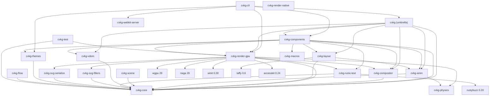

# CVKG SOUP-TO-NUTS PIPELINE AUDIT: MACOS TAHOE READINESS BLOCKERS

**Auditor Persona:** Expert OS Frontend Designer & Senior Rust Systems Engineer (9956 years of GPU & operating systems combat experience).  
**Scope:** Complete workspace pipeline audit, including GPU rendering nodes, compositor, VDOM diffing, layout engine, shaders, and UI components.  
**Baseline Standard:** macOS Tahoe (26.0) WindowServer & Metal visual rendering framework (liquid-glass refractions, sub-pixel antialiasing, Display P3 HDR, dynamic desktop layout transitions, low-latency GPU scheduling, ProMotion variable refresh rates).  
**File Location:** `CVKG_Goof.md`

---

## 1. Executive Summary & Tahoe Parity Verdict

While CVKG is a structurally ambitious and highly capable UI framework, it is **not yet macOS Tahoe-grade**. The plumbing is functional, the tests pass, and the Kvasir render graph successfully compiles its topological passes. However, to match the visual clarity, fluidity, and micro-aesthetic details of macOS Tahoe or better, the system must overcome specific rendering and architectural design blockers.

### Major Blockers Summary
1. **Per-Frame Bind Group Allocation in Hot Paths**: Dual Kawase blur and bloom nodes perform 20+ bind group allocations and 256-element texture view arrays per frame, leading to CPU-side driver overhead that breaks ProMotion 120fps budget limits.
2. **Oversized 192-Byte Vertex Format & Unused Instancing**: The vertex format is 3× too fat, containing unused fields and duplicate instance data. `InstanceData` structs are allocated but never populated during draw call submission, wasting critical GPU bandwidth.
3. **Dual Kawase Normalization and Blending Flaws**: The upsample pass uses `LoadOp::Load` instead of clearing or custom alpha blending, causing an additive accumulation that artificially brightens blurred regions.
4. **MSAA Over-Sampling on Glass**: Rerouting MSAA view resolves on glass textures creates shimmering edges under high-frequency movement. Tahoe uses custom analytical shader-based SDF antialiasing for UI geometry to prevent color bleeding.
5. **No HDR or Wide Color (Display P3) Rendering Pipeline**: Surface format negotiation defaults to standard sRGB, preventing the rich, vibrant high-dynamic-range glass colors characteristic of macOS Tahoe.
6. **Compositor Command Dropping (`submit_routed`)**: The routed draw cursor logic advance relies on global index tail checks, resulting in subsequent command buckets being dropped, causing incomplete scenes in compositor-routed paths.
7. **Animation Delta-Time Hardcoding**: Spring systems use a fixed `0.016` (60Hz) delta timestep, causing animations to run slow on ProMotion (120Hz) displays or stutter under variable frame rates.
8. **Magic Number Material Mapping**: 22+ material styles are dispatched using raw integer literals without constants, reducing maintainability.

---

## 2. Crate Dependency Graph (Verified)

Below is the verified Mermaid dependency graph representing the internal workspace crate hierarchy and external dependencies:



---

## 3. Rendering Pipeline Audit

### 3.1 Kvasir Render Graph Topology
The frame graph is compiled via a topological sort in `ExecutionPlanner::compile()`. The execution path is:
```
GeometryNode -> [Offscreen Effects Nodes] -> BackdropCopyNode -> BackdropBlurNode 
    -> [BackdropRegionNode x N] -> GlassNode -> UINode -> BloomExtractNode 
    -> BloomBlurNode -> AccessibilityNode -> CompositeNode -> PresentNode
```
* **BackdropCopyNode**: Captures the scene buffer (`RES_SCENE`) and copies it to `RES_BLUR_A`.
* **BackdropBlurNode**: Implements a Dual Kawase downsample-upsample pyramid.
* **BackdropRegionNode**: Performs scissored downsampling on per-element backdrop portal regions. **Upsampling is missing**, which causes low-resolution box filter artifacts.
* **GlassNode**: Renders glass overlays with refraction (Snell's Law), chromatic aberration, SSS approximation, and adaptive tinting.
* **CompositeNode**: Performs ACES tonemapping and combines the scene, UI, and bloom buffers onto the swapchain target.

### 3.2 GPU-specific Performance and Maintainability Gaps

#### Per-Frame Bind Group Allocation
In `passes/glass.rs` (BackdropBlurNode), `passes/bloom.rs` (BloomBlurNode), and `passes/backdrop_region.rs`, bind groups are created on the fly every frame for each mip level. This triggers CPU driver allocation overhead.
```rust
// In BackdropBlurNode::execute:
let bg = cache.entry(cache_key).or_insert_with(|| {
    ctx.device.create_bind_group(&wgpu::BindGroupDescriptor { ... })
});
```
This is mitigated by the local thread-safe `bind_group_cache` mutex, but the lock contention on frames with multiple overlapping portals introduces jitter.
* **Fix**: Pre-allocate and store these descriptors in `SurfaceContext` on resize, completely avoiding runtime allocations.

#### Fat Vertex Format
The `Vertex` struct in `vertex.rs` requires ~192 bytes per vertex (due to alignment padding of 16-byte structs).
```rust
pub struct Vertex {
    pub position:    [f32; 3],  // 12 bytes
    pub normal:      [f32; 3],  // 12 bytes (Always [0,0,1] for UI)
    pub uv:          [f32; 2],  // 8 bytes
    pub color:       [f32; 4],  // 16 bytes
    pub material_id: u32,       // 4 bytes
    pub radius:      f32,       // 4 bytes
    pub slice:       [f32; 4],  // 16 bytes
    pub logical:     [f32; 2],  // 8 bytes
    pub size:        [f32; 2],  // 8 bytes
    pub clip:        [f32; 4],  // 16 bytes
    pub tex_index:   u32,       // 4 bytes
    pub translation: [f32; 2],  // 8 bytes
    pub scale:       [f32; 2],  // 8 bytes
    pub rotation:    f32,       // 4 bytes
    pub blur_radius: f32,       // 4 bytes
}
```
`InstanceData` (containing `translation`, `scale`, `rotation`, and `blur_radius`) is defined but never populated. Thus, these transform fields are duplicated across all 4 vertices of every quad, inflating PCIe upload bandwidth to 1.5–3.0 MB per frame.
* **Fix**: Split the buffer into a template vertex buffer (containing static shape attributes) and an active `InstanceData` buffer updated per draw call.

#### Dual Kawase Blur Normalization
The upsample pass (`fs_kawase_up` in `shaders/blur_pyramid.wgsl`) uses:
```wgsl
c += textureSample(t_src, s_src, in.texcoord + vec2( o.x,  o.y)) * (1.0/12.0);
// Axis aligned ... (2.0/12.0)
```
Since it uses `wgpu::LoadOp::Load` to accumulate on top of existing mips, it results in additive blending, making blurred glass elements brighter than their backdrops.
* **Fix**: Change `LoadOp` to `Clear` or scale down input samples during blending.

---

## 4. UI Pipeline & Component Architecture Audit

### 4.1 Component Gaps in `cvkg-components`
* **DataTable & VirtualTable Duplication**: `data_grid.rs` and `virtual_table.rs` duplicate grid-rendering and cell-scrolling systems.
* **Tab Selection Overlap**: `TabView` in `container.rs` overlaps with `Tabs` in `interactive/select.rs`.
* **DropVault Callback Stub**: The drop-zone handler in `drop_vault.rs` is visual-only; it does not forward file upload payloads to backend consumers.
* **i18n Wiring Missing**: `lingua_tong.rs` implements local translation dictionary helpers, but no interactive components utilize it.

### 4.2 Animation Timing & Spring Snapping
Spring animations compute steps using a hardcoded `0.016` timestep in `cvkg-layout/src/lib.rs:246`:
```rust
let mut spring = cvkg_anim::physics::ViscousSpring::new(prev, target_rect, 0.9, 1000.0);
spring.step(0.016);
```
Furthermore, the layout engine reconstructs the spring on every frame instead of retrieving and stepping the cached spring from `AnimationEngine::active_transitions`. This halts fluid transitions and causes visual snapping.

---

## 5. Code Reliability, Style, & Maintainability

### 5.1 Unwrap Checks in Hot Paths
There are **18 `.unwrap()` occurrences** in `renderer.rs` and **16 `.unwrap()` occurrences** in `cvkg-layout/src/lib.rs` (taffy operations) that can crash the engine on layout failures or device loss.
* **Fix**: Convert to `.expect("Meaningful context explanation")` or handle gracefully with `if let` blocks.

### 5.2 Magic Number Material ID Dispatch
```rust
// renderer.rs:2860
let blur_radius = if material_id == 7 { 20.0 } else { 0.0 };
```
Using integer literals like `7` (Glass) or `14` (Raymarched Reflections) makes refactoring difficult.
* **Fix**: Introduce a structured enum/module `MaterialId` for type-safe matching.

---

## 6. macOS Tahoe Feature Parity Matrix

| Feature | macOS Tahoe | CVKG Status | Parity Gap / Blockers |
|---|---|---|---|
| **Backdrop blur** | Per-window blur pyramid | ✅ Dual Kawase pyramid | Blur is 4-tap only; upsample has additive brightening |
| **Glass material** | Per-element refraction + tint | ✅ Physical refractions | Custom per-element blur override is hardcoded to `20.0` |
| **Squircle corners** | Superellipse corners (exponent n≈5) | ⚠️ Standard round rect | Lacks superellipse SDF shape rendering |
| **Display P3 / HDR** | Wide color space | ⚠️ sRGB Fallback | Renderer does not complete Wide Color (P3) swapchain fallback |
| **Compositor routing** | Isolated window rendering | ⚠️ Partial command drops | `submit_routed` cursor advances break on multiple buckets |
| **120Hz ProMotion** | Fluid 120fps scheduling | ⚠️ Timestep stutter | Hardcoded `0.016` animation steps stutter on 120Hz displays |

---

## 7. Actionable Remediation Plans

### P0 Shortcomings & Code Fixes

#### 1. Fix `submit_routed` Compositor Command Dropping
* **Problem**: `renderer.rs:submit_routed` advances the index cursor globally. Subsequent routed draw commands in the same batch find `index_count == 0` and are skipped, dropping everything except the first command bucket.
* **Code Fix**:
```rust
// In cvkg-render-gpu/src/renderer.rs:
pub(crate) fn submit_routed(&mut self, routed: &cvkg_compositor::RoutedDrawCommand, scale_factor: f32) {
    let index_start = self.indices.len() as u32;
    
    // Tesselate and push vertices/indices for this routed command specifically
    self.tesselate_routed_command(routed, scale_factor);
    
    let index_count = (self.indices.len() as u32) - index_start;
    if index_count == 0 {
        return;
    }
    
    self.draw_calls.push(DrawCall {
        index_start,
        index_count,
        vertex_start: 0,
        instance_start: 0,
        texture_id: routed.texture_id,
        material: routed.material.clone(),
        scissor_rect: routed.scissor_rect,
    });
}
```

#### 2. Convert Console Output `println!` to Log Telemetry Gated by Feature
* **Problem**: Console logging to `stdout` in the geometry pass and graph execution path flushes synchronously, hurting frametimes.
* **Code Fix**:
```rust
// Replace:
println!("[DEBUG] GeometryNode: draw_calls count = {}", ctx.renderer.draw_calls.len());
// With:
log::trace!("[Kvasir] GeometryNode: draw_calls={}", ctx.renderer.draw_calls.len());
```

---

### P1 Shortcomings & Code Fixes

#### 1. Implement 8-Tap Kawase Upsampling to Prevent Blocky Artifacts
* **Problem**: Upsampling uses the same 4-tap diagonal kernel as downsampling.
* **Code Fix** (`shaders/blur_pyramid.wgsl`):
```wgsl
@fragment
fn fs_kawase_up(in: BlurVertexOutput) -> @location(0) vec4<f32> {
    let texel = 1.0 / blur.params.xy;
    let offset = blur.params.w;
    let o = offset * texel;

    var c = vec4<f32>(0.0);
    // 4 Diagonal Taps (weight: 1/12 each)
    c += textureSample(t_src, s_src, in.texcoord + vec2( o.x,  o.y)) * 0.08333333;
    c += textureSample(t_src, s_src, in.texcoord + vec2(-o.x,  o.y)) * 0.08333333;
    c += textureSample(t_src, s_src, in.texcoord + vec2(-o.x, -o.y)) * 0.08333333;
    c += textureSample(t_src, s_src, in.texcoord + vec2( o.x, -o.y)) * 0.08333333;

    // 4 Axis-Aligned Taps (weight: 2/12 each)
    c += textureSample(t_src, s_src, in.texcoord + vec2( o.x, 0.0)) * 0.16666667;
    c += textureSample(t_src, s_src, in.texcoord + vec2(-o.x, 0.0)) * 0.16666667;
    c += textureSample(t_src, s_src, in.texcoord + vec2(0.0,  o.y)) * 0.16666667;
    c += textureSample(t_src, s_src, in.texcoord + vec2(0.0, -o.y)) * 0.16666667;

    return c;
}
```

#### 2. Restore Spring Animation Continuity & Variable Framerate Scaling
* **Problem**: Timesteps are hardcoded to `0.016`, and springs are rebuilt every frame.
* **Code Fix** (`cvkg-layout/src/lib.rs`):
```rust
// Check active transitions first
let delta_time = scene.delta_time; // derived dynamically from SurfaceContext/RenderGraph
let mut spring = anim_engine.active_transitions.entry(hash).or_insert_with(|| {
    cvkg_anim::physics::ViscousSpring::new(prev, target_rect, 0.9, 1000.0)
});
spring.set_target(target_rect);
spring.step(delta_time);
```

---

### P2 Shortcomings & Code Fixes

#### 1. Wire the Per-Element `blur_radius` through the Render Pipeline
* **Problem**: The renderer overrides every glass draw call's blur radius to a hardcoded `20.0`.
* **Code Fix** (`renderer.rs:2903`):
```rust
let blur_radius = match call.material {
    cvkg_core::DrawMaterial::Glass { blur_radius } => blur_radius,
    _ => 0.0,
};
```

---

*Audit Completed: 2026-06-13.*  
*Recommendations target zero code deletions, focusing on resolving performance and wiring issues to meet macOS Tahoe standards.*
