# CVKG: Cyber Viking Kvasir Graph

CVKG is a hardware-accelerated user interface framework for Rust. It targets GPU backends (Vulkan, Metal, DirectX 12, WebGPU) through a declarative view system with physics-based animation.

```mermaid
graph TD
    %% ========================
    %% SUBGRAPHS
    %% ========================
    subgraph Core ["Core Foundations"]
        cvkg-core["cvkg-core<br/>(View trait, state, geometry)"]
        cvkg-vdom["cvkg-vdom<br/>(Virtual DOM & diffing)"]
        cvkg-scene["cvkg-scene<br/>(Scene graph, AABB culling)"]
        cvkg-spatial["cvkg-spatial<br/>(QuadTree, BVH, SpatialHash)"]
    end

    subgraph Layout ["Layout & Animation"]
        cvkg-layout["cvkg-layout<br/>(Taffy flexbox/grid)"]
        cvkg-anim["cvkg-anim<br/>(Spring physics, particles)"]
    end

    subgraph Rendering ["GPU Rendering"]
        cvkg-render-gpu["cvkg-render-gpu<br/>(wgpu render graph)"]
        cvkg-compositor["cvkg-compositor<br/>(Layer tree, damage tracking)"]
        cvkg-svg-filters["cvkg-svg-filters<br/>(SVG filter effects)"]
        cvkg-svg-serialize["cvkg-svg-serialize<br/>(SVG serialization)"]
    end

    subgraph Text ["Text"]
        cvkg-runic-text["cvkg-runic-text<br/>(HarfBuzz shaper, BiDi)"]
    end

    subgraph UI ["UI Layer"]
        cvkg-components["cvkg-components<br/>(Widget library)"]
        cvkg-themes["cvkg-themes<br/>(OKLCH color tokens)"]
        cvkg-flow["cvkg-flow<br/>(Node graph editor)"]
    end

    subgraph Platform ["Platform"]
        cvkg-render-native["cvkg-render-native<br/>(winit + AccessKit)"]
        cvkg-render-software["cvkg-render-software<br/>(CPU fallback)"]
    end

    subgraph Services ["Services & Tooling"]
        cvkg-cli["cvkg-cli<br/>(Dev server, asset pipeline)"]
        cvkg-webkit-server["cvkg-webkit-server<br/>(axum HTTP/WS)"]
        cvkg-physics["cvkg-physics<br/>(XPBD rigid body)"]
        cvkg-scheduler["cvkg-scheduler<br/>(Frame update ordering)"]
        cvkg-test["cvkg-test<br/>(Visual regression)"]
        cvkg-macros["cvkg-macros<br/>(hamr! proc macro)"]
    end

    subgraph Meta ["Meta / Infra"]
        cvkg-reflect["cvkg-reflect<br/>(Type metadata)"]
        cvkg-materials["cvkg-materials<br/>(Glass, Mica, Acrylic)"]
        cvkg-accessibility["cvkg-accessibility<br/>(A11y tree)"]
        cvkg-certification["cvkg-certification<br/>(Cross-crate tests)"]
        cvkg-telemetry["cvkg-telemetry<br/>(Metrics)"]
        cvkg-icons["cvkg-icons<br/>(Icon components)"]
    end

    subgraph Demos ["Demos / Apps"]
        cvkg["cvkg<br/>(Umbrella facade)"]
        berserker["berserker<br/>(Native tactical HUD)"]
        adele-web["adele-web<br/>(Web design explorer)"]
        niflheim-wasi["niflheim-wasi<br/>(WASI headless)"]
        berserker-fire-web["berserker-fire-web<br/>(WASM stress test)"]
        cvkg-gallery["cvkg-gallery<br/>(Component gallery)"]
        cvkg-game-hud["cvkg-game-hud<br/>(Game HUD overlay)"]
        cvkg-export-raster["cvkg-export-raster<br/>(PNG/GIF export)"]
    end

    %% ========================
    %% CORE LAYER
    %% ========================
    cvkg-scene --> cvkg-core
    cvkg-scene --> cvkg-vdom
    cvkg-scene --> cvkg-spatial
    cvkg-spatial --> cvkg-core
    cvkg-layout --> cvkg-core
    cvkg-layout --> cvkg-anim
    cvkg-anim --> cvkg-core

    %% ========================
    %% RENDERING LAYER
    %% ========================
    cvkg-render-gpu --> cvkg-core
    cvkg-render-gpu --> cvkg-compositor
    cvkg-render-gpu --> cvkg-svg-filters
    cvkg-render-gpu --> cvkg-svg-serialize
    cvkg-render-gpu --> cvkg-runic-text
    cvkg-render-gpu --> cvkg-vdom
    cvkg-render-gpu --> cvkg-anim
    cvkg-compositor --> cvkg-core

    %% ========================
    %% TEXT
    %% ========================
    cvkg-core --> cvkg-runic-text

    %% ========================
    %% UI LAYER
    %% ========================
    cvkg-components --> cvkg-core
    cvkg-components --> cvkg-vdom
    cvkg-components --> cvkg-layout
    cvkg-components --> cvkg-anim
    cvkg-components --> cvkg-runic-text
    cvkg-components --> cvkg-themes
    cvkg-components --> cvkg-render-gpu
    cvkg-components --> cvkg-render-native
    cvkg-themes --> cvkg-core
    cvkg-themes --> cvkg-anim
    cvkg-flow --> cvkg-core
    cvkg-flow --> cvkg-scene
    cvkg-flow --> cvkg-themes

    %% ========================
    %% PLATFORM
    %% ========================
    cvkg-render-native --> cvkg-core
    cvkg-render-native --> cvkg-render-gpu
    cvkg-render-native --> cvkg-runic-text
    cvkg-render-native --> cvkg-themes
    cvkg-render-native --> cvkg-vdom
    cvkg-render-software --> cvkg-core
    cvkg-render-software --> cvkg-runic-text

    %% ========================
    %% SERVICES
    %% ========================
    cvkg-cli --> cvkg-core
    cvkg-cli --> cvkg-physics
    cvkg-cli --> cvkg-anim
    cvkg-cli --> cvkg-macros
    cvkg-webkit-server --> cvkg-cli
    cvkg-physics --> cvkg-core
    cvkg-physics --> cvkg-scene
    cvkg-scheduler --> cvkg-core
    cvkg-test --> cvkg-core
    cvkg-test --> cvkg-vdom
    cvkg-test --> cvkg-scene
    cvkg-test --> cvkg-render-gpu
    cvkg-test --> cvkg-layout
    cvkg-test --> cvkg-anim
    cvkg-test --> cvkg-components
    cvkg-test --> cvkg-flow
    cvkg-test --> cvkg-macros
    cvkg-test --> cvkg-runic-text
    cvkg-macros --> cvkg-core
    cvkg-macros --> cvkg-components

    %% ========================
    %% META
    %% ========================
    cvkg-accessibility --> cvkg-core
    cvkg-certification --> cvkg-core
    cvkg-certification --> cvkg-runic-text
    cvkg-certification --> cvkg-scene
    cvkg-certification --> cvkg-spatial
    cvkg-certification --> cvkg-svg-serialize
    cvkg-certification --> cvkg-themes
    cvkg-telemetry --> cvkg-core
    cvkg-icons --> cvkg-core
    cvkg-icons --> cvkg-components

    %% ========================
    %% EXPORT
    %% ========================
    cvkg-export-raster --> cvkg-render-gpu

    %% ========================
    %% UMPIRE / DEMOS
    %% ========================
    cvkg --> cvkg-core
    cvkg --> cvkg-scene
    cvkg --> cvkg-layout
    cvkg --> cvkg-themes
    cvkg --> cvkg-anim
    cvkg --> cvkg-macros
    cvkg --> cvkg-components
    cvkg --> cvkg-render-gpu
    cvkg --> cvkg-render-native

    berserker --> cvkg
    berserker --> cvkg-core
    berserker --> cvkg-physics
    berserker --> cvkg-anim
    berserker --> cvkg-components
    berserker --> cvkg-themes
    berserker --> cvkg-vdom

    adele-web --> cvkg-core
    adele-web --> cvkg-render-gpu
    adele-web --> cvkg-components
    adele-web --> cvkg-themes
    adele-web --> cvkg-vdom
    adele-web --> cvkg-layout

    niflheim-wasi --> cvkg-core
    niflheim-wasi --> cvkg-components

    berserker-fire-web --> cvkg-core
    berserker-fire-web --> cvkg-render-gpu

    cvkg-gallery --> cvkg
    cvkg-gallery --> cvkg-components
    cvkg-gallery --> cvkg-core
    cvkg-gallery --> cvkg-render-software
    cvkg-gallery --> cvkg-runic-text

    cvkg-game-hud --> cvkg-anim
    cvkg-game-hud --> cvkg-components
    cvkg-game-hud --> cvkg-core

    %% ========================
    %% STYLING
    %% ========================
    classDef core fill:#1a1a2e,stroke:#1e293b,color:#e2e8f0,stroke-width:1px
    classDef layout fill:#1e1b4b,stroke:#6366f1,color:#a5b4fc,stroke-width:1px
    classDef gpu fill:#0f172a,stroke:#3b82f6,color:#38bdf8,stroke-width:1.5px
    classDef text fill:#1c1917,stroke:#78716c,color:#d6d3d1,stroke-width:1px
    classDef ui fill:#311042,stroke:#d946ef,color:#f472b6,stroke-width:1px
    classDef platform fill:#0c4a6e,stroke:#0ea5e9,color:#7dd3fc,stroke-width:1px
    classDef services fill:#14532d,stroke:#22c55e,color:#86efac,stroke-width:1px
    classDef meta fill:#3f3f46,stroke:#a1a1aa,color:#d4d4d8,stroke-width:1px
    classDef demo fill:#4a1d96,stroke:#a855f7,color:#c084fc,stroke-width:1.5px

    class cvkg-core,cvkg-vdom,cvkg-scene,cvkg-spatial core
    class cvkg-layout,cvkg-anim layout
    class cvkg-render-gpu,cvkg-compositor,cvkg-svg-filters,cvkg-svg-serialize gpu
    class cvkg-runic-text text
    class cvkg-components,cvkg-themes,cvkg-flow ui
    class cvkg-render-native,cvkg-render-software platform
    class cvkg-cli,cvkg-webkit-server,cvkg-physics,cvkg-scheduler,cvkg-test,cvkg-macros services
    class cvkg-reflect,cvkg-materials,cvkg-accessibility,cvkg-certification,cvkg-telemetry,cvkg-icons meta
    class cvkg,berserker,adele-web,niflheim-wasi,berserker-fire-web,cvkg-gallery,cvkg-game-hud,cvkg-export-raster demo
```



## Problem and Audience

CVKG targets developers who need custom-drawn interfaces with GPU performance but do not want to build a rendering engine from scratch. It provides a declarative view system, retained scene graph, flexbox/grid layout, spring-physics animation, and SVG support -- all compiling to native GPU pipelines or WebGPU.

## Prerequisites

- **Rust**: 1.85.0 or later (Edition 2024).
- **GPU**: Vulkan, Metal, or DX12 compatible hardware for native targets.
- **Linux system deps**: `libfontconfig1-dev`, `pkg-config`, `libx11-dev`, `libwayland-dev`.
- **WASM target**: `rustup target add wasm32-unknown-unknown`.

## Quick Start

```bash
git clone https://github.com/sydonayrex/cvkg.git && cd cvkg
rustup target add wasm32-unknown-unknown
cargo build --workspace
cargo test --workspace
cargo run -p berserker
```

## Workspace Crate Map

| Crate | Role |
|---|---|
| cvkg | Umbrella facade selecting native or web backends |
| cvkg-core | View trait, state management, geometry types, renderer interface |
| cvkg-scene | Retained scene graph with AABB culling and dirty-rect tracking |
| cvkg-spatial | Spatial indexing: QuadTree, BVH, SpatialHash |
| cvkg-layout | Taffy-based flexbox and grid layout engine |
| cvkg-anim | Spring-physics solver (RK4), particle systems, morph/growth |
| cvkg-render-gpu | WGPU render graph, multi-pass pipeline, texture management |
| cvkg-compositor | Layer tree orchestration, damage tracking, material routing |
| cvkg-render-native | Desktop windowing via winit, event loop, AccessKit bridge |
| cvkg-render-software | CPU-based rendering fallback |
| cvkg-runic-text | HarfBuzz text shaper, BiDi, word-wrap, font discovery |
| cvkg-svg-filters | GPU SVG filter primitives (blur, color matrix, etc.) |
| cvkg-svg-serialize | SVG serialization via usvg and quick-xml |
| cvkg-components | Widget library: buttons, sliders, toggles, AI workflow panels |
| cvkg-themes | OKLCH color model, semantic design tokens |
| cvkg-flow | Interactive node graph editor with bezier edges |
| cvkg-cli | Dev server, asset pipeline, project scaffolding |
| cvkg-webkit-server | axum HTTP/WebSocket server for hot-reload |
| cvkg-physics | Rigid body simulation, collision detection, constraint solving |
| cvkg-scheduler | Frame update sequencing and timing |
| cvkg-test | Visual regression testing, pixel comparison |
| cvkg-macros | `hamr!` procedural macro for declarative views |
| cvkg-reflect | Runtime type reflection, property inspector |
| cvkg-materials | Material data models: Glass, Mica, Acrylic |
| cvkg-accessibility | Accessibility tree, focus management, screen reader bridge |
| cvkg-certification | Cross-crate integration test suites |
| cvkg-telemetry | Metrics collection |
| cvkg-icons | Icon component library |
| berserker | Native tactical HUD demo application |
| demos/adele-web | Web design system explorer |
| demos/niflheim-web | WASM component suite showcase |
| demos/niflheim-wasi | Headless WASI validation target |
| demos/berserker-fire-web | WASM stress test (procedural fire/lightning) |
| cvkg-gallery | Component gallery browser |
| cvkg-game-hud | Game HUD overlay demo |
| cvkg-export-raster | PNG/GIF raster export from GPU frames |

## Documentation

- [Onboarding](docs/onboarding.md) -- Clone, build, run, make a change.
- [Architecture](docs/architecture.md) -- Crate topology, data flow, design decisions.
- [Troubleshooting](docs/troubleshooting.md) -- Build errors, runtime crashes, visual artifacts.

### How-To Guides

- [Run a Demo](docs/howto/run-demo.md)
- [Run Tests](docs/howto/run-tests.md)
- [Build for Web](docs/howto/build-for-web.md)
- [Create a Component (Manual)](docs/howto/create-component.md)
- [Create Components (Macros)](docs/howto/creating-components.md)
- [Use the CLI](docs/howto/using-cli.md)
- [Generate a Theme](docs/howto/generate-theme.md)

## License

Mozilla Public License 2.0 -- see [LICENSE](LICENSE).
