# CVKG: Cyber Viking Kvasir Graph

CVKG is a graphical user interface framework for Rust that enables building hardware-accelerated desktop and web applications.

```mermaid
graph TD
    %% Subgraphs for visual structure and tiering
    subgraph Core ["Core Foundations"]
        cvkg-core["cvkg-core<br/>(Core traits, state, telemetry)"]
        cvkg-vdom["cvkg-vdom<br/>(Virtual DOM & diffing)"]
        cvkg-scene["cvkg-scene<br/>(Scene graph & spatial partitioning)"]
        cvkg-layout["cvkg-layout<br/>(Constraint layout & Taffy wrapper)"]
    end

    subgraph Graphics ["Graphics & Shaping Layer"]
        cvkg-render-gpu["cvkg-render-gpu<br/>(wgpu rendering engine)"]
        cvkg-compositor["cvkg-compositor<br/>(Compositor, layers, damage)"]
        cvkg-runic-text["cvkg-runic-text<br/>(Text shaping & BiDi engine)"]
        cvkg-svg-filters["cvkg-svg-filters<br/>(SVG filter effects)"]
        cvkg-svg-serialize["cvkg-svg-serialize<br/>(SVG serialization)"]
    end

    subgraph Platform ["Platform Integration"]
        cvkg-render-native["cvkg-render-native<br/>(Native backend, windowing)"]
    end

    subgraph Presentation ["UI & Interaction Layer"]
        cvkg-themes["cvkg-themes<br/>(OKLCH color, premium materials)"]
        cvkg-anim["cvkg-anim<br/>(Spring dynamics, particles)"]
        cvkg-flow["cvkg-flow<br/>(Visual node graph engine)"]
        cvkg-components["cvkg-components<br/>(Tahoe component library)"]
    end

    subgraph Infra ["Infrastructure & Tooling"]
        cvkg-physics["cvkg-physics<br/>(XPBD physics solver)"]
        cvkg-macros["cvkg-macros<br/>(hamr! DSL macro)"]
        cvkg-cli["cvkg-cli<br/>(Dev Server & asset pipeline)"]
        cvkg-webkit-server["cvkg-webkit-server<br/>(axum HTTP/WS server)"]
        cvkg-test["cvkg-test<br/>(Visual regression comparator)"]
    end

    subgraph Entry ["Umbrella Crate"]
        cvkg["cvkg<br/>(Top-level umbrella)"]
    end

    %% Dependency Connections
    cvkg-vdom --> cvkg-core
    cvkg-vdom --> cvkg-scene
    cvkg-layout --> cvkg-core
    cvkg-layout --> cvkg-anim
    cvkg-scene --> cvkg-core

    cvkg-render-gpu --> cvkg-core
    cvkg-render-gpu --> cvkg-compositor
    cvkg-render-gpu --> cvkg-svg-filters
    cvkg-render-gpu --> cvkg-svg-serialize
    cvkg-render-gpu --> cvkg-runic-text

    cvkg-render-native --> cvkg-core
    cvkg-render-native --> cvkg-render-gpu
    cvkg-render-native --> cvkg-vdom
    cvkg-render-native --> cvkg-themes

    cvkg-compositor --> cvkg-core

    cvkg-themes --> cvkg-core
    cvkg-themes --> cvkg-anim
    cvkg-anim --> cvkg-core
    cvkg-flow --> cvkg-core
    cvkg-flow --> cvkg-scene
    cvkg-flow --> cvkg-themes

    cvkg-runic-text --> cvkg-core
    cvkg-svg-filters --> cvkg-core

    cvkg-components --> cvkg-core
    cvkg-components --> cvkg-vdom
    cvkg-components --> cvkg-layout
    cvkg-components --> cvkg-themes
    cvkg-components --> cvkg-anim
    cvkg-components --> cvkg-runic-text

    cvkg-macros --> cvkg-core
    cvkg-cli --> cvkg-core
    cvkg-cli --> cvkg-physics
    cvkg-cli --> cvkg-anim
    cvkg-cli --> cvkg-macros
    cvkg-webkit-server --> cvkg-cli
    cvkg-physics --> cvkg-core
    cvkg-physics --> cvkg-scene

    cvkg --> cvkg-core
    cvkg --> cvkg-vdom
    cvkg --> cvkg-scene
    cvkg --> cvkg-layout
    cvkg --> cvkg-themes
    cvkg --> cvkg-anim
    cvkg --> cvkg-macros
    cvkg --> cvkg-components
    cvkg --> cvkg-render-gpu
    cvkg --> cvkg-render-native

    %% Visual Styling Classes for Premium Design (High-Contrast, Harmonious)
    classDef core fill:#1a1a2e,stroke:#1e293b,color:#e2e8f0,stroke-width:1px
    classDef render fill:#0f172a,stroke:#3b82f6,color:#38bdf8,stroke-width:1.5px
    classDef ui fill:#311042,stroke:#d946ef,color:#f472b6,stroke-width:1px
    classDef infra fill:#1c1917,stroke:#78716c,color:#d6d3d1,stroke-width:1px
    classDef platform fill:#1e1b4b,stroke:#6366f1,color:#a5b4fc,stroke-width:1.5px
    classDef umbrella fill:#064e3b,stroke:#10b981,color:#a7f3d0,stroke-width:2px

    class cvkg-core,cvkg-vdom,cvkg-scene,cvkg-layout core
    class cvkg-render-gpu,cvkg-compositor,cvkg-runic-text,cvkg-svg-filters,cvkg-svg-serialize render
    class cvkg-render-native platform
    class cvkg-components,cvkg-themes,cvkg-anim,cvkg-flow ui
    class cvkg-macros,cvkg-cli,cvkg-webkit-server,cvkg-test,cvkg-physics infra
    class cvkg umbrella
```



## Problem and Target Audience

Modern application developers frequently face a choice between high-performance but low-fidelity native GUI tools, or heavy web-tech runtimes. CVKG addresses this challenge by providing a declarative UI system that compiles directly to GPU pipelines (Vulkan, Metal, DirectX 12) and browser WebGPU/WebGL canvases, delivering sub-millisecond drawing times and spring-physics animations without sacrificing performance. This framework is tailored for creative engineers and system designers building custom interfaces, tactical widgets, and node-based dashboards.

A core feature of CVKG is the **Vili Interaction Paradigm**—a next-generation interaction model where UI components are driven by continuous proximity and kinematic fields rather than static hitboxes. Elements react fluidly to cursor speed and path via dynamic attention scaling (`fafnir_evolve`), magnetic snapping (`magnetic_warp`), and velocity-based intent projection (`mimir_intent`).

Furthermore, CVKG includes a high-performance **GPU Vector Graphics Engine** capable of handling full SVG stroke tessellation (`lyon`), full 3x3 affine transformation stacks (scale, shear, rotation), and real-time CPU evaluation of embedded Animated SVGs (`<animate>`, `<animateTransform>`).

## Recent Technical Updates

- **AgX Tonemapping**: Replaced standard color mapping in `cvkg-render-gpu` with a custom logarithmic AgX tonemapping pipeline to prevent hue shifting in high-luminance highlight zones.
- **Render Graph Caching**: Integrated `CachedGraphPlan` into the Surtr renderer to store topological sort sequences, avoiding sort calculation overhead on frames where geometry and bindings are static.
- **Temporal Sub-Pixel Snapping**: Integrated dynamic snapping into `cvkg-layout` checking mass/spring velocities from `cvkg-anim` to skip standard pixel boundary snaps during active motion.
- **New Atomic Components**: Equipped the base widget library (`cvkg-components`) with additional primitives: `PhoneInput` (formatted dialing), `MentionInput` (trigger dropdown lists), `Editable` (inline toggles), `Popconfirm` (action bubbles), and `QRCode` (vector barcode matrices).

---

## Prerequisites

- **Rust Compiler**: Rust 1.85.0 or later (Edition 2024).
- **GPU Drivers**: Vulkan, Metal, or DX12 compatible hardware.
- **Linux Tools**: System packages `libfontconfig1-dev`, `pkg-config`, and windowing libraries (`libx11-dev`, `libwayland-dev`) are required.
- **WebAssembly Compiler**: `wasm-pack` is required for web build pipelines.

---

## Quick Start (Five Commands)

```bash
# 1. Clone the project repository
git clone https://github.com/sydonayrex/cvkg.git && cd cvkg

# 2. Add WASM target library
rustup target add wasm32-unknown-unknown

# 3. Compile the workspace packages
cargo build --workspace

# 4. Execute the unit testing suite
cargo test --workspace

# 5. Run the native tactical HUD launcher application
cargo run -p berserker
```

---

## Workspace Crate Map

| Crate Path | Role / Responsibility |
| :--- | :--- |
| cvkg | Main public entry point facade selecting native or web backends. |
| cvkg-core | Core traits defining view composition, renderers, and geometry types. |
| cvkg-vdom | Stateless Virtual DOM implementation managing tree diffs and updates. |
| cvkg-compositor | Retained-mode layer orchestration engine routing UI to GPU passes. |
| cvkg-scene | Retained scene graph utilizing bounding box acceleration for culling. |
| cvkg-layout | Coordinate layout engines distributing spacer proposed bounds. |
| cvkg-anim | Physics-based RK4 Sleipnir spring motion solver system. |
| cvkg-physics | Tyr rigid body physics engine: collision detection, constraint solving, scene graph bridge. |
| cvkg-render-gpu | Surtr graphics pipeline rendering custom GPU shader pipelines. |
| cvkg-render-native | Desktop platform windowing and event loops wrapping `winit`. |
| cvkg-render-software | CPU-based software rendering fallback using standard text layouts. |
| cvkg-components | Base widget library housing inputs, sliders, and advanced AI workflow components. |
| cvkg-themes | OKLCH-based system token catalog managing semantic color and typography mappings. |
| cvkg-macros | Procedural compiler macros scaffolding DSL views and reactive bindings. |
| cvkg-runic-text | Font-discovery, word-wrapping, and HarfBuzz text shaper. |
| cvkg-cli | Scaffolding command line interface managing development pipelines and AI templates. |
| cvkg-webkit-server | Headless WebSocket dev server handling local bundle reloading. |
| cvkg-flow | Interactive node and flow-chart visual editor component. |
| cvkg-test | Pixel comparison engine executing visual regression testing. |
| cvkg-accessibility | Mappings and adapters linking core views to platform accessibility protocols. |
| cvkg-reflect | Type introspection system tracking component configuration properties. |
| cvkg-materials | Configuration files defining Mica, Acrylic, and Glass material profiles. |
| cvkg-scheduler | Frame update sequencing, layout timing, and render synchronization. |
| cvkg-spatial | Space-partitioning algorithms and hit-testing data structures. |
| cvkg-certification | Automated pipeline and runtime specification conformance audits. |
| berserker | Native tactical HUD application showcasing layout and graphics. |
| demos/adele-web | Web design system explorer and matrix comparison layout. |
| demos/niflheim-web | WebAssembly showcase executing the standard components suite. |
| demos/niflheim-wasi | Headless server-side WASI target checking view validation. |
| demos/berserker-fire-web | Web stress-test drawing procedural fires and lightning. |

---

## Documentation Index

Explore our guides to understand CVKG's capabilities:

- [Onboarding Guide](docs/onboarding.md) — Step-by-step setup and local development workflow.
- [Architecture Guide](docs/architecture.md) — System topology, subsystem specs, and crate graph.
- [Troubleshooting Guide](docs/troubleshooting.md) — Compilation errors, runtime crashes, and graphics resolution.

### How-To Guides

- [How to Run a Demo](docs/howto/run-demo.md) — Run native and web-based graphic previews.
- [How to Run Tests](docs/howto/run-tests.md) — Run workspace tests, single packages, or visual regressions.
- [How to Build for Web](docs/howto/build-for-web.md) — Bundle, target, and serve WebAssembly applications.
- [How to Create a Component (Manual)](docs/howto/create-component.md) — Write custom primitive drawings implementing `View` manually.
- [How to Create Components (Macros)](docs/howto/creating_components.md) — Author interactive components utilizing state macros.
- [How to Use the CVKG CLI](docs/howto/using-cli.md) — Scaffold projects, start dev servers, and run telemetry streams.
- [How to Generate a Theme](docs/howto/generate-theme.md) — Compile Rust style constants from JSON color tokens.

---

## License

Mozilla Public License 2.0 - see [LICENSE](LICENSE).
