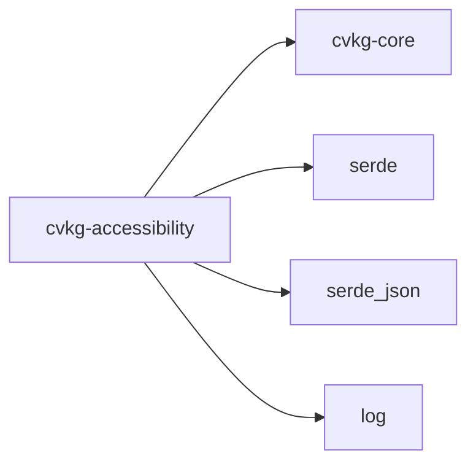

# cvkg-accessibility

## Purpose

Finding #10 from the crosscrate audit: cvkg-vdom had ARIA properties and some accesskit integration but no unified architecture for accessibility. This crate provides the authoritative accessibility layer for the CVKG workspace — a platform-facing accessibility tree, a keyboard focus manager, and a screen reader bridge abstraction.

## Boundaries

This crate owns:

- The accessibility tree model (`AccessNode`, `AccessibilityTree`, `SemanticRole`) — the canonical platform-facing tree derived from the VDOM
- Keyboard focus management (`FocusManager`, `FocusDirection`, `FocusResult`) — tab order and directional navigation
- Screen reader integration (`ScreenReaderBridge`, `Announcement`, `AnnouncementPriority`, `NullScreenReaderBridge`) — platform-agnostic announcement API

This crate does **not** own:

- ARIA property parsing or VDOM annotation — that lives in cvkg-vdom
- Platform-specific AT backends (COM automation, NSAccessibility, AT-SPI) — implement `ScreenReaderBridge` to plug one in
- Rendering or layout — this crate is data-only

## Dependency graph



All dependencies are workspace members. No optional dependencies. No features.

## Public API overview

Re-exports from `cvkg_accessibility` (top-level):

| Type | Module | Description |
|---|---|---|
| `Announcement` | `bridge` | A message to be spoken by a screen reader |
| `AnnouncementPriority` | `bridge` | Priority level controlling announcement queuing |
| `NullScreenReaderBridge` | `bridge` | No-op implementation of `ScreenReaderBridge` |
| `ScreenReaderBridge` | `bridge` | Trait abstracting platform screen reader backends |
| `FocusDirection` | `focus` | Direction enum for directional focus movement |
| `FocusManager` | `focus` | Owns canonical tab order and focus cycling |
| `FocusResult` | `focus` | Outcome of a focus movement operation |
| `AccessNode` | `tree` | Single node in the accessibility tree |
| `AccessibilityTree` | `tree` | Authoritative platform-facing tree container |
| `SemanticRole` | `tree` | Richer role enum replacing VDOM string roles |

Three public modules for direct access to internals: `bridge`, `focus`, `tree`.

## Usage example

```rust
use cvkg_accessibility::{
    AccessibilityTree, AccessNode, SemanticRole,
    FocusManager, FocusDirection,
    ScreenReaderBridge, Announcement, AnnouncementPriority,
};

// Build an accessibility tree from VDOM output
let mut tree = AccessibilityTree::new();
tree.add_node(AccessNode {
    role: SemanticRole::Button,
    label: "Submit form".into(),
    ..Default::default()
});

// Manage focus
let mut focus = FocusManager::new();
let result = focus.move_focus(FocusDirection::Forward, &tree);

// Announce to screen reader
struct MyBridge;
impl ScreenReaderBridge for MyBridge {
    fn announce(&self, announcement: &Announcement) {
        // platform-specific announcement
    }
}
let bridge = MyBridge;
bridge.announce(&Announcement {
    text: "Form submitted".into(),
    priority: AnnouncementPriority::High,
});
```

## Use cases

- **WCAG 2.1 AA compliance** — `FocusManager` provides the keyboard navigation model required for Level AA conformance
- **Screen reader integration** — implement `ScreenReaderBridge` once per platform; the rest of the crate works uniformly
- **Accessibility tree inspection** — `AccessibilityTree` can be serialized via serde for testing or devtools
- **Fallback behavior** — `NullScreenReaderBridge` allows running without a screen reader backend in headless or test environments

## Edge cases and limitations

- `AccessibilityTree` is data-only; it does not listen for platform events. A consumer must drive tree updates from VDOM changes.
- `ScreenReaderBridge` is a trait — no default platform backend is provided. You must supply an implementation or use `NullScreenReaderBridge`.
- `FocusManager` owns tab order but does not track DOM mutations. The tree must be rebuilt or patched externally when nodes are added or removed.
- `SemanticRole` is richer than the string roles in cvkg-vdom but is not exhaustive. New roles may need to be added as the platform surface expands.
- No `unsafe` code in this crate, but platform bridge implementations may require it.
- `serde` and `serde_json` are direct dependencies; serializing `AccessNode` or `AccessibilityTree` requires the corresponding serde impls on those types.

## Build flags / features / env vars

None. This crate has no Cargo features, no required environment variables, and no conditional compilation. It builds with a plain `cargo build` from the workspace root.
