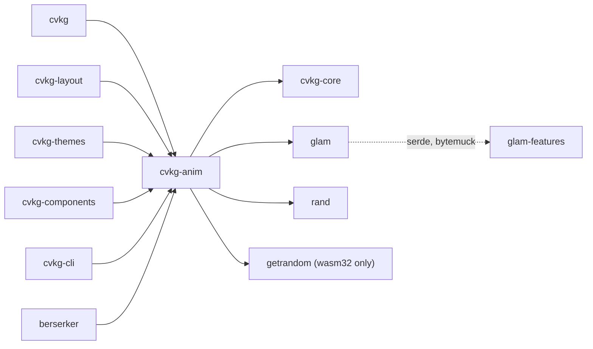

# cvkg-anim

## Purpose

Spring-physics animation engine for the CVKG UI framework. Provides RK4-integrated spring solvers, easing functions, elastic rubber-banding, keyframe/spring hybrid paths, inertial momentum decay, and a composable animation tree (sequence, parallel, stagger). Supports both time-based and scroll-linked progress drivers.

## Boundaries

`cvkg-anim` owns all motion physics and animation state. It does not render. It produces numeric values (positions, opacities, progress) that consumers map to visual output. It does not own layout, theming, or scene-graph concerns — those live in `cvkg-layout`, `cvkg-themes`, and `cvkg-core` respectively.

## Dependency graph



`glam` is activated with `serde` and `bytemuck` features. `getrandom` is a `cfg(target_arch = "wasm32")` dependency with the `wasm_js` feature.

## Public API overview

### Structs

| Type | Description |
|---|---|
| `SpringParams` | Spring constants: `stiffness`, `damping`, `mass` (`f32` each). |
| `SpringSolver` | RK4 spring integrator. Holds target, current state, and reduce-motion flag. |
| `RubberBand` | Elastic over-scroll clamp. Maps unbounded input to `[min, max]` with logarithmic resistance. |
| `Motion` | High-level animation controller wrapping an `Animation` with lifecycle callbacks (`on_start`, `on_settle`, `on_interrupt`). |
| `ActiveAnimation` | Playback state for an `Animation`. Call `update` each frame. |
| `Keyframe` | A single keyframe: `value`, `time`, `easing`. |
| `ProgressDriver` | Drives animation progress: `Time(Duration)` or `Scalar(f32)`. |

### Enums

| Type | Variants |
|---|---|
| `Easing` | `Linear`, `EaseIn`, `EaseOut`, `EaseInOut`. Has `evaluate(t: f32) -> f32`. |
| `Animation` | `Ginnungagap`, `Linear`, `Sleipnir`, `Hybrid`, `Parallel`, `Sequence`, `Stagger`, `BifrostFade`, `MjolnirSlice`, `MjolnirShatter`, `Momentum`. |

### Traits

| Type | Methods |
|---|---|
| `AnimationValue` | `lerp(&self, other: &Self, t: f32) -> Self`, `distance(&self, other: &Self) -> f32`. Implemented for `f32`. |

### `SpringParams` constructors

| Method | Constants |
|---|---|
| `snappy()` | stiffness 230, damping 22, mass 1 |
| `fluid()` | stiffness 170, damping 26, mass 1 (also `Default`) |
| `heavy()` | stiffness 90, damping 20, mass 1 |
| `bouncy()` | stiffness 190, damping 14, mass 1 |

### `SpringSolver` methods

- `new(params, target, current)` — create solver.
- `with_velocity(v)` — set initial velocity (builder).
- `set_target(target)` — change target mid-flight.
- `set_reduce_motion(bool)` — enable accessibility instant-snap mode.
- `tick(dt) -> f32` — advance by `dt` seconds, returns new position.
- `is_settled() -> bool` — true when position and velocity are near zero.

### `RubberBand` methods

- `new(min, max)` — create with default resistance constant 0.55.
- `solve(input) -> f32` — return elastically clamped value.

### Modules

| Module | Domain |
|---|---|
| `advanced_particles` | Extended particle simulation. |
| `behavior` | Behavioral animation presets. |
| `geometry` | Geometric animation helpers. |
| `growth` | Growth/scale animations. |
| `particles` | Particle system (re-exported at crate root via `pub use`). |
| `shader_anim` | GPU shader animation utilities. |
| `skeletal` | Skeletal/bone animation. |
| `momentum` | Inertial decay solver (`DecaySolver`). |
| `morph` | Morph-target animation. |
| `physics` | General physics utilities. |
| `spring_snap` | Snap-to-grid spring helpers. |
| `verlet` | Verlet integration. |

## Usage example

```rust
use cvkg_anim::{
    Animation, ActiveAnimation, ProgressDriver,
    SpringParams, SpringSolver, RubberBand, Easing,
};
use std::time::Duration;

// Spring solver: animate from 0.0 to 100.0
let params = SpringParams::snappy();
let mut solver = SpringSolver::new(params, 100.0, 0.0);
let value = solver.tick(0.016); // advance one frame at 60 fps

// Rubber band: clamp scroll input to [0, 0, 100.0] with elastic resistance
let rb = RubberBand::new(0.0, 100.0);
let clamped = rb.solve(150.0); // > 100.0, with logarithmic resistance

// Easing
let t = Easing::EaseInOut.evaluate(0.25);

// Composite animation: two linear segments in sequence
let anim = Animation::Sequence(vec![
    Animation::Linear { duration: Duration::from_millis(200) },
    Animation::Linear { duration: Duration::from_millis(300) },
]);
let mut active = ActiveAnimation::new(anim);
let value = active.update(
    ProgressDriver::Time(Duration::from_millis(16)),
    0.0,
    1.0,
);
```

## Use cases

- UI element entrance/exit transitions with spring physics.
- Scroll-linked parallax and reveal animations via `ProgressDriver::Scalar`.
- Over-scroll elastic resistance on touch/drag surfaces.
- Staggered list-item animations.
- Hybrid keyframe-then-spring paths (e.g., gesture-driven card flip that settles with spring).
- Physical shatter/slice transition effects (`MjolnirShatter`, `MjolnirSlice`).
- Inertial flick scrolling with friction decay (`Animation::Momentum`).
- Accessibility: `set_reduce_motion(true)` on `SpringSolver` snaps instantly, bypassing physics.

## Edge cases and limitations

- `SpringParams::default()` returns `fluid()`, not `snappy()`.
- `mass` is clamped to a minimum of `0.001` inside `SpringSolver::evaluate` to prevent division by zero, but `SpringParams` itself does not enforce this — zero or negative mass values are accepted at construction.
- `ProgressDriver::Scalar` is ignored by physics animations (`Sleipnir`, `Momentum`, etc.). Only `Linear`, `Hybrid`, `BifrostFade`, and `MjolnirSlice` respond to scalar scrubbing.
- `is_settled()` uses a fixed epsilon of `0.001` for both position and velocity. Very slow springs may appear settled before reaching the exact target.
- `RubberBand::constant` is not exposed as a builder field after construction; only the default `0.55` is available via `new`.
- `Animation::Ginnungagap` is a no-op: it finishes instantly and snaps to `end_val`.
- `MjolnirShatter` creates `pieces` independent spring solvers internally; large piece counts allocate proportional state.
- `ActiveAnimation` is not `Send + Sync` due to internal `Option<SpringSolver>` state; wrap in `Arc<Mutex<_>>` for cross-thread use.
- No built-in animation blending or cross-fading between two active animations — compose via `Animation::Parallel` manually.

## Build flags / features / env vars

`cvkg-anim` has no optional Cargo features. Dependencies are fixed:

- `cvkg-core` — always required.
- `glam` — always required, with `serde` and `bytemuck` features.
- `rand` — always required.
- `getrandom` — `cfg(target_arch = "wasm32")` only, with `wasm_js` feature.

No environment variables affect build or runtime behavior.
