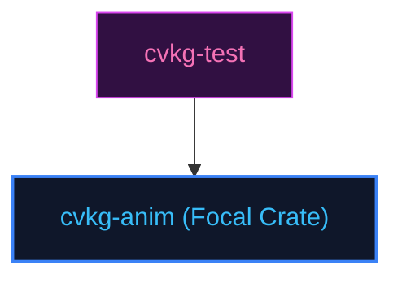

# cvkg-anim

## Purpose
Solves spring-physics motion transitions using RK4 numerical integration solvers.

## Boundaries
- It does not manage visual layers or rasterize character fonts.
- It does not contain testing frameworks; quality checks are managed by `cvkg-test`.

## Dependency Graph


## Public API Overview
- `SleipnirSolver` — RK4 spring motion solver.
- `RubberBand` — Scroll overflow damping resolver.

## Usage Example
```rust
use cvkg_anim::SleipnirSolver;
```

## Use Cases
- Mapped as a core component inside the standard framework dependency tree.

## Edge Cases and Limitations
- Under extreme scale or thread contention, ensure the host runtime balances cycles appropriately.

## Crate-Specific Build Flags
This crate has no custom feature flags or compile-time options. It compiles under standard cargo parameters.
