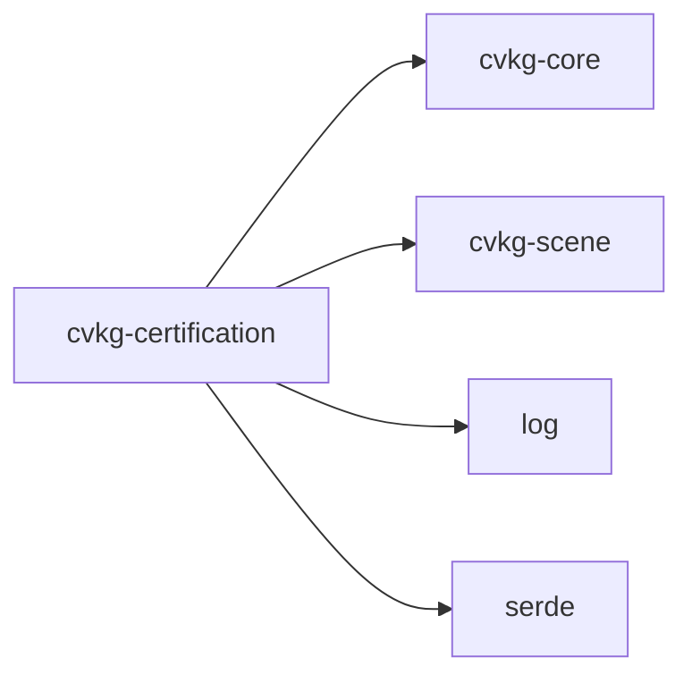

# cvkg-certification

## Purpose

Finding #9 from the crosscrate audit: testing was crate-focused, not platform-focused. The critical missing certification paths are Scene → Layout → Render, Scene → Animation → Render, Flow → Scene → Render, and Theme → Layout → Render. This crate provides the framework and reference implementations for those cross-crate certification suites.

## Boundaries

- This crate contains integration test suites only. It is not a library consumed by other crates at runtime.
- Reverse dependents: none in the workspace.
- The two test binaries (`pipeline_cert`, `scene_layout_render`) exercise cross-crate pipelines end-to-end. They do not replace per-crate unit tests.

## Dependency graph



## Public API overview

| Type | Kind | Description |
|---|---|---|
| `CertResult` | enum | Outcome of a single certification check: `Pass`, `Fail { reason }`, or `Skip { reason }`. |
| `CertResult::is_pass` | method | Returns `true` only for `Pass`. |
| `CertResult::is_fail` | method | Returns `true` only for `Fail`. |
| `CertCheck` | struct | One discrete assertion. Fields: `name`, `description`, `result`. |
| `CertCheck::new` | constructor | Creates an unresolved check (`result = None`). |
| `CertCheck::pass` | method | Marks the check as passed. |
| `CertCheck::fail` | method | Marks the check as failed with a reason string. |
| `CertCheck::skip` | method | Marks the check as skipped with a reason string. |
| `CertificationSuite` | struct | A named group of `CertCheck` items. |
| `CertificationSuite::new` | constructor | Creates an empty suite. |
| `CertificationSuite::add_check` | method | Adds a pre-constructed `CertCheck`. |
| `CertificationSuite::run` | method | Registers a check by name, executes the closure, and records the result. If the closure does not call `pass`/`fail`/`skip`, the framework injects a `Fail`. |
| `CertificationSuite::pass_count` | method | Number of checks that passed. |
| `CertificationSuite::fail_count` | method | Number of checks that failed. |
| `CertificationSuite::skip_count` | method | Number of checks that were skipped. |
| `CertificationSuite::total` | method | Total number of registered checks. |
| `CertificationSuite::all_pass` | method | `true` only when every check is `Pass` (empty suite returns `false`). |
| `CertificationSuite::report` | method | Emits a structured summary via `log::info!`. |
| `CertificationReport` | struct | Aggregates multiple `CertificationSuite` instances. |
| `CertificationReport::new` | constructor | Creates an empty report. |
| `CertificationReport::add_suite` | method | Adds a completed suite. |
| `CertificationReport::total_pass` | method | Sum of `pass_count` across all suites. |
| `CertificationReport::total_fail` | method | Sum of `fail_count` across all suites. |
| `CertificationReport::all_pass` | method | `true` only when every suite's `all_pass` is `true` (empty report returns `false`). |
| `CertificationReport::report` | method | Emits a consolidated report for all suites via `log::info!`. |

## Usage example

```rust
use cvkg_certification::{CertificationSuite, CertResult};

#[test]
fn scene_spatial_pipeline_certifies() {
    let mut suite = CertificationSuite::new("Scene Spatial Pipeline");

    suite.run("scene_has_root", "scene graph contains a root node", |check| {
        // ... exercise cvkg-scene and cvkg-core ...
        check.pass();
    });

    suite.run("layout_computes_bounds", "layout produces valid bounding boxes", |check| {
        // ... exercise the layout path ...
        check.fail("bounding box was NaN");
    });

    suite.run("render_produces_output", "render target receives pixels", |check| {
        check.skip("render backend not yet wired");
    });

    suite.report();
    assert!(suite.all_pass(), "certification suite did not pass");
}
```

For multi-suite tests:

```rust
use cvkg_certification::{CertificationReport, CertificationSuite};

#[test]
fn full_pipeline_cert() {
    let mut report = CertificationReport::new();
    report.add_suite(build_scene_suite());
    report.add_suite(build_layout_suite());
    report.add_suite(build_render_suite());

    report.report();
    assert!(report.all_pass());
}
```

## Use cases

- **CI gate**: Run `pipeline_cert` and `scene_layout_render` in CI to block merges that break cross-crate invariants.
- **Platform-level regression detection**: Catch regressions that per-crate unit tests cannot see (e.g. a scene change that breaks layout assumptions).
- **Coverage surfacing**: `Skip` results make deferred certification paths visible in CI logs rather than silently absent.

## Edge cases and limitations

- An empty `CertificationSuite` or `CertificationReport` returns `false` from `all_pass`. A suite with zero checks cannot certify anything.
- `Skip` is not treated as `Pass` by `all_pass`. Skipped checks represent gaps in coverage and must be addressed explicitly.
- If a `run` closure panics, the panic propagates normally. Use `CertCheck::fail` to handle expected errors gracefully.
- Duplicate check names within a suite are allowed but produce duplicate rows in the report. Names are for humans, not keyed lookup.
- `CertificationReport::total_skip` is not exposed; use per-suite `skip_count` if skip aggregation is needed.

## Build flags / features / env vars

- **Features**: none.
- **Environment variables**: none. The crate uses the `log` crate for report output; configure your logger (e.g. `env_logger`) externally.
