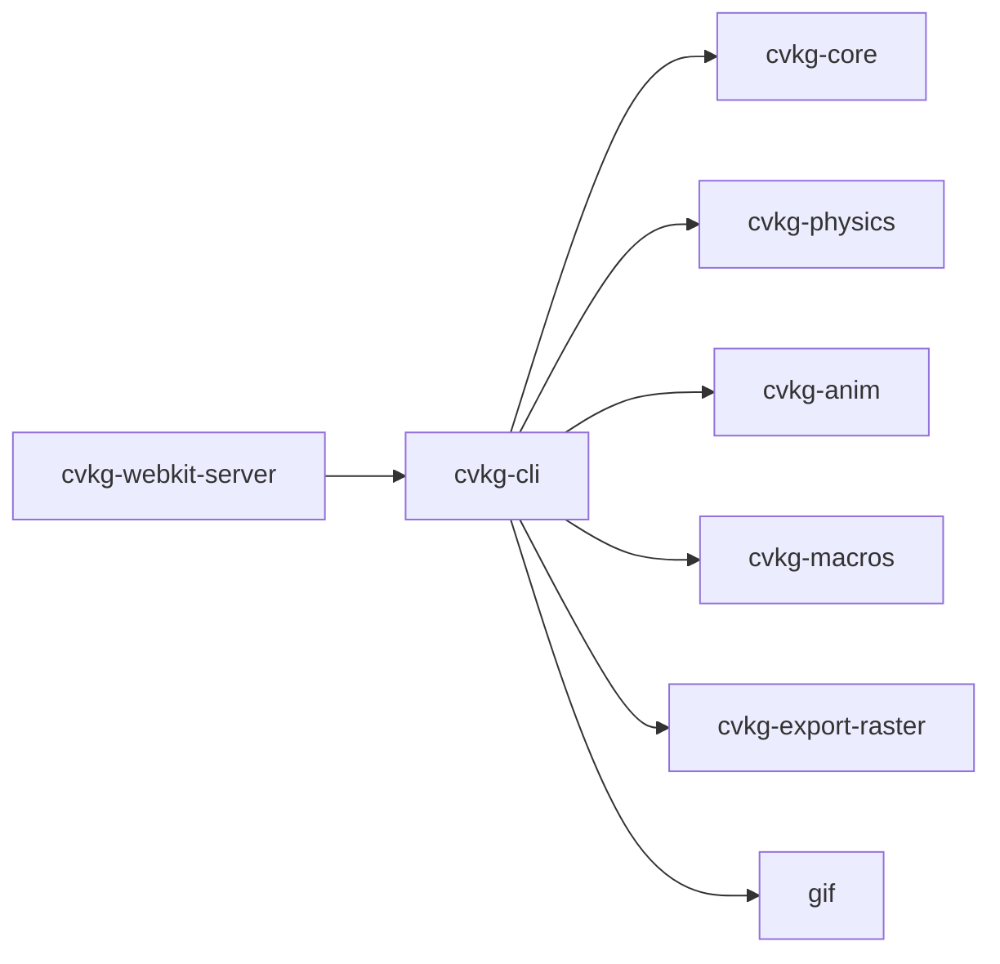

# cvkg-cli

CLI tool, dev server, and hot-reload orchestrator for the CVKG framework.

## Boundaries

cvkg-cli is the outer shell: it parses commands, loads config, starts servers, and orchestrates pipelines. It does not implement the rendering engine, layout system, or animation solvers — those live in `cvkg-core`, `cvkg-physics`, and `cvkg-anim`. Downstream crates (e.g. `cvkg-webkit-server`) depend on cvkg-cli for the dev server, scaffolding API, and token export.

## Dependency graph



## Public API overview

### Re-exports

| Re-export | Source module |
|---|---|
| `CliConfig` | `config` |
| `DevToolWidget`, `DevToolsDashboard`, `LogEntry`, `LogLevel`, `Panel`, `PanelContent`, `PerfMetrics` | `devtools` |
| `CliError`, `exit_with_error` | `error` |
| `NativeShell`, `ShellBackend`, `ShellError`, `ShellWindow`, `WindowEvent`, `create_window`, `poll_events` | `native_shell` |
| `Scaffolder`, `Template` | `scaffold` |
| `TokenExport` | `token_export` |
| `AppState`, `DevtoolsCommand`, `DevtoolsMessage`, `WsMessage`, `create_router`, `start_file_watcher`, `start_server` | `ws_server` |

### Public modules

| Module | Purpose |
|---|---|
| `agent_replay` | Replay recorded agent interaction sessions |
| `asset_pipeline` | Asset processing and bundling pipeline |
| `build_pipeline` | Compilation pipeline for target platforms |
| `config` | `.cvkg.toml` loading and CLI flag merging |
| `dev_runtime` | Runtime state snapshots and event types |
| `devtools` | In-process developer tools dashboard types |
| `devtools_dashboard` | Dashboard server and UI |
| `error` | CLI error types |
| `raster_export` | Raster image export (PNG, GIF) |
| `native_shell` | Native window creation and event loop |
| `patch_engine` | Hot-reload patch application engine |
| `plugin` | Plugin trait and context for extending the CLI |
| `runtime_connection` | Runtime client connection management |
| `scaffold` | Project scaffolding from templates |
| `token_export` | Design token export (Figma, CSS, Swift, JSON) |
| `webkit_server` | WebKit preview server |
| `ws_server` | WebSocket server for dev communication and hot reload |

## Usage example

```bash
# Scaffold a new project
cvkg new my-app --template minimal --git

# Start dev server with hot reload on port 3000
cvkg dev --target native --port 3000 --inspector

# Build for a target
cvkg build --target wasm --release

# Run checks
cvkg check --all

# Export design tokens
cvkg tokens --format figma --output tokens.json

# Export raster
cvkg export-raster --format png --output screenshot.png

# Launch the DevTools dashboard
cvkg dashboard --port 9731
```

As a library:

```rust
use cvkg_cli::{CliConfig, scaffold::{Scaffolder, Template}, ws_server::start_server};

let config = CliConfig::load();
let scaffolder = Scaffolder::new("my-app".into(), Template::Minimal, true);
scaffolder.run()?;
```

## Use cases

- **Local development**: `cvkg dev` starts the WebSocket dev server with file watching and hot reload.
- **Project bootstrapping**: `cvkg new` generates a workspace from a template (minimal, full, etc.).
- **CI checks**: `cvkg check --all` runs `cargo check`, `clippy`, and `fmt`.
- **Design token pipeline**: `cvkg tokens` exports design tokens to Figma, CSS, Swift, or JSON.
- **Raster export**: `cvkg export-raster` captures rendered frames as PNG or animated GIF.
- **Inspector**: `cvkg inspect` connects to a running dev server via WebSocket and streams live metrics.
- **Plugin system**: Extend the CLI with custom commands via the `plugin` module.
- **WebKit preview**: `cvkg serve` starts a WebKit-based preview server without triggering rebuilds.

## Edge cases and limitations

- Config file must be valid TOML; parse errors are silently ignored and defaults are used.
- `cvkg dev` binds to `0.0.0.0`; no built-in authentication on the WebSocket endpoint.
- The inspector (`cvkg inspect`) requires a running dev server with an active WebSocket devtools stream.
- Raster export depends on `cvkg-export-raster` and supports only PNG and GIF output.
- `cvkg serve` (WebKit preview) does not rebuild assets; run `cvkg build` first.
- The `native_shell` module is platform-dependent and may not compile on all targets.
- File watcher (`start_file_watcher`) uses `notify` with OS-specific backends; rapid successive saves may coalesce into a single reload event.

## Build flags / features / env vars

### Environment variable

| Variable | Description |
|---|---|
| `CVKG_CONFIG` | Path to the config file. Defaults to `.cvkg.toml` in the current directory. |

### Binary target

The crate produces a single binary `cvkg` from `src/main.rs`.

### Cargo features

This crate defines no optional features. All dependencies are always enabled.
