# cvkg-cli

```mermaid
graph TD
    cvkg-core["cvkg-core"]
    cvkg-vdom["cvkg-vdom"]
    cvkg-scene["cvkg-scene"]
    cvkg-layout["cvkg-layout"]
    cvkg-render-gpu["cvkg-render-gpu"]
    cvkg-render-native["cvkg-render-native"]
    cvkg-compositor["cvkg-compositor"]
    cvkg-themes["cvkg-themes"]
    cvkg-anim["cvkg-anim"]
    cvkg-flow["cvkg-flow"]
    cvkg-runic-text["cvkg-runic-text"]
    cvkg-svg-filters["cvkg-svg-filters"]
    cvkg-svg-serialize["cvkg-svg-serialize"]
    cvkg-components["cvkg-components"]
    cvkg-macros["cvkg-macros"]
    cvkg-cli["cvkg-cli"]
    cvkg-webkit-server["cvkg-webkit-server"]
    cvkg-test["cvkg-test"]
    cvkg-physics["cvkg-physics"]
    cvkg["cvkg (umbrella)"]

    cvkg-vdom --> cvkg-core
    cvkg-vdom --> cvkg-scene
    cvkg-layout --> cvkg-core
    cvkg-layout --> cvkg-anim
    cvkg-scene --> cvkg-core

    cvkg-render-gpu --> cvkg-core
    cvkg-render-gpu --> cvkg-compositor
    cvkg-render-gpu --> cvkg-svg-filters
    cvkg-render-gpu --> cvkg-svg-serialize
    cvkg-render-gpu --> cvkg-runic-text

    cvkg-render-native --> cvkg-core
    cvkg-render-native --> cvkg-render-gpu
    cvkg-render-native --> cvkg-vdom
    cvkg-render-native --> cvkg-themes

    cvkg-compositor --> cvkg-core

    cvkg-themes --> cvkg-core
    cvkg-themes --> cvkg-anim
    cvkg-anim --> cvkg-core
    cvkg-flow --> cvkg-core
    cvkg-flow --> cvkg-scene
    cvkg-flow --> cvkg-themes

    cvkg-runic-text --> cvkg-core
    cvkg-svg-filters --> cvkg-core

    cvkg-components --> cvkg-core
    cvkg-components --> cvkg-vdom
    cvkg-components --> cvkg-layout
    cvkg-components --> cvkg-themes
    cvkg-components --> cvkg-anim
    cvkg-components --> cvkg-runic-text

    cvkg-macros --> cvkg-core
    cvkg-cli --> cvkg-core
    cvkg-cli --> cvkg-physics
    cvkg-cli --> cvkg-anim
    cvkg-cli --> cvkg-macros
    cvkg-webkit-server --> cvkg-cli
    cvkg-physics --> cvkg-core
    cvkg-physics --> cvkg-scene

    cvkg --> cvkg-core
    cvkg --> cvkg-vdom
    cvkg --> cvkg-scene
    cvkg --> cvkg-layout
    cvkg --> cvkg-themes
    cvkg --> cvkg-anim
    cvkg --> cvkg-macros
    cvkg --> cvkg-components
    cvkg --> cvkg-render-gpu
    cvkg --> cvkg-render-native
```



`cvkg-cli` is the authoritative command-line toolchain for the CVKG ecosystem, managing the lifecycle of applications from scaffolding to production deployment.

## Boundaries and Responsibilities

This crate provides the developer interface to the framework. Its responsibilities include:
- **Project Scaffolding**: Creating new workspaces with `cvkg new`.
- **Development Engine**: Orchestrating hot-reloading dev servers with `cvkg dev`.
- **Build Orchestration**: Compiling for native and web targets via `cvkg build`.
- **Quality Assurance**: Running lints, audits, and visual regression tests with `cvkg check` and `cvkg test`.
- **Observability**: Providing a real-time telemetry inspector via `cvkg inspect`.
- **Asset Management**: Processing and bundling assets through the `asset_pipeline`.

## Public API Overview

### Primary Commands
- `cvkg new <NAME>`: Scaffolds a new project with optional templates and git initialization.
- `cvkg dev --target <PLATFORM>`: Launches the development server with state-preserving hot reload.
- `cvkg build --target <PLATFORM>`: Compiles the project for the specified hardware/runtime.
- `cvkg serve`: Starts a high-performance preview server for web targets.
- `cvkg export`: Bundles a project into a production-ready static WASM distribution.

### Advanced Tooling
- `cvkg inspect`: Connects to a running application to stream real-time FPS, VRAM, and VDOM metrics.
- `cvkg theme`: Generates type-safe Rust themes from design token JSON files.

## Usage Example

```bash
# Start a new project
cvkg new my-tactical-app

# Run in development mode with the inspector enabled
cvkg dev --target native --inspector

# Build for web deployment
cvkg build --target wasm --release
```

## Known Limitations
- `cvkg export` requires `wasm-pack` to be installed on the system path for web targets.
- Hot reload stability is dependent on the complexity of the state graph being preserved.
- The asset pipeline currently assumes an `assets/` directory at the project root.
