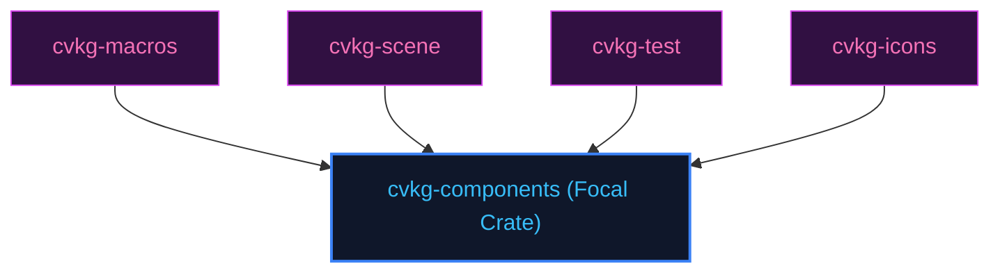

# cvkg-components

## Purpose
Tahoe component library containing base inputs, buttons, and custom layout controls.

## Boundaries
- It does not write GPU hardware drivers or compute text metrics directly.
- It does not contain testing frameworks; quality checks are managed by `cvkg-test`.

## Dependency Graph


## Public API Overview
- `Button` — Native-drawn click component.
- `PhoneInput` / `MentionInput` — Custom input editors.

## Usage Example
```rust
use cvkg_components::Button;
```

## Use Cases
- Mapped as a core component inside the standard framework dependency tree.

## Edge Cases and Limitations
- Under extreme scale or thread contention, ensure the host runtime balances cycles appropriately.

## Crate-Specific Build Flags
This crate has no custom feature flags or compile-time options. It compiles under standard cargo parameters.
