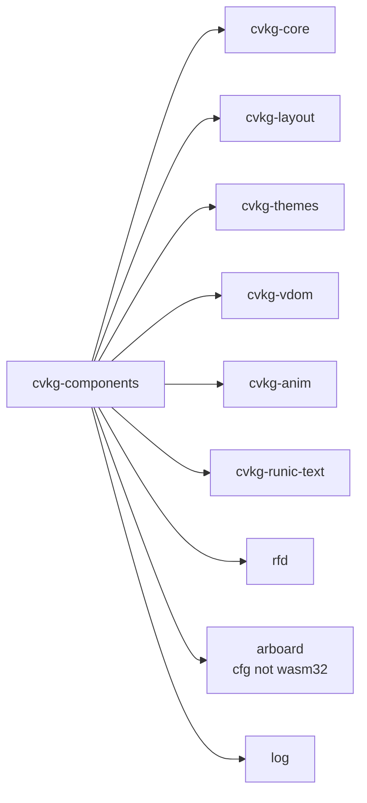

# cvkg-components

## Purpose

Built-in component library for the CVKG UI framework. Implements standard UI widgets (buttons, sliders, toggles, forms, charts, navigation, layout primitives, etc.) using public CVKG APIs. All components are built on top of `cvkg-core`, `cvkg-layout`, `cvkg-themes`, `cvkg-vdom`, and `cvkg-anim` — no internal compiler or renderer details are exposed.

## Boundaries

- **In scope:** Ready-to-use widgets, design tokens (typography, spacing, radii), focus-ring helpers, English API aliases for Norse-named components, and the `ViewExt` modifier trait.
- **Out of scope:** Rendering backend selection (that lives in `cvkg-render-native` / `cvkg-render-gpu`), application shell/windowing (that lives in `cvkg`), and asset pipeline or font loading (those are in `cvkg-core` or external crates).
- **Platform note:** `arboard` (clipboard support) is only available on non-wasm32 targets. Components that use clipboard will silently no-op on wasm32.

## Dependency graph



## Public API overview

### Shared types

- `FontWeight` — enum with variants `Regular`, `Bold`, `Italic`.
- `Color` — re-exported from `cvkg_core`.

### Design tokens

| Category | Constants |
|----------|-----------|
| Typography | `FONT_XS` (10.0), `FONT_SM` (12.0), `FONT_BASE` (14.0), `FONT_MD` (16.0), `FONT_LG` (20.0), `FONT_XL` (24.0), `FONT_2XL` (32.0), `FONT_3XL` (48.0) |
| Line heights | `LINE_HEIGHT_XS` through `LINE_HEIGHT_3XL` |
| Spacing | `SPACE_XS` (4.0) through `SPACE_XL` (32.0) |
| Border radius | `RADIUS_XS` (2.0) through `RADIUS_FULL` (9999.0) |
| Focus ring | `FOCUS_RING_WIDTH`, `FOCUS_RING_OFFSET`, `draw_focus_ring()`, `draw_focus_ring_color()` |

### Core components (selected)

- **Interactive:** `Button`, `Checkbox`, `Slider`, `Toggle`, `Input`, `Textarea`, `Select`, `Picker`, `Stepper`, `SecureField`, `RadioGroup`, `ColorPicker`, `Rating`, `Pagination`
- **Layout:** `HStack`, `VStack`, `FlexBox`, `ScrollView`, `NavigationStack`, `NavigationSplitView`, `LazyVStack`, `HStack`, `ZStack`, `AspectRatio`, `Separator`, `Resizable`, `Group`, `GroupBox`
- **Surfaces:** `Dialog`, `Sheet`, `Popover`, `HoverCard`, `ContextMenu`, `DropdownMenu`, `AlertDialog`, `ConfirmationDialog`, `FullScreenCover`
- **Display:** `Typography`, `Icon`, `Badge`, `Avatar`, `Spinner`, `ProgressBar`, `Carousel`, `Marquee`, `Loader`
- **Charts:** `BarChart`, `LineChart`, `PieChart`, `CandlestickChart`, `ScatterPlot`, `HeatmapChart`, `GaugeChart`, `RadarChart`, `TreemapChart`, `SankeyChart`, `SparkLineChart`, `FunnelChart`, `Histogram`, `RangeChart`
- **Navigation:** `Tabs`, `Drawer`, `Menubar`, `NavigationMenu`, `Breadcrumb`, `DisclosureGroup`, `List`, `Section`
- **Forms:** `DateTimePicker`, `DateRangePicker`, `TimePicker`, `SearchField`, `Tag`, `Label`, `Link`, `FormBinder`, `Binding`
- **Advanced:** `Scheduler`, `Gantt`, `Kanban`, `TreeView`, `RichTreeView`, `TextEditor`, `Codeblock`, `Audio`, `Video`, `Map`
- **Effects:** `TextAnimate`, `TypewriterEffect`, `ShimmerButton`, `RippleButton`, `NumberTicker`, `CardStack`, `DraggableCard`, `ExpandableCard`

### Extension trait

- `ViewExt` — adds `.sheet()` to any `cvkg_core::View`.

### English aliases

Type aliases provide standard names for all Norse-named components (e.g. `Alert` = `GjallarAlert`, `Tabs` = `BifrostTabs`, `Dialog` = `GeriDialog`, `Spinner` = `HatiSpinner`, `Accordion` = `SagaAccordion`, etc.).

## Usage example

```rust
use cvkg_components::{
    Button, FontWeight, FONT_MD, Color,
    interactive::ButtonVariant,
    container::{VStack, HStack},
};

let label = Text::new("Submit")
    .font_weight(FontWeight::Bold)
    .font_size(FONT_MD)
    .color(Color::WHITE);

let button = Button::new(label)
    .variant(ButtonVariant::Default)
    .on_click(|ctx| {
        ctx.trigger_haptic(HapticIntensity::Medium);
    });

let layout = VStack::new()
    .child(button)
    .child(HStack::new().child(Label::new("Status: Ready")));
```

## Use cases

- Building agentic dashboards and tool UIs with pre-made interactive widgets
- Rapid prototyping with design tokens instead of hardcoded pixel values
- Charting and data visualization (time series, distributions, comparisons)
- Multi-step forms with validation, date/time pickers, and rich text
- Navigation-heavy applications using tabs, drawers, trees, and split views
- Themed applications that switch between light/dark/high-contrast at runtime
- Accessibility-compliant interfaces (WCAG 2.4.7 focus rings, a11y inspector)

## Edge cases and limitations

- `arboard` clipboard is unavailable on `wasm32` targets; clipboard-dependent components degrade silently.
- `FONT_3XL` (48.0) is the largest typography token; values above this must be set manually.
- `RADIUS_FULL` (9999.0) is a sentinel value — it is not a valid CSS pixel value and only works with the framework's own rounded-rect renderer.
- `draw_focus_ring` uses `crate::theme::focus_ring()` internally; the deprecated `FOCUS_RING_COLOR` constant does not respect theme changes.
- `MicroFeedback` defaults to `NullHapticEngine` / `NullAudioEngine`; haptics and audio do not work unless a real engine is provided via `with_haptic()` / `with_audio()`.
- English aliases (`Alert`, `Dialog`, etc.) are type aliases, not new types — they are interchangeable with their Norse counterparts in generic contexts.
- `ViewExt::sheet()` returns a `ModifiedView`; it cannot be nested without wrapping in a concrete container first.

## Build flags / features / env vars

This crate does not define its own Cargo features. All dependencies are unconditional except `arboard`, which is gated on `cfg(not(target_arch = "wasm32"))`.

| Dependency | Condition | Effect |
|------------|-----------|--------|
| `arboard` | `cfg(not(target_arch = "wasm32"))` | Clipboard support for copy/paste components |
| `cvkg-runic-text` | Always | Runic text shaping and rendering |
| `rfd` | Always | Native file dialogs |
| `log` | Always | Logging facade used by component internals |

Dev-dependencies (`insta`, `pollster`, `cvkg-render-native`, `cvkg-macros`, `cvkg-render-gpu`, `winit`) are only used for examples and tests.
