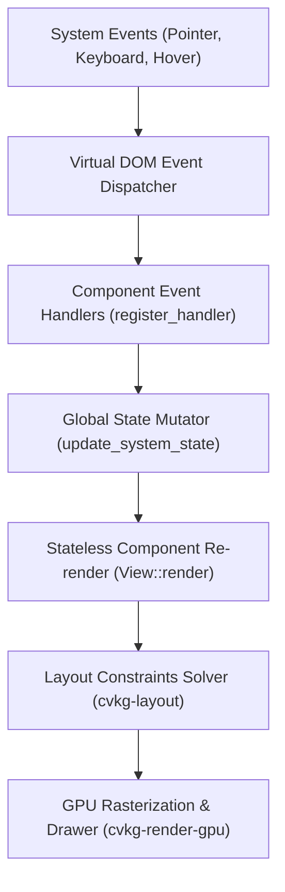

# cvkg-components


`cvkg-components` is the authoritative, premium UI component and widget library for the **Cyber Viking Kvasir Graph (CVKG)** framework. It provides a comprehensive suite of highly responsive, glassmorphic UI elements—ranging from fundamental atomic primitives to complex, stateful tactical HUDs and agentic dashboards.

Built entirely atop the `cvkg-core` stateless architecture and styled with modern Norse-cyberpunk design motifs, these components leverage the custom layout engine (`cvkg-layout`) and react natively to pointer, keyboard, and system lifecycle events.

---

## Core Architecture & Event Pipeline

Every component in `cvkg-components` is declared state-free using the `View` trait. Component interactivity, focus tracking, and animation progressions are driven by registering event-handlers into the central virtual DOM tree. State updates are pushed atomically through the global state store (`load_system_state` / `update_system_state`), triggering unified, sub-millisecond layout reflows and GPU redraws.



---

## Technical Features & Subsystems

### 1. Atomic Primitives (The Core Hearth)
- **Standard Controls**: `Button`, `Toggle`, `Slider`, `Input`, `Textarea`, `Checkbox`, and `Picker` form the core interaction layer.
- **Aesthetic Rendering**: Custom text styling (via `Text` and `RunicTooltip`), static images (`Image`), and custom vector shapes (`Shape`) with neon border configurations.

### 2. Dynamic Floating Interactions (The Bifrost Bridges)
These are our newly minted, high-fidelity widgets designed to enrich user experience with smooth transitions and context-aware feedback:
- **`AutoComplete`**: A text field with a filtered dropdown list. Fully supports key down navigation (arrows, select, dismiss) and pointer selection.
- **`DatePicker`**: A calendar component displaying an active, interactive input field and a glassmorphic calendar popover. Offers comprehensive month navigation and day validation.
- **`Popover`**: A floating panel anchored to a trigger view. Renders with an auto-placement helper arrow and subtle neon contours.
- **`Tooltip`**: A floating, contextual tip that emerges dynamically after a brief delay (0.3s) on pointer hover, disappearing smoothly when the pointer leaves the target.
- **`Toast` & `ToastManager`**: A notification overlay managing active feedback stacks with lifetime countdown animations, distinct levels (`Info`, `Success`, `Warning`, `Error`), and persistent alarm modes.

### 3. Tactical HUD & Diagnostics (The Seeress readouts)
- **`Vegvísir`**: A modern vector compass HUD that scales dynamically to represent system directories and coordinates.
- **`OracleOrb`**: An interactive, state-aware agentic status indicator visualizing active AI worker states (thinking, listening, idle).
- **`WyrdHUD` & `TacticalGauge`**: High-contrast, glowing neon telemetry widgets designed for real-time diagnostic visual feedback.
- **`RunestoneEditor`**: A robust, GPU-accelerated code and plain-text editor with virtualized scrolling capabilities.

### 4. Layout & Structural Frameworks (Yggdrasil Branches)
- **Flex Containers**: `HStack`, `VStack`, `LazyVStack`, and `Grid` facilitate automatic relative coordinate layouts.
- **Structural Navigators**: `NavigationStack`, `TabView`, and `ScrollView` control screen transitions.
- **`GjallarSplitter`**: A resizable split-pane divider supporting interactive mouse drag-to-resize operations.
- **`MjolnirFrame`**: A stylized Norse container frame featuring decorative, neon-glowing runic borders and corner brackets.

---

## Public API Reference

| Component / Module | Type | Description | Primary Source File |
| :--- | :--- | :--- | :--- |
| `AutoComplete` | Struct | Text input with a filtered, glassmorphic dropdown list. | [autocomplete.rs](file:///D/rex/projects/cvkg/cvkg-components/src/autocomplete.rs) |
| `DatePicker` | Struct | Calendar date selector with inline text field and popover grid. | [datepicker.rs](file:///D/rex/projects/cvkg/cvkg-components/src/datepicker.rs) |
| `Popover` | Struct | Floating content container anchored to a trigger element. | [popover.rs](file:///D/rex/projects/cvkg/cvkg-components/src/popover.rs) |
| `Tooltip` | Struct | Hover-activated contextual tooltip with pointer delay tracking. | [tooltip.rs](file:///D/rex/projects/cvkg/cvkg-components/src/tooltip.rs) |
| `ToastManager` | Struct | Central notification queue managing animated alert stacks. | [toast.rs](file:///D/rex/projects/cvkg/cvkg-components/src/toast.rs) |
| `Button` / `Toggle` | Struct | Fundamental interactive primitives for user commands. | [interactive.rs](file:///D/rex/projects/cvkg/cvkg-components/src/interactive.rs) |
| `MjolnirFrame` | Struct | Runic panel frame with custom Norse-engraved styling. | [mjolnir_frame.rs](file:///D/rex/projects/cvkg/cvkg-components/src/mjolnir_frame.rs) |
| `GjallarSplitter` | Struct | Drag-to-resize multi-view structural layout. | [container.rs](file:///D/rex/projects/cvkg/cvkg-components/src/container.rs) |
| `OracleOrb` | Struct | Floating AI Agent state visualizer. | [oracle_orb.rs](file:///D/rex/projects/cvkg/cvkg-components/src/oracle_orb.rs) |
| `Vegvísir` | Struct | Specialized directional nav and layout compass. | [hud.rs](file:///D/rex/projects/cvkg/cvkg-components/src/hud.rs) |

---

## Code Examples

### 1. Composing a Norse Cyberpunk Console

Build a standard interactive terminal view using flex stacks, runic texts, and buttons:

```rust
use cvkg_components::{VStack, HStack, Text, Button, Color, ViewExt};
use cvkg_core::{View, Never};

fn render_terminal_hud() -> impl View {
    VStack::new(12.0)
        .alignment(layout::Alignment::Start)
        .children((
            Text::new("KVASIR SHIELD PROTOCOL: ACTIVE")
                .font_size(18.0)
                .font_weight(FontWeight::Bold)
                .color(Color::NEON_CYAN),
                
            HStack::new(8.0).children((
                Button::new("ACTIVATE VALKYRIE", || {
                    println!("Valkyrie defensive matrix initialized.");
                }),
                Button::new("DISMISS", || {
                    println!("Console closed.");
                }),
            ))
        ))
}
```

### 2. Utilizing the Auto-Complete & Date Picker Subsystems

Implement a user input form with predictive text typing and calendar selection:

```rust
use cvkg_components::{VStack, Text, Color};
use cvkg_components::autocomplete::AutoComplete;
use cvkg_components::datepicker::DatePicker;
use cvkg_core::View;

fn render_input_form() -> impl View {
    VStack::new(16.0).children((
        Text::new("Deploy Operations Center").color(Color::VIKING_GOLD),
        
        // Auto-complete text input with pre-filled items
        AutoComplete::new(
            "Search target repository...",
            vec!["Berserker Core".into(), "Asgard Vault".into(), "Midgard Node".into()],
            |text| println!("Query typed: {}", text),
            |selection| println!("Confirmed repo: {}", selection),
        ),
        
        // Calendar date picker with custom selection callbacks
        DatePicker::new(|day, month, year| {
            println!("Tactical deployment scheduled: {:02}/{:02}/{}", day, month, year);
        })
        .selected(15, 6, 2026)
    ))
}
```

### 3. Deploying Hover-based Tooltips and Floating Popovers

Enhance diagnostic widgets with floating contextual details:

```rust
use cvkg_components::Text;
use cvkg_components::popover::{Popover, PopoverPosition};
use cvkg_components::tooltip::Tooltip;
use cvkg_core::View;

fn render_telemetry_node() -> impl View {
    // 1. Wrap a core element with a hover Tooltip showing info after 0.3s
    let hovered_metric = Tooltip::new(
        Text::new("CPU Core: 98.4%").color([1.0, 0.2, 0.2, 1.0]),
        "Critical Thermal Limits Reached! Auto-cooling active."
    );

    // 2. Wrap that metric with an interactive click Popover showing full details
    Popover::new(
        hovered_metric,
        Text::new("Detailed logs:\n- Temp: 92°C\n- Fan: 100%\n- Node: Bifrost-7"),
    )
    .position(PopoverPosition::Bottom)
    .open(false)
}
```

### 4. Directing Alert Stacks via the Toast Manager

Set up a global alert and notification subsystem:

```rust
use cvkg_components::toast::{ToastManager, ToastKind};
use cvkg_core::View;

fn trigger_alert_system(manager: &mut ToastManager) {
    // Push an informational diagnostic toast that expires in 5.0 seconds
    manager.add(
        "DIAGNOSTIC",
        "Sleipnir network heartbeat resolved in 12ms.",
        ToastKind::Info,
        Some(5.0),
    );

    // Push a critical warning notification that stays persistent until dismissed
    manager.add(
        "SECURITY BREACH",
        "Unauthorized handshake attempt at Node-Heimdall.",
        ToastKind::Error,
        None, // Persistent
    );
}
```

---

## Aesthetic Guidelines & Design Tokens

To maintain visual cohesion, all custom subcomponents should align with the core CVKG design tokens:
- **Neon Colors**: 
  - Viking Gold: `[0.85, 0.65, 0.12, 1.0]` (HSL tailored)
  - Neon Cyan: `[0.0, 0.85, 1.0, 1.0]`
  - Berserker Red: `[0.9, 0.1, 0.2, 1.0]`
- **Glassmorphism (The Bifrost Effect)**: Standard components should utilize `renderer.bifrost(...)` and semi-transparent backdrops (`[0.06, 0.06, 0.1, 0.88]`) to generate frosted glass filters with neon stroke borders.
- **Typography**: Leverage the custom `Jupiteroid` and `Lanix Ox` variable font faces for telemetry displays and system labels.

---

## Known Limitations

- **Harnessing Thread Safety in Tests**: Tests utilizing global static variables (such as `INSTANCE_COUNT` in memory leak stress testing) must be serialized using a lock guard to prevent concurrent thread contamination.
- **Layout Parent Bounds**: Hover components (`Tooltip` and `Popover`) calculate relative bounds based on anchor views. Ensure layout trees do not restrict rendering clips inside parent views when displaying floating overlays.