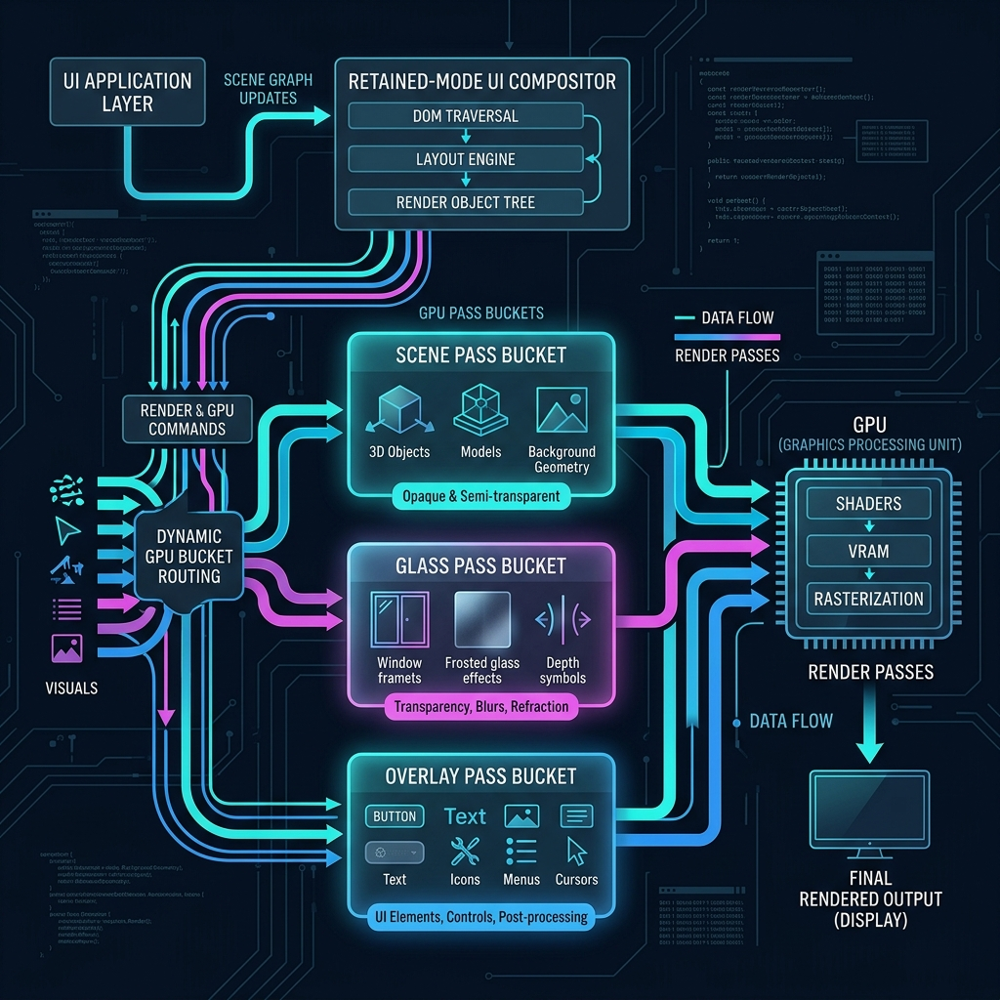

# CVKG Compositor



`cvkg-compositor` is the retained-mode layer orchestration engine for the Cyber Viking Kvasir Graph (CVKG) UI framework.

The compositor acts as the critical bridge between `cvkg-vdom` (the virtual UI state) and `cvkg-render-gpu` (the actual drawing backend). It is responsible for intelligently routing UI elements into GPU passes and minimizing unnecessary redraws.

## Key Capabilities

1. **Material Routing**: 
   The engine reads the `Material` property of each `Layer` (e.g., `Opaque`, `Glass`, `Overlay`) and routes the draw commands into specific GPU pass buckets. This enables advanced, multi-pass rendering pipelines like Kawase Blur pyramids for frosted glass effects without burdening the application layer.

2. **Damage Tracking**: 
   A robust generation-based system tracks which UI layers have been modified since the last frame. Static UI elements are not re-recorded, significantly reducing CPU overhead and preserving battery life on native desktop environments.

3. **Layer Orchestration**: 
   Maintains a retained `LayerTree` with proper Z-sorting (painter's algorithm) and hierarchical relationships, separating the UI definition from the GPU command submission.

## Architecture

```text
VDom → LayerTreeBuilder → CompositorEngine → SurtrRenderer
                                   │
                         ┌─────────┼─────────┐
                         ▼         ▼         ▼
                    scene_cmds  glass_cmds  overlay_cmds
                         │         │         │
                         ▼         ▼         ▼
                    ┌─────────────────────────────┐
                    │  Backdrop Capture Pipeline  │
                    │  (Scene→Blur→Composite→UI)  │
                    └─────────────────────────────┘
```

## Quick Start

The compositor is typically driven internally by `cvkg-core` and the platform-specific runners. However, you can inspect the orchestration logic by interacting with `LayerTree` and `CompositorEngine` directly if you are writing a custom rendering backend.

```rust
use cvkg_compositor::{CompositorEngine, LayerTree, Layer, Material};

let mut tree = LayerTree::new();
let mut engine = CompositorEngine::new();

// Define a glassmorphic layer
let mut glass_layer = Layer::default();
glass_layer.material = Material::Glass { blur_radius: 12.0 };
let id = tree.allocate_id();
glass_layer.id = id;

tree.insert_layer(glass_layer);
tree.set_roots(vec![id]);

// Route commands based on material
let buckets = engine.route_layers(&tree);

// Dispatch to GPU passes...
// renderer.render_scene(&buckets.scene_cmds);
// renderer.render_glass(&buckets.glass_cmds);
```

## License

This project is licensed under the MPL-2.0 License.
