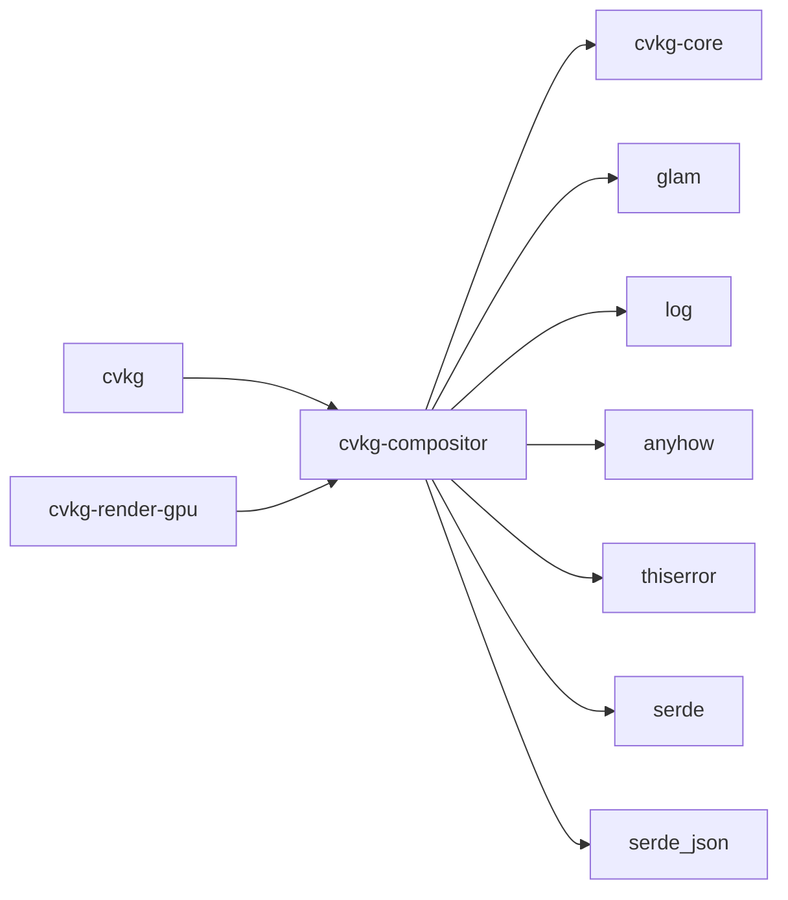

# cvkg-compositor

Retained-mode layer orchestration engine for the CVKG UI framework.

Sits between `cvkg-vdom` and `cvkg-render-gpu`. Organizes draw calls into GPU pass buckets, tracks damage to avoid re-recording static content, and maintains a retained `LayerTree` with Z-sorting and hierarchy.

## Boundaries

- **Input**: A `LayerTree` built by upstream consumers (e.g. `cvkg-vdom`).
- **Output**: `CommandBuckets` — three `Vec<RenderCommand>` segmented by material, consumed by `cvkg-render-gpu`.
- **Does not**: own the GPU device, compile shaders, or present frames. Does not parse DOM or handle input events.

## Dependency graph



`glam` is used with `serde` and `bytemuck` features for transform data.

## Public API overview

### Re-exports (crate root)

| Type | Source module |
|---|---|
| `CompositorEngine` | `engine` |
| `CommandBuckets` | `engine` |
| `DamageInfo` | `engine` |
| `RoutedDrawCommand` | `engine` |
| `RenderTemplate` | `template` |
| `TemplateError` | `template` |
| `DrawCommand` | `layer` |
| `Layer` | `layer` |
| `LayerId` | `layer` |
| `LayerTree` | `layer` |
| `Material` | `layer` |

### `engine` — `CompositorEngine`

| Method | Signature | Description |
|---|---|---|
| `new` | `fn new() -> Self` | Creates an empty engine. |
| `create_layer` | `fn create_layer(&mut self, layer: Layer) -> LayerId` | Inserts a layer, marks damage. |
| `remove_layer` | `fn remove_layer(&mut self, id: LayerId) -> Option<Layer>` | Removes a layer, marks damage. |
| `mark_dirty` | `fn mark_dirty(&mut self, id: LayerId)` | Flags a layer's content as changed. |
| `flatten_and_route` | `fn flatten_and_route(&mut self) -> CommandBuckets` | Depth-first tree traversal; routes draw calls into scene / glass / overlay buckets. |
| `needs_reflatten` | `fn needs_reflatten(&self) -> bool` | Returns `true` if the tree changed since last flatten (always `true` when `ShaderEffect` materials are active). |
| `damage_info` | `fn damage_info(&self) -> &DamageInfo` | Current frame's dirty layer IDs and rebuild flag. |
| `end_frame` | `fn end_frame(&mut self)` | Advances the generation counter. |
| `clear` | `fn clear(&mut self)` | Removes all layers and resets state. |
| `layer_tree` / `layer_tree_mut` | `fn layer_tree(&self) -> &LayerTree` | Access the retained tree. |

### `layer` — `LayerTree`, `Layer`, `Material`

`LayerTree` is a `HashMap<LayerId, Layer>` with a root list and per-layer generation stamps. Key methods: `allocate_id`, `insert_layer`, `remove_layer`, `get_layer`, `get_layer_mut`, `set_roots`, `mark_dirty`, `is_dirty`, `advance_generation`, `clear`.

`Material` enum variants:

| Variant | GPU pass | Notes |
|---|---|---|
| `Opaque` | Scene | Standard alpha compositing. |
| `Glass { blur_radius, depth_index }` | Glass | Samples Kawase blur pyramid. |
| `Overlay` | Foreground | Crisp text, icons, edge lighting. |
| `Multiply` – `Luminosity` (13 blend modes) | Scene | SVG 1.1 / CSS Compositing Level 1 blend modes. |
| `Isolated` | Scene (offscreen) | Renders to offscreen buffer, composites back. |
| `ShaderEffect { effect_name, params_json }` | Scene (offscreen) | Custom WGSL post-processing shader. |

### `template` — `RenderTemplate`

| Method | Description |
|---|---|
| `RenderTemplate::capture(&LayerTree) -> Self` | Snapshot the tree. |
| `save_to_file(&self, path) -> Result<(), TemplateError>` | Serialize to JSON. |
| `load_from_file(path) -> Result<Self, TemplateError>` | Deserialize from JSON. |
| `replay(&self) -> LayerTree` | Rebuild a `LayerTree` from the template. |

Template format version: `1`. Loading a newer version returns `TemplateError::VersionMismatch`.

## Usage example

```rust
use cvkg_compositor::{
    CompositorEngine, CommandBuckets, Layer, LayerId, LayerTree, Material,
    DrawCommand, RenderTemplate,
};

// Build a layer tree.
let mut engine = CompositorEngine::new();

let root = Layer {
    id: engine.layer_tree().allocate_id(),
    bounds: cvkg_core::Rect { x: 0.0, y: 0.0, width: 1920.0, height: 1080.0 },
    material: Material::Opaque,
    ..Default::default()
};
let root_id = engine.create_layer(root);

let glass = Layer {
    id: engine.layer_tree().allocate_id(),
    bounds: cvkg_core::Rect { x: 100.0, y: 100.0, width: 400.0, height: 300.0 },
    material: Material::Glass { blur_radius: 12.0, depth_index: 1 },
    ..Default::default()
};
engine.create_layer(glass);

engine.layer_tree_mut().set_roots(vec![root_id]);

// Flatten and route into GPU pass buckets.
let CommandBuckets {
    scene_commands,
    glass_commands,
    overlay_commands,
} = engine.flatten_and_route();

// Feed scene_commands, glass_commands, overlay_commands to cvkg-render-gpu.

// Optional: save a template for fast startup.
let template = RenderTemplate::capture(engine.layer_tree());
template.save_to_file(std::path::Path::new("ui-template.json")).unwrap();

engine.end_frame();
```

## Use cases

- **Glassmorphism UI**: Route `Glass` layers to the Material Composite pass for blur sampling.
- **Damage-limited redraw**: Call `needs_reflatten()` to skip flattening entirely when no layers changed and no shaders are active.
- **Template fast-startup**: Capture the tree on first launch, replay from JSON on subsequent launches to skip VDOM rebuild.
- **Offscreen effects**: Use `Material::Isolated` or `Material::ShaderEffect` for layers that need offscreen rendering (SVG isolation, custom post-processing).
- **SVG blend modes**: 13 CSS Compositing Level 1 blend modes are available as `Material` variants.

## Edge cases and limitations

- **Cyclic references**: Detected at runtime; the flatten step logs an error and skips the cycle.
- **Missing layer references**: `flatten_layer` logs a warning and skips layers not found in the tree.
- **Template fidelity**: `Isolated` and `ShaderEffect` materials are serialized as `Opaque` on capture. Replaying a template loses offscreen/shader state.
- **Template version**: Only forward-compatible within the same major version. Loading a template with a higher `version` field fails.
- **Reusable buffer**: `CompositorEngine` retains a `flatten_buffer` across frames to avoid per-frame allocation. The buffer is drained during `flatten_and_route`.
- **Z-ordering**: Children are processed in reverse order (back-to-front) for painter's algorithm. `draw_order` on `RoutedDrawCommand` defaults to `0` and is not currently assigned by the engine.
- **No WASM-specific dependencies**: The `Cargo.toml` has empty `cfg(wasm32)` dependency sections but no wasm-specific code paths in the current source.

## Build flags / features / env vars

`Cargo.toml` defines no `[features]` table and no optional dependencies. There are no feature flags or environment variables consumed by this crate at build time or runtime.
