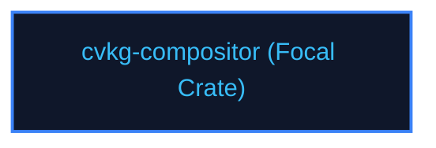

# cvkg-compositor

## Purpose
Groups and routes visual layers to multi-pass GPU drawing pipelines.

## Boundaries
- It does not parse raw vector icons or track keyboard focus arrays.
- It does not contain testing frameworks; quality checks are managed by `cvkg-test`.

## Dependency Graph


## Public API Overview
- `CompositorEngine` — Layer compositor logic.
- `LayerTree` — Z-sorted visually overlapping layer tree.

## Usage Example
```rust
use cvkg_compositor::CompositorEngine;
```

## Use Cases
- Mapped as a core component inside the standard framework dependency tree.

## Edge Cases and Limitations
- Under extreme scale or thread contention, ensure the host runtime balances cycles appropriately.

## Crate-Specific Build Flags
This crate has no custom feature flags or compile-time options. It compiles under standard cargo parameters.
