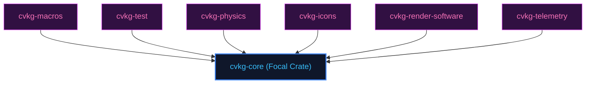

# cvkg-core

## Purpose
Defines fundamental traits, shared data structures, state management types, and layout primitives for CVKG.

## Boundaries
- It does not implement layout calculations or drawing operations; those are handled by cvkg-layout and render backends.
- It does not contain testing frameworks; quality checks are managed by `cvkg-test`.

## Dependency Graph


## Public API Overview
- `View` — Core view trait.
- `Renderer` — Drawing facade.
- `State` — Reactive state wrapper.

## Usage Example
```rust
use cvkg_core::prelude::*;
```

## Use Cases
- Mapped as a core component inside the standard framework dependency tree.

## Edge Cases and Limitations
- Under extreme scale or thread contention, ensure the host runtime balances cycles appropriately.

## Crate-Specific Build Flags
This crate has no custom feature flags or compile-time options. It compiles under standard cargo parameters.
