# cvkg-core

```mermaid
graph TD
    cvkg-core["cvkg-core"]
    cvkg-vdom["cvkg-vdom"]
    cvkg-scene["cvkg-scene"]
    cvkg-layout["cvkg-layout"]
    cvkg-render-gpu["cvkg-render-gpu"]
    cvkg-render-native["cvkg-render-native"]
    cvkg-compositor["cvkg-compositor"]
    cvkg-themes["cvkg-themes"]
    cvkg-anim["cvkg-anim"]
    cvkg-flow["cvkg-flow"]
    cvkg-runic-text["cvkg-runic-text"]
    cvkg-svg-filters["cvkg-svg-filters"]
    cvkg-svg-serialize["cvkg-svg-serialize"]
    cvkg-components["cvkg-components"]
    cvkg-macros["cvkg-macros"]
    cvkg-cli["cvkg-cli"]
    cvkg-webkit-server["cvkg-webkit-server"]
    cvkg-test["cvkg-test"]
    cvkg-physics["cvkg-physics"]
    cvkg["cvkg (umbrella)"]

    cvkg-vdom --> cvkg-core
    cvkg-vdom --> cvkg-scene
    cvkg-layout --> cvkg-core
    cvkg-layout --> cvkg-anim
    cvkg-scene --> cvkg-core

    cvkg-render-gpu --> cvkg-core
    cvkg-render-gpu --> cvkg-compositor
    cvkg-render-gpu --> cvkg-svg-filters
    cvkg-render-gpu --> cvkg-svg-serialize
    cvkg-render-gpu --> cvkg-runic-text

    cvkg-render-native --> cvkg-core
    cvkg-render-native --> cvkg-render-gpu
    cvkg-render-native --> cvkg-vdom
    cvkg-render-native --> cvkg-themes

    cvkg-compositor --> cvkg-core

    cvkg-themes --> cvkg-core
    cvkg-themes --> cvkg-anim
    cvkg-anim --> cvkg-core
    cvkg-flow --> cvkg-core
    cvkg-flow --> cvkg-scene
    cvkg-flow --> cvkg-themes

    cvkg-runic-text --> cvkg-core
    cvkg-svg-filters --> cvkg-core

    cvkg-components --> cvkg-core
    cvkg-components --> cvkg-vdom
    cvkg-components --> cvkg-layout
    cvkg-components --> cvkg-themes
    cvkg-components --> cvkg-anim
    cvkg-components --> cvkg-runic-text

    cvkg-macros --> cvkg-core
    cvkg-cli --> cvkg-core
    cvkg-cli --> cvkg-physics
    cvkg-cli --> cvkg-anim
    cvkg-cli --> cvkg-macros
    cvkg-webkit-server --> cvkg-cli
    cvkg-physics --> cvkg-core
    cvkg-physics --> cvkg-scene

    cvkg --> cvkg-core
    cvkg --> cvkg-vdom
    cvkg --> cvkg-scene
    cvkg --> cvkg-layout
    cvkg --> cvkg-themes
    cvkg --> cvkg-anim
    cvkg --> cvkg-macros
    cvkg --> cvkg-components
    cvkg --> cvkg-render-gpu
    cvkg --> cvkg-render-native
```



`cvkg-core` defines the fundamental traits, types, and architectural guidelines that power the entire Cyber Viking Kvasir Graph (CVKG) ecosystem.

## Boundaries and Responsibilities

This crate provides the abstract definitions for the UI system but does NOT implement specific rendering backends or complex layout algorithms. It focuses on:
- The `View` trait and its modifier-based composition system.
- Core geometric types (`Rect`, `Point`, `Size`).
- The `Renderer` trait facade.
- Agentic development protocols and knowledge state structures.

## Public API Overview

### Core Traits
- `View`: The primary building block. Every UI element implements `View`. It uses a declarative `body()` method for composition.
- `Renderer`: A trait defining the drawing operations available to primitive views, now supporting full 3x3 affine transformations (`push_affine`).
- `ViewModifier`: Enables the extension of view behavior and appearance via composition.

### Key Structs
- `Rect`, `Size`, `Point`: Fundamental geometry primitives.
- `KnowledgeState`: Captures the cognitive state of the agentic system, including thoughts, actions, and temporal nodes.
- `YggdrasilTokens`: Authoritative container for design tokens (colors, fonts, spacing).
- `ModifiedView`: The type produced when a modifier is applied to a `View`.

### Main Modifiers
- `.bifrost()`: Applies frosted glass effects.
- `.gungnir()`: Applies neon glow effects.
- `.mjolnir_slice()`: Applies geometric clipping.
- `.padding()`, `.background()`, `.frame()`: Standard layout and styling modifiers.

## Usage Example

```rust
use cvkg_core::prelude::*;

struct MyComponent;

impl View for MyComponent {
    type Body = impl View;
    
    fn body(self) -> Self::Body {
        Text::new("Skål!")
            .padding(20.0)
            .background([0.1, 0.1, 0.1, 1.0])
            .bifrost(10.0, 1.0, 0.5)
            .gungnir([0.0, 1.0, 1.0, 1.0], 5.0, 1.0)
    }
}
```

## Known Limitations
- Modifier order matters; transformations are applied sequentially.
- Recursive view bodies will cause a stack overflow at compile time or runtime if not type-erased.
