# cvkg-core

## Purpose

`cvkg-core` is the foundational crate of the CVKG (Cyber Viking Kvasir Graph) framework. It defines the core view system, rendering abstraction, reactive state primitives, layout engine, and type system that every other crate in the workspace depends on.

The crate provides:

- The `View` trait — the composable building block for all UI elements
- The `Renderer` trait — the abstract drawing backend interface
- `State<T>` and `Binding<T>` — reactive state management with STM-backed transactions
- `Color`, `Rect`, `Size`, `SizeProposal` — geometric and color primitives
- `KvasirId` — process-unique identity type shared across scene, VDOM, and flow crates
- `LayoutCache` and `LayoutView` — layout engine integration
- `AnyView`, `MemoView`, `ModifiedView<V, M>` — type erasure, memoization, and modifier composition

## Boundaries

`cvkg-core` contains **no platform code**, **no GPU calls**, and **no text shaping implementation**. It defines interfaces and data types only. Platform backends (native, GPU, software, WASM) live in downstream crates such as `cvkg-render-native`, `cvkg-render-gpu`, and `cvkg-render-software`.

The crate is split into these modules:

| Module | Contents |
|---|---|
| `asset` | `AssetKey`, `AssetState`, `TokenValue`, `DesignTokens` |
| `dependency` | `DependencyGraph`, `FrameBudgetTracker`, `SubsystemBudget`, `InputLatencyTracker` |
| `error_boundary` | `ComponentErrorState`, `ErrorBoundary` |
| `knowledge` | `AnnouncementPriority`, `KnowledgeFragment`, `KnowledgeId`, `AppState`, `MemoryLayer`, `UiFidelityLevel`, `TemporalEdge`, `TemporalNode` |
| `renderer` | Sub-traits: `RendererCore`, `RendererShapes`, `Renderer3D`, `RendererText`, `RendererImages`, `RendererEffects`, `RendererClipping`, `RendererTransforms`, `RendererOpacity`, `RendererBerserker`, `RendererCyberpunk`, `RendererCompute`, `RendererVolumetric`, `RendererAccessibility`, `RendererTelemetry`, `RendererVDOM`, `RendererZIndex`, `RendererLayoutDebug`, `RendererPointer`, `RendererMaterial`, `RendererDataViz`, `RendererVectorGraphics`, `RendererExport` |
| `undo` | `UndoGroup`, `UndoManager` |
| `virtual_list` | Virtualized list view support |
| `window` | `Window`, `WindowCloseAction`, `WindowConfig`, `WindowHandle`, `WindowId`, `WindowLevel` |

Re-exports from `future_views`: `HologramView`, `ParticleEmitter`, `StreamingText`.

## Dependency graph

```mermaid
graph TD
    cvkg_core[cvkg-core]
    cvkg_runic_text[cvkg-runic-text]
    glam[glam]
    serde[serde]
    serde_json[serde_json]
    tokio[tokio]
    arc_swap[arc-swap]
    bytemuck[bytemuck]
    log[log]
    once_cell[once_cell]
    stl_io[stl_io]
    tobj[tobj]
    thiserror[thiserror]
    anyhow[anyhow]
    stm[stm\n<!-- native only -->]
    rfd[rfd\n<!-- native only -->]
    wasm_bindgen[wasm-bindgen\n<!-- wasm32 only -->]
    wasm_bindgen_futures[wasm-bindgen-futures\n<!-- wasm32 only -->]
    js_sys[js-sys\n<!-- wasm32 only -->]
    getrandom[getrandom\n<!-- wasm32 only -->]

    cvkg_core --> cvkg_runic_text
    cvkg_core --> glam
    cvkg_core --> serde
    cvkg_core --> serde_json
    cvkg_core --> tokio
    cvkg_core --> arc_swap
    cvkg_core --> bytemuck
    cvkg_core --> log
    cvkg_core --> once_cell
    cvkg_core --> stl_io
    cvkg_core --> tobj
    cvkg_core --> thiserror
    cvkg_core --> anyhow
    cvkg_core --> stm
    cvkg_core --> rfd
    cvkg_core --> wasm_bindgen
    cvkg_core --> wasm_bindgen_futures
    cvkg_core --> js_sys
    cvkg_core --> getrandom
```



Reverse dependents (crates that depend on `cvkg-core`): `cvkg`, `cvkg-scene`, `cvkg-layout`, `cvkg-anim`, `cvkg-render-native`, `cvkg-render-gpu`, `cvkg-render-software`, `cvkg-telemetry`, `cvkg-compositor`, `cvkg-cli`, `cvkg-svg-serialize`, `cvkg-svg-filters`, `cvkg-webkit-server`, `cvkg-components`, `cvkg-icons`, `cvkg-themes`, `cvkg-macros`, `cvkg-runic-text` (dev), `cvkg-test`, `cvkg-physics`, `cvkg-flow`, `cvkg-scheduler`, `cvkg-spatial`, `cvkg-reflect`, `cvkg-materials`, `cvkg-accessibility`, `cvkg-certification`, `cvkg-gallery`, `cvkg-game-hud`, `cvkg-export-raster`, and all demo crates.

## Public API overview

### Core traits

**`View`** — the composable UI building block. Every view has a `Body` type, a `body()` method, and a `render()` method. Primitive views use `Never` as `Body` and register paint commands directly. The trait provides default modifier methods (`background`, `padding`, `opacity`, `frame`, `flex`, `border`, `elevation`, `on_click`, etc.) that wrap `self` in `ModifiedView<Self, M>`.

```rust
pub trait View: Sized + Send {
    type Body: View;
    fn body(self) -> Self::Body;
    fn render(&self, renderer: &mut dyn Renderer, rect: Rect);
    fn intrinsic_size(&self, renderer: &mut dyn Renderer, proposal: SizeProposal) -> Size;
    fn layout(&self) -> Option<&dyn layout::LayoutView>;
    fn flex_weight(&self) -> f32;
    fn get_grid_placement(&self) -> Option<GridPlacement>;
    fn modifier<M: ViewModifier>(self, m: M) -> ModifiedView<Self, M>;
    fn erase(self) -> AnyView where Self: Clone + 'static;
    fn changed(&self) -> bool;
    fn view_id(&self) -> Option<u64>;
    // + modifier convenience methods: background, padding, opacity, frame,
    //   flex, grid_placement, overlay, safe_area_padding, ignores_safe_area,
    //   clip_to_bounds, border, elevation, position, z_index, magnetic,
    //   mani_glow, memory_layer, fafnir_evolve, mimir_intent, kvasir_vibes,
    //   odins_eye, on_appear, on_disappear, on_click, on_pointer_enter,
    //   on_pointer_leave, on_pointer_move, on_pointer_down, on_pointer_up,
    //   bifrost, bifrost_full, gungnir, mjolnir_slice, mjolnir_shatter,
    //   bifrost_bridge, foreground_color
}
```

**`Renderer`** — the abstract rendering backend. Requires `ElapsedTime + Send`. Provides methods for filled/stroked shapes, text, images, glass materials, squircles, focus rings, 3D cubes, and polygons. Default implementations are provided for most methods; backends override the ones they support.

```rust
pub trait Renderer: ElapsedTime + Send {
    fn request_redraw(&mut self);
    fn is_over_budget(&self) -> bool;
    fn fill_rect(&mut self, rect: Rect, color: [f32; 4]);
    fn fill_rounded_rect(&mut self, rect: Rect, radius: f32, color: [f32; 4]);
    fn fill_ellipse(&mut self, rect: Rect, color: [f32; 4]);
    fn fill_glass_rect(&mut self, rect: Rect, radius: f32, blur_radius: f32);
    fn fill_squircle(&mut self, rect: Rect, n: f32, color: [f32; 4]);
    fn stroke_squircle(&mut self, rect: Rect, n: f32, color: [f32; 4], stroke_width: f32);
    fn draw_focus_ring(&mut self, rect: Rect, radius: f32, offset: f32, width: f32, color: [f32; 4]);
    fn draw_3d_cube(&mut self, rect: Rect, color: [f32; 4], rotation: [f32; 3]);
    fn stroke_rect(&mut self, rect: Rect, color: [f32; 4], stroke_width: f32);
    fn stroke_rounded_rect(&mut self, rect: Rect, radius: f32, color: [f32; 4], stroke_width: f32);
    fn stroke_ellipse(&mut self, rect: Rect, color: [f32; 4], stroke_width: f32);
    fn draw_line(&mut self, x1: f32, y1: f32, x2: f32, y2: f32, color: [f32; 4], stroke_width: f32);
    fn fill_polygon(&mut self, vertices: &[[f32; 2]], color: [f32; 4]);
    fn stroke_polygon(&mut self, vertices: &[[f32; 2]], color: [f32; 4], stroke_width: f32);
    fn draw_text(&mut self, text: &str, x: f32, y: f32, size: f32, color: [f32; 4]);
    fn draw_text_centered(&mut self, text: &str, rect: Rect, size: f32, color: [f32; 4]);
    fn measure_text(&mut self, text: &str, size: f32) -> (f32, f32);
    fn measure_text_baseline(&mut self, text: &str, size: f32) -> f32;
    fn text_scale_factor(&self) -> f32;
    fn draw_image(&mut self, image_name: &str, rect: Rect);
    fn draw_background_image(&mut self, image_name: &str, rect: Rect);
    fn push_vnode(&mut self, rect: Rect, name: &'static str);
    fn pop_vnode(&mut self);
    fn memoize(&mut self, id: u64, data_hash: u64, render_fn: &dyn Fn(&mut dyn Renderer));
    fn register_shared_element(&mut self, id: &str, rect: Rect);
    fn bifrost(&mut self, rect: Rect, blur: f32, saturation: f32, opacity: f32);
    fn push_mjolnir_slice(&mut self, angle: f32, offset: f32);
    fn pop_mjolnir_slice(&mut self);
    fn gungnir(&mut self, rect: Rect, color: [f32; 4], radius: f32, intensity: f32);
    fn mani_glow(&mut self, rect: Rect, color: [f32; 4], radius: f32);
}
```

**`ViewModifier`** — the modifier protocol. Each modifier wraps a `View` into a `ModifiedView<V, M>` and can intercept rendering, layout proposals, and size transformations.

```rust
pub trait ViewModifier: Send + Clone {
    fn modify<V: View>(self, content: V) -> impl View;
    fn get_grid_placement(&self) -> Option<GridPlacement>;
    fn render(&self, renderer: &mut dyn Renderer, rect: Rect);
    fn post_render(&self, renderer: &mut dyn Renderer, rect: Rect);
    fn render_view<V: View>(&self, view: &V, renderer: &mut dyn Renderer, rect: Rect);
    fn transform_rect(&self, rect: Rect) -> Rect;
    fn transform_proposal(&self, proposal: SizeProposal) -> SizeProposal;
    fn transform_size(&self, size: Size) -> Size;
    fn measure_view<V: View>(&self, view: &V, renderer: &mut dyn Renderer, proposal: SizeProposal) -> Size;
    fn child_flex_weight<V: View>(&self, view: &V) -> f32;
    fn layout(&self) -> Option<&dyn layout::LayoutView>;
}
```

**`LayoutView`** — for views that participate in the layout engine.

```rust
pub trait LayoutView: Send {
    fn size_that_fits(&self, proposal: SizeProposal, subviews: &[&dyn LayoutView], cache: &mut LayoutCache) -> Size;
    fn place_subviews(&self, bounds: Rect, subviews: &mut [&mut dyn LayoutView], cache: &mut LayoutCache);
    fn flex_weight(&self) -> f32;
    fn view_hash(&self) -> u64;
    fn changed(&self) -> bool;
    fn debug_layout(&self, indent: usize) -> String;
}
```

### Key types

| Type | Description |
|---|---|
| `State<T>` | Reactive state container. Uses `ArcSwap<T>` for lock-free reads and `stm::TVar<T>` (native only) for atomic multi-field transactions. Supports conflict resolution, subscriber notifications, and batched updates. |
| `Binding<T>` | Read/write handle derived from `State<T>`. Does not own subscribers. Created via `Binding::from_state(&state)`. |
| `Color` | RGBA color with components in `[0.0, 1.0]`. Provides named constants (`BLACK`, `WHITE`, `RED`, `VIKING_GOLD`, `TACTICAL_OBSIDIAN`, etc.), `from_hex`, `lighten`, `darken`, `relative_luminance`, and `contrast_ratio` (WCAG 2.x). Implements `View` (fills a rect). |
| `Rect` | Axis-aligned rectangle with `x`, `y`, `width`, `height`. Methods: `new`, `inset`, `offset`, `zero`, `contains`, `intersects`, `size`, `split_horizontal`, `split_vertical`. |
| `Size` | Two-dimensional size with `width` and `height`. Constant `ZERO`. |
| `SizeProposal` | Optional width/height proposal from a parent view during layout. |
| `KvasirId` | Process-unique identifier (`pub struct KvasirId(pub u64)`). Allocated via `KvasirId::new()` (atomic increment). Sentinel `KvasirId::NULL` (0). Used as `NodeId` across `cvkg-scene`, `cvkg-vdom`, and `cvkg-flow`. |
| `LayoutCache` | Per-frame layout context. Contains safe area insets, delta time, scale factor, viewport, time budget, size cache, parent map, generation counter, and previous rects for transitions. |
| `AnyView` | Type-erased `View` wrapper. Requires `V: View + Clone + 'static`. Created via `view.erase()` or `AnyView::new(view)`. |
| `MemoView<V, F>` | Memoizing view wrapper. Skips re-rendering when `data_hash` is unchanged. |
| `ModifiedView<V, M>` | A `View` wrapped by a `ViewModifier`. |
| `Never` | Uninhabitable enum (`pub enum Never {}`). Used as `Body` for primitive views. |
| `EmptyView` | A view that renders nothing and has zero intrinsic size. |
| `GridPlacement` | Grid cell assignment: `column`, `column_span`, `row`, `row_span`. |
| `Alignment` | Cross-axis alignment: `Center`, `Leading`, `Trailing`, `Top`, `Bottom`. |
| `Distribution` | Main-axis distribution: `Fill`, `Center`, `Leading`, `Trailing`, `SpaceBetween`, `SpaceAround`, `SpaceEvenly`. |
| `EdgeInsets` | Padding/margin insets: `top`, `leading`, `bottom`, `trailing`. |
| `SafeArea` | Platform safe area insets. |
| `AriaRole` | WCAG 2.1 semantic role enum (52 variants). |
| `AriaProperties` | Accessibility metadata: role, label, description, value, pressed, checked, expanded, disabled, hidden, level, shortcut, focused, live, atomic. |
| `FocusableId` | Opaque focus target identifier. |
| `FocusManager` | Tab-order management with focus trap support. |
| `KeyModifiers` | Keyboard modifier flags: `shift`, `ctrl`, `alt`, `meta`. |
| `KeyShortcut` | Keyboard shortcut binding with description. |
| `DesignTokens` | Yggdrasil design token tree. |
| `AssetKey`, `AssetState` | Asset loading key and state. |
| `ErrorBoundary`, `ComponentErrorState` | Error boundary for view subtrees. |
| `UndoManager`, `UndoGroup` | Undo/redo stack. |
| `Window`, `WindowConfig`, `WindowHandle`, `WindowId`, `WindowLevel`, `WindowCloseAction` | Window management types. |

### Renderer sub-traits

The `Renderer` trait aggregates all rendering capabilities. The `renderer/` module splits these into fine-grained sub-traits so consumer code can depend on only the slice it needs:

| Sub-trait | Capability |
|---|---|
| `RendererCore` | `request_redraw`, `is_over_budget` |
| `RendererShapes` | 2D filled/stroked primitives |
| `Renderer3D` | Cubes, meshes |
| `RendererText` | Text drawing, measurement, shaping |
| `RendererTextExt` | `draw_text_centered` (blanket impl) |
| `RendererImages` | Textures, image loading, VRAM prewarm |
| `RendererDataViz` | Heatmaps, data textures |
| `RendererVectorGraphics` | SVG loading and drawing |
| `RendererEffects` | Gradients, shadows, 9-slice, dashed strokes |
| `RendererClipping` | Clip-rect stack |
| `RendererTransforms` | 2D affine transform stack |
| `RendererOpacity` | Opacity stack |
| `RendererBerserker` | Theme, rage, shatter, scene presets |
| `RendererExport` | PNG capture, print |
| `RendererCyberpunk` | Bifrost, Gungnir, Mani, Mjolnir, memoize |
| `RendererCompute` | GPU particle dispatch |
| `RendererVolumetric` | Holograms, raymarching |
| `RendererAccessibility` | ARIA, shared elements, keys |
| `RendererTelemetry` | Frame budget / performance data |
| `RendererVDOM` | Virtual-DOM node tracking, handler registration |
| `RendererZIndex` | Depth ordering |
| `RendererLayoutDebug` | Layout query / visualization |
| `RendererPointer` | Mouse / touch position query |
| `RendererMaterial` | Draw call routing for multi-pass pipeline |

## Usage example

```rust
use cvkg_core::{
    View, Renderer, Rect, Color, State, Binding,
    layout::{LayoutView, LayoutCache, SizeProposal},
};

// Define a simple view
struct CounterView {
    count: Binding<i32>,
}

impl View for CounterView {
    type Body = cvkg_core::Never;

    fn body(self) -> Self::Body {
        unreachable!()
    }

    fn render(&self, renderer: &mut dyn Renderer, rect: Rect) {
        // Background
        renderer.fill_rect(rect, [0.05, 0.05, 0.07, 1.0]);

        // Text
        let count = self.count.get();
        let text = format!("Count: {}", count);
        renderer.draw_text(&text, rect.x + 16.0, rect.y + 24.0, 16.0, [1.0, 1.0, 1.0, 1.0]);
    }

    fn intrinsic_size(&self, _renderer: &mut dyn Renderer, _proposal: SizeProposal) -> cvkg_core::Size {
        cvkg_core::Size::new(200.0, 48.0)
    }
}

// Create reactive state
let state = State::new(0i32);
let binding = Binding::from_state(&state);

// Build the view with modifiers
let view = CounterView {
    count: binding,
}
.background([0.1, 0.1, 0.15, 1.0])
.padding(16.0)
.on_click(|| {
    // state.set(state.get() + 1);
});

// Type-erase when needed
let erased = view.erase();
```

## Use cases

- **Declarative UI composition** — Build view trees using the `View` trait and modifier chain. Every UI element from a text label to a navigation controller is a `View`.
- **Cross-platform rendering** — Implement `Renderer` once per backend (native, GPU, software, WASM). The trait provides default no-op implementations for most methods so backends only override what they support.
- **Reactive state management** — Use `State<T>` for shared mutable state with lock-free reads, STM-backed multi-field transactions (native), conflict resolution, and subscriber notifications.
- **Type erasure** — Use `AnyView` (via `view.erase()`) when you need to store heterogeneous views in a collection or pass them across API boundaries.
- **Memoization** — Wrap expensive subtrees in `MemoView::new(id, data_hash, || view)` to skip re-rendering when data hasn't changed.
- **Accessibility** — Implement `aria_properties()` on your views and use `FocusManager` for keyboard navigation. The `AriaRole` enum covers all WCAG 2.1 roles.
- **Layout** — Implement `LayoutView` for custom layout containers. Use `LayoutCache` for caching, budget enforcement, and transition tracking.
- **Shared element transitions** — Use `bifrost_bridge(id)` modifier to mark views that should animate geometry across view hierarchy changes.

## Edge cases and limitations

- **`Never` is uninhabitable** — Primitive views use `Never` as their `Body` type. Calling `body()` on them is `unreachable!()`. This is a compile-time guarantee enforced by the type system, not a runtime check.
- **`State<T>` requires `T: Clone + Send + Sync + 'static`** — The `Clone` bound is needed because `get()` returns a fresh copy. The `'static` bound is required for subscriber storage.
- **STM transactions are native-only** — On `wasm32`, `State::set()` and `State::mutate()` fall back to `ArcSwap`-only updates without atomic multi-field coordination. `transact_pair` is not available on WASM.
- **`Binding<T>` does not own subscribers** — It is a lightweight handle derived from `State<T>`. Subscribers are attached to the `State`, not the `Binding`.
- **`AnyView` requires `Clone`** — Type erasure via `erase()` requires `Self: Clone + 'static` because `ErasedView::clone_box` needs to clone the inner value.
- **`View` types must be `Send` but not `Sync`** — This enables safe multi-threaded layout passes but means views cannot be shared between threads via `&dyn View`.
- **`changed()` defaults to `true`** — For backward compatibility, `View::changed()` and `LayoutView::changed()` return `true` by default. Override to return `false` for static subtrees to enable incremental skip in the VDOM and layout engine.
- **`view_id()` defaults to `None`** — Anonymous views return `None`. Return `Some(id)` for stable identity across VDOM rebuilds, enabling handler survival and incremental patch generation.
- **Renderer default implementations are no-ops or fallbacks** — Most `Renderer` methods have default implementations (e.g., `fill_squircle` falls back to `fill_rounded_rect`). Backends must override methods to get correct behavior.
- **No feature flags** — `cvkg-core` has no Cargo features. All functionality is always enabled.
- **No environment variables** — The crate reads no environment variables at build time or runtime.

## Build flags / features / env vars

`cvkg-core` defines **no Cargo features** and reads **no environment variables**. The crate is always built with its full API surface.

Platform-specific dependencies are handled via standard Cargo target filters:

- `cfg(not(target_arch = "wasm32"))` — `stm` (software transactional memory), `rfd` (native file dialogs)
- `cfg(target_arch = "wasm32")` — `wasm-bindgen`, `wasm-bindgen-futures`, `js-sys`, `getrandom` (with `wasm_js` feature)
