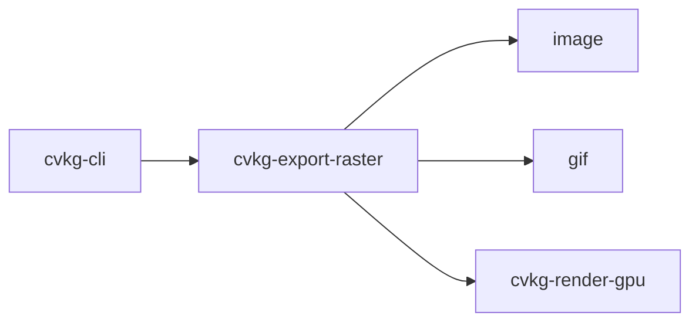

# cvkg-export-raster

## Purpose

Encode GPU-rendered frames into PNG and animated GIF byte buffers. The crate accepts raw RGBA8 frame data and produces format-encoded output suitable for writing to disk or serving over a network.

## Boundaries

This crate only handles raster encoding. It does not:

- Interact with the GPU or schedule rendering commands.
- Perform color-space conversion, resizing, or format conversion beyond what the `image` and `gif` crates provide.
- Decode images.

It consumes frames produced by `cvkg-render-gpu` (or any source that can supply `CapturedFrame` data) and emits `Vec<u8>` containing the encoded image.

## Dependency graph



## Public API overview

| Symbol | Kind | Signature | Description |
|---|---|---|---|
| `CapturedFrame` | struct | `{ width: u32, height: u32, rgba: Vec<u8> }` | A single frame in RGBA8, tightly packed (`len == width * height * 4`). |
| `encode_png` | fn | `(&CapturedFrame) -> Result<Vec<u8>, String>` | Encode one frame as PNG. |
| `encode_gif` | fn | `(&[CapturedFrame], fps: u16) -> Result<Vec<u8>, String>` | Encode a frame sequence as an animated GIF. |

## Usage example

```rust
use cvkg_export_raster::{CapturedFrame, encode_png, encode_gif};

let frame = CapturedFrame {
    width: 800,
    height: 600,
    rgba: vec![0u8; 800 * 600 * 4],
};

// Single PNG
let png_bytes = encode_png(&frame).expect("encode failed");
std::fs::write("output.png", &png_bytes).unwrap();

// Animated GIF (30 fps)
let frames = vec![frame.clone(); 60];
let gif_bytes = encode_gif(&frames, 30).expect("encode failed");
std::fs::write("output.gif", &gif_bytes).unwrap();
```

## Use cases

- Exporting still-rendered scenes from a GPU pipeline to PNG files.
- Recording animation sequences from a real-time renderer as animated GIFs.
- Generating raster thumbnails or previews of GPU-rendered content.
- Integration by `cvkg-cli` for user-facing export commands.

## Edge cases and limitations

- `encode_png` returns `Err` when `frame.rgba.len() != frame.width * frame.height * 4`.
- `encode_gif` returns `Err` when the frame slice is empty.
- `encode_gif` clamps `fps` to a minimum of 1 to avoid division-by-zero when computing frame delay.
- All frames in `encode_gif` are expected to share the same dimensions; mismatched sizes may produce corrupted GIF output since only the first frame's dimensions configure the GIF encoder (width and height are `u16`, so dimensions above 65535 px are rejected by the `gif` crate).
- No interlacing, color quantization beyond the default speed setting, or custom palette support is exposed.
- Error messages are plain `String`, not a typed error enum.

## Build flags / features / environment variables

This crate has no Cargo features, no required build flags, and reads no environment variables at build time or runtime.
