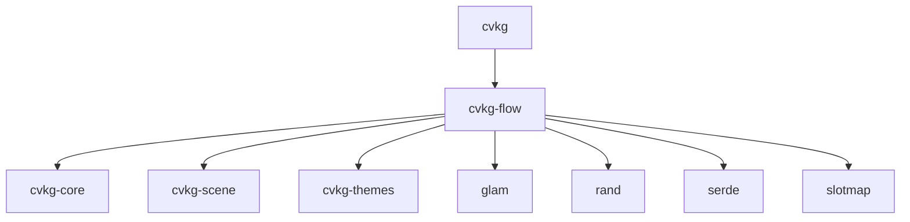

# cvkg-flow

## Purpose

Interactive node graph editing for the CVKG framework. Provides canvas rendering, node/port/edge management, spline-based edge routing, force-directed layout, ribbon tessellation, and pointer/keyboard interaction handling.

## Boundaries

cvkg-flow owns the graph data model and its visual representation. It does not own the application shell, windowing, or rendering backend — those are provided by `cvkg-scene` and the consumer crate (`cvkg`). It does not handle persistence, networking, or agent logic.

## Dependency graph



## Public API overview

### Modules

| Module | Responsibility |
|---|---|
| `canvas` | Camera and canvas transform state |
| `edge` | Edge data, spline easing, edge interaction |
| `graph` | `FlowGraph` — the top-level graph container |
| `interaction` | Pointer, keyboard, and selection handling |
| `layout` | Force-directed layout algorithm |
| `node` | Node data, glass material, shadow, color types |
| `port` | Port definitions on nodes |
| `ribbon` | Ribbon batching and Bézier tessellation |
| `types` | Shared type definitions |

### Re-exports

| Symbol | Source module |
|---|---|
| `Camera` | `canvas` |
| `FlowCanvas` | `canvas` |
| `FlowEdge` | `edge` |
| `SplineEasing` | `edge` |
| `FlowGraph` | `graph` |
| `apply_force_directed_layout` | `layout` |
| `FlowNode` | `node` |
| `GlassNodeMaterial` | `node` |
| `NodeShadow` | `node` |
| `OklchColor` | `node` |
| `RibbonBatch` | `ribbon` |
| `RibbonVertex` | `ribbon` |
| `build_ribbon_batch` | `ribbon` |
| `tessellate_bezier` | `ribbon` |

## Usage example

```rust
use cvkg_flow::{
    Camera, FlowCanvas, FlowGraph, FlowNode, FlowEdge, SplineEasing,
    OklchColor, GlassNodeMaterial, apply_force_directed_layout,
};

// Create a graph and add nodes
let mut graph = FlowGraph::new();
let a = graph.add_node(FlowNode {
    position: glam::vec2(0.0, 0.0),
    color: OklchColor::new(0.7, 0.12, 260.0),
    material: GlassNodeMaterial::default(),
    ..Default::default()
});
let b = graph.add_node(FlowNode {
    position: glam::vec2(300.0, 100.0),
    color: OklchColor::new(0.7, 0.12, 140.0),
    material: GlassNodeMaterial::default(),
    ..Default::default()
});

// Connect with a spline edge
graph.add_edge(FlowEdge {
    source: a,
    target: b,
    easing: SplineEasing::default(),
    ..Default::default()
});

// Run force-directed layout
apply_force_directed_layout(&mut graph, 100);

// Set up the canvas camera
let camera = Camera::default();
let canvas = FlowCanvas::new(camera);
```

## Use cases

- Visual programming interfaces
- Dataflow / pipeline editors
- State machine designers
- Mind-map tools
- Any application requiring interactive node-link diagrams with spline edges

## Edge cases and limitations

- Force-directed layout is CPU-based and synchronous; graphs with thousands of nodes will block the calling thread.
- Spline edge routing uses cubic Bézier curves; very dense edge counts may require manual port placement to avoid overlap.
- `OklchColor` is the only supported node color space; consumers must convert from sRGB or other spaces before construction.
- `slotmap` keys (`KvasirId`) are not stable across serialization by default — `serde` support depends on the `cvkg-core` feature configuration.
- Ribbon tessellation (`tessellate_bezier`) produces a flat vertex list; the consumer is responsible for uploading to the GPU.

## Build flags / features / env vars

This crate has no custom Cargo features or environment variables. All dependencies are enabled unconditionally:

- `glam/serde` — vector types with serde serialization
- `serde/derive` — derive macros for `Serialize` / `Deserialize`

To build examples:

```bash
cargo run -p cvkg-flow --example basic_flow
cargo run -p cvkg-flow --example bezier_edges
cargo run -p cvkg-flow --example interaction_demo
cargo run -p cvkg-flow --example minimap_demo
cargo run -p cvkg-flow --example styled_nodes
```

To run tests:

```bash
cargo test -p cvkg-flow
```
