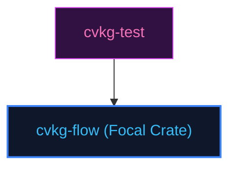

# cvkg-flow

## Purpose
Canvas grid node-graph drawing engine and visual flow charts.

## Boundaries
- It does not execute core application controller state logic.
- It does not contain testing frameworks; quality checks are managed by `cvkg-test`.

## Dependency Graph


## Public API Overview
- `FlowCanvas` — Node-graph editor workspace.

## Usage Example
```rust
use cvkg_flow::FlowCanvas;
```

## Use Cases
- Mapped as a core component inside the standard framework dependency tree.

## Edge Cases and Limitations
- Under extreme scale or thread contention, ensure the host runtime balances cycles appropriately.

## Crate-Specific Build Flags
This crate has no custom feature flags or compile-time options. It compiles under standard cargo parameters.
