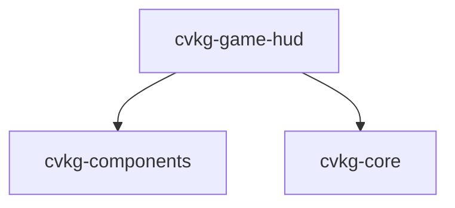

# cvkg-game-hud

## Purpose

Game-specific HUD components for CVKG. Provides `HealthBar`, `ManaBar`, `CooldownIndicator`, `DamageNumber`, and `Minimap` — each a thin composition of existing primitives (`Progress`, `Text`, `ZStack`) from `cvkg-components` and `cvkg-core`.

## Boundaries

This crate contains only HUD-level view components. It does not handle input, game logic, layout, or asset loading. It depends on `cvkg-components` and `cvkg-core` and is not depended on by any other workspace crate.

## Dependency graph



## Public API overview

| Type | Constructor | Builder methods | Description |
|------|-------------|-----------------|-------------|
| `HealthBar` | `new(current: f32, max: f32)` | `height(f32)`, `colors(Color, Color, Color)` | Segmented bar with color thresholds (>50% green, >25% yellow, ≤25% red) |
| `ManaBar` | `new(current: f32, max: f32)` | `height(f32)` | Blue progress bar |
| `CooldownIndicator` | `new(remaining: f32, total: f32)` | `size(f32)` | Circular overlay whose opacity scales with remaining time |
| `DamageNumber` | `new(value: u32)` | `color(Color)`, `heal()` | Renders a numeric value as colored text; `heal()` switches to green |
| `Minimap` | `new()` | `size(f32)` | Rounded-rect placeholder with dark fill and border |

All types implement `View<Body = Never>` from `cvkg-core`.

## Usage example

```rust
use cvkg_core::{Color, Rect, Renderer, View};
use cvkg_game_hud::{HealthBar, ManaBar, CooldownIndicator, DamageNumber, Minimap};

let health = HealthBar::new(75.0, 100.0).height(14.0);
let mana = ManaBar::new(40.0, 80.0);
let cooldown = CooldownIndicator::new(2.5, 5.0).size(48.0);
let damage = DamageNumber::new(42);
let heal = DamageNumber::new(15).heal();
let minimap = Minimap::new().size(150.0);

// In a render pass:
// health.render(renderer, Rect { x: 10.0, y: 10.0, width: 200.0, height: 14.0 });
```

## Use cases

- Real-time health/mana display in action RPGs or MOBAs
- Ability cooldown overlays on skill buttons
- Floating combat text for damage and healing
- Minimap frame in strategy or adventure games

## Edge cases and limitations

- `HealthBar` and `ManaBar` clamp the fill ratio to `[0.0, 1.0]`; negative or overflow values are not rendered beyond the bar bounds.
- `CooldownIndicator` opacity reaches zero when `remaining` is 0; the element becomes invisible rather than disappearing from the view tree.
- `DamageNumber` has no built-in animation or lifetime management; the caller must handle fade-out and repositioning.
- `Minimap` is a static placeholder — it renders a blank rounded rectangle with no map data, entities, or camera viewport.
- All components use fixed colors except `HealthBar` (configurable via `colors()`) and `DamageNumber` (configurable via `color()` / `heal()`).

## Build flags / features / env vars

None. This crate has no Cargo features and no environment-variable configuration.
