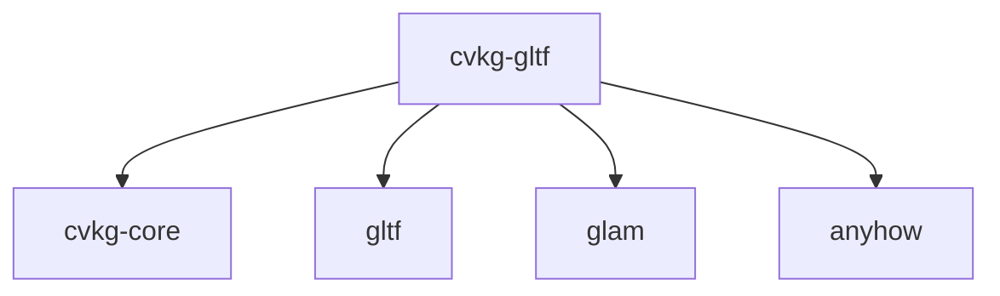

# cvkg-gltf

glTF 2.0 asset loader for CVKG — converts glTF scenes to CVKG `Mesh`, `Material3D`, `Transform3D`, and `Camera3D`.

## Purpose

Loads `.glb` and `.gltf` files and converts them into CVKG's native 3D types. Uses the `gltf` crate for parsing and maps glTF concepts (meshes, materials, nodes, cameras) to CVKG equivalents.

## Boundaries

This crate does NOT:
- Render anything (no GPU code, no wgpu dependency)
- Perform frustum culling or shadow mapping (those are in `cvkg-render-3d`)
- Define the 3D transform hierarchy (that's `cvkg-render-3d-hierarchy`)
- Handle animation playback (skeletal animation data is loaded but not played back)

It ONLY parses glTF and produces plain Rust structs.

## Dependency graph



## Public API overview

### Types

- `Scene3D` — Top-level loaded scene
  - `nodes: Vec<Node3D>` — Flattened node hierarchy
  - `meshes: Vec<LoadedMesh>` — Mesh data with vertex attributes
  - `textures: Vec<LoadedTexture>` — Image data and sampler info
  - `materials: Vec<Material3D>` — CVKG PBR materials
  - `cameras: Vec<Camera3D>` — Perspective/orthographic cameras

- `Node3D` — Scene graph node
  - `name: String`
  - `transform: Transform3D` — Local transform (from `cvkg_core`)
  - `mesh: Option<usize>` — Index into `meshes`
  - `material: Option<usize>` — Index into `materials`
  - `camera: Option<usize>` — Index into `cameras`
  - `children: Vec<usize>` — Indices into `nodes`
  - `skin: Option<usize>` — Skeleton index (if skinned)

- `LoadedMesh` — GPU-ready mesh data
  - `primitives: Vec<MeshPrimitive>` — Each with attributes, indices, material index
  - `bounds: AABB` — Axis-aligned bounding box

- `LoadedTexture` — Image data
  - `data: Vec<u8>` — Raw pixel data (RGBA8, sRGB)
  - `width: u32`, `height: u32`
  - `format: TextureFormat` — Enum: `R8`, `RG8`, `RGBA8`, `sRGB`

- `MeshPrimitive` — Single draw call
  - `attributes: MeshAttributes` — Position, normal, tangent, texcoord, color, joints, weights
  - `indices: Option<Vec<u32>>`
  - `material: Option<usize>`

### Functions

- `load_gltf(path: &str) -> Result<Scene3D, anyhow::Error>` — Load from file (`.gltf` or `.glb`)

## Usage example

```rust
use cvkg_gltf::load_gltf;

let scene = load_gltf("assets/scene.glb")
    .expect("Failed to load glTF file");

for node in &scene.nodes {
    println!("Node: {} (mesh: {:?}, material: {:?})", node.name, node.mesh, node.material);
    if let Some(mesh_idx) = node.mesh {
        let mesh = &scene.meshes[mesh_idx];
        println!("  {} primitives, bounds: {:?}", mesh.primitives.len(), mesh.bounds);
    }
}

// Convert to cvkg-render-3d types for rendering
for mesh in &scene.meshes {
    for prim in &mesh.primitives {
        // prim.attributes -> cvkg_core::Mesh
        // scene.materials[prim.material.unwrap()] -> cvkg_core::Material3D
    }
}
```

## Use cases

- Loading 3D assets authored in Blender, Maya, or other DCC tools
- Converting glTF PBR materials (metallic/roughness) to CVKG `Material3D`
- Importing scene hierarchy for `cvkg-render-3d-hierarchy`
- Loading cameras for view setup

## Edge cases and limitations

- **No skeletal animation playback** — Joint matrices and weights are loaded but not animated
- **No morph targets** — glTF morph targets are ignored
- **Texture formats** — Only loads base color, normal, metallic-roughness, occlusion, emissive maps. Other channels ignored.
- **No Draco compression support** — Requires uncompressed glTF/GLB
- **No KHR_lights_punctual** — Light data not yet mapped to `cvkg-render-3d::Light`
- **Material conversion** — glTF specular/glossiness workflow not supported (only metallic/roughness)
- **Large files** — Entire file loaded into memory; no streaming

## Build flags / features

No Cargo features. All dependencies mandatory.

- `gltf` = 1.4 (glTF parsing)
- `cvkg-core` = Target types
- `anyhow` = Error handling