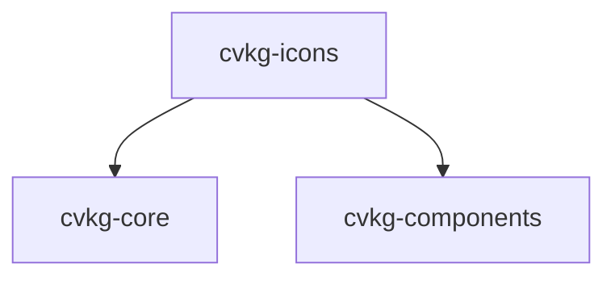

# cvkg-icons

## Purpose

Icon registry and `Icon` component for the CVKG UI toolkit. Icons are defined as SVG path data or glyph indices and rendered via the GPU path rasterizer (`draw_svg`) with `material_id=0` (Opaque) and `draw_order=200` (above UI chrome, below overlays).

## Boundaries

This crate owns:

- Icon data definition (`IconData` enum)
- Icon registration and lookup (`IconRegistry`)
- Icon rendering as a `View` component (`Icon`)

This crate does **not** own:

- Layout or positioning of icons within widgets (handled by parent components)
- Icon font loading or management (glyph rendering is limited to codepoint conversion)
- Asset loading from disk or network (all icon data is embedded or registered at runtime)

## Dependency graph



## Public API overview

### `IconData` (enum)

```rust
pub enum IconData {
    Svg(String),   // SVG path data (SVG path `d` attribute format)
    Glyph(u32),    // Icon font glyph index (Unicode codepoint)
}
```

Methods:

- `pub fn svg_path(&self) -> Option<&str>` — Returns the SVG path string if `Svg` variant.

### `IconRegistry` (struct)

Thread-safe icon registry mapping icon names (`String`) to `IconData`.

Methods:

- `pub fn new() -> Self` — Empty registry.
- `pub fn with_defaults() -> Self` — Registry pre-populated with 24 default icons.
- `pub fn register(&mut self, name: &str, data: IconData)` — Register/replace an icon by name.
- `pub fn get(&self, name: &str) -> Option<&IconData>` — Look up icon data by name.
- `pub fn contains(&self, name: &str) -> bool` — Check if a name is registered.
- `pub fn len(&self) -> usize` — Number of registered icons.
- `pub fn is_empty(&self) -> bool` — Whether the registry has no icons.

Implements `Default` (delegates to `with_defaults()`).

### Default icon set (24 icons)

| Category  | Icons                                                                 |
|-----------|-----------------------------------------------------------------------|
| Navigation | `close`, `menu`, `chevron-right`, `chevron-down`, `chevron-left`, `chevron-up`, `arrow-right`, `arrow-left` |
| Actions   | `add`, `remove`, `search`, `settings`, `edit`, `delete`, `copy`, `check` |
| Status    | `info`, `warning`, `error`, `success`                                  |
| Media     | `play`, `pause`, `stop`                                               |
| Misc      | `home`, `user`, `calendar`, `mail`                                    |

### `Icon` (struct, `View` impl)

```rust
pub struct Icon<'a> {
    registry: &'a IconRegistry,
    name: &'a str,
    color: [f32; 4],
    aria_label: Option<&'a str>,
    aria_hidden: bool,
}
```

Constructor and builder methods:

- `pub fn new(registry: &'a IconRegistry, name: &'a str) -> Self` — Default color `[1.0, 1.0, 1.0, 1.0]`, no ARIA label.
- `pub fn with_color(mut self, color: [f32; 4]) -> Self` — Set RGBA color (0.0–1.0 range).
- `pub fn with_aria_label(mut self, label: &'a str) -> Self` — Set accessibility label.
- `pub fn decorative(mut self) -> Self` — Mark as decorative (ARIA `presentation` role).

`View` trait implementation:

- `render(&self, renderer: &mut dyn Renderer, rect: Rect)` — Draws the icon centered within `rect`. SVG icons are rendered via `draw_svg_with_offset` with a 24×24 viewBox. Glyph icons are rendered via `draw_text`. If the icon name is not found, nothing is rendered.
- `aria_properties(&self) -> Option<AriaProperties>` — Returns `Presentation` role if decorative, `Img` role with label if ARIA label is set, `None` otherwise.

## Usage example

```rust
use cvkg_icons::{IconRegistry, IconData, Icon};

// Create a registry with the default 24 icons
let mut registry = IconRegistry::with_defaults();

// Register a custom icon
registry.register("custom", IconData::Svg("M12 2 L22 22 L2 22 Z".into()));

// Look up an icon
if let Some(data) = registry.get("custom") {
    println!("Found icon: {:?}", data);
}

// Build an Icon view
let icon = Icon::new(&registry, "close")
    .with_color([0.9, 0.2, 0.2, 1.0])
    .with_aria_label("Close dialog");

// Use in a parent view's render method:
// renderer.draw_view(&icon, rect);
```

## Use cases

- Toolbar and menu icons in the CVKG editor
- Status indicators (info, warning, error, success)
- Navigation controls (arrows, chevrons, close buttons)
- Media playback controls (play, pause, stop)
- Custom icon registration for application-specific glyphs

## Edge cases and limitations

- **Missing icons**: If `Icon::name` is not found in the registry, `render` is a no-op. No error or fallback is produced.
- **Glyph rendering**: `IconData::Glyph` converts the `u32` index directly to a `char` via `char::from_u32`. Invalid codepoints are silently skipped.
- **SVG viewBox**: All SVG icons use a hardcoded 24×24 viewBox. Path data outside this range may be clipped.
- **Color range**: `with_color` accepts `f32` values but does not clamp. Values outside 0.0–1.0 depend on the renderer.
- **Thread safety**: `IconRegistry` is not `Send`/`Sync` by default (backed by `HashMap`). Wrap in `Arc<Mutex<_>>` for cross-thread sharing.
- **No deduplication**: `register` always overwrites. Calling `register` twice with the same name replaces the previous entry without warning.
- **ARIA**: If neither `with_aria_label` nor `decorative` is called, `aria_properties` returns `None`, meaning the icon has no accessibility annotation.

## Build flags / features / env vars

This crate has no Cargo features, no required build flags, and no environment variables.
