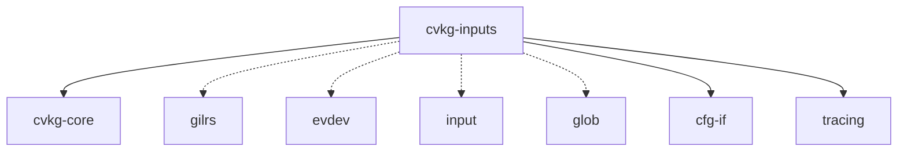

# cvkg-inputs

CVKG HID interconnect — gamepad, keyboard, mouse, and touch input backends with unified event type and action mapping.

## Purpose

Provides cross-platform input handling for CVKG applications. Supports multiple backends (gilrs for gamepads, evdev for Linux raw input, noop for headless), normalizes events into a unified `InputEvent` type, and provides an action mapping layer for binding physical inputs to logical actions.

## Boundaries

This crate does NOT:
- Handle windowing or event loops (that's `cvkg-render-native` / `winit`)
- Process high-level UI gestures (swipe, pinch — those are in `cvkg-components`)
- Define the `cvkg_core::Event` type (this crate provides conversion functions only)
- Render anything

It ONLY aggregates raw HID events into `InputState` and provides action mapping.

## Dependency graph



Solid lines = mandatory; dashed = feature-gated.

## Features

| Feature | Default | Dependencies | Platform | Description |
|---------|---------|--------------|----------|-------------|
| `gilrs` | yes | `gilrs` | All | Cross-platform gamepad via gilrs |
| `evdev` | no | `evdev`, `input`, `glob` | Linux | Raw `/dev/input/event*` access |
| `rumble` | no | `gilrs` | All | Force feedback (requires `gilrs`) |
| `serde` | no | `serde` | All | Serialization for `ActionConfig` |

Default features = `["gilrs"]`.

## Public API overview

### Backend traits

- `InputBackend` — Trait for input backends. Method: `poll() -> Vec<InputEvent>`
- `InputEvent` — Unified event enum:
  - `GamepadConnected(DeviceId)`
  - `GamepadDisconnected(DeviceId)`
  - `GamepadAxis { device: DeviceId, axis: u8, value: f32 }`
  - `GamepadButton { device: DeviceId, button: u8, pressure: f32 }`
  - `KeyDown(Key)`, `KeyUp(Key)`
  - `MouseMove { dx: f32, dy: f32 }`
  - `MouseButton { button: u8, pressed: bool }`
  - `MouseWheel { dx: f32, dy: f32 }`
  - `Touch(TouchEvent)` — Down/Move/Up/Cancel

### Device types

- `DeviceId(u64)` — Opaque device identifier
- `GamepadAxis` — `LeftStickX`, `LeftStickY`, `RightStickX`, `RightStickY`, `LeftTrigger`, `RightTrigger`, `Raw(u8)`
- `GamepadButton` — `South`, `East`, `West`, `North`, `LeftBumper`, `RightBumper`, `LeftTrigger`, `RightTrigger`, `Select`, `Start`, `LeftStick`, `RightStick`, `DpadUp`, `DpadDown`, `DpadLeft`, `DpadRight`, `Home`, `Raw(u8)`
- `Key` — Unicode codepoint + modifiers
- `MouseButton` — `Left`, `Right`, `Middle`, `Back`, `Forward`, `Raw(u8)`
- `TouchPoint` — `id: u64`, `x: f32`, `y: f32`, `pressure: f32`

### State aggregation

- `InputState` — Cloneable aggregate state (`Arc<RwLock<...>>` internally)
  - `gamepads: HashMap<DeviceId, GamepadState>`
  - `keyboard: KeyboardState`
  - `mouse: MouseState`
  - `touch: TouchState`
  - `action_map: ActionMap`
  - `apply_event(&mut self, event: &InputEvent)` — Updates state from raw event

- `InputSystem` — Owns backends, polls them, updates shared `InputState`
  - `new() -> Self`
  - `add_backend(&mut self, backend: Box<dyn InputBackend>)`
  - `poll(&mut self) -> Result<(), InputError>`
  - `state(&self) -> Arc<RwLock<InputState>>`

### Action mapping

- `ActionMap` — Configurable layer binding physical inputs to logical actions
  - `ActionConfig` — `Binding` (physical input), `sensitivity`, `invert`, `deadzone`
  - `Binding` — `GamepadAxis`, `GamepadButton`, `Key`, `MouseButton`, `Chord(Vec<Binding>)`
  - `deadzone::apply(value, deadzone)` — Stick drift compensation
  - `deadzone::radial(x, y, deadzone)` — 2D radial deadzone

### Conversion to cvkg-core

- `into_cvkg_event(input_event: InputEvent) -> cvkg_core::Event`
- `from_cvkg_event(core_event: cvkg_core::Event) -> Option<InputEvent>`

Maps to `cvkg_core::Event::GamepadConnected`, `GamepadDisconnected`, `GamepadButton`, `GamepadAxis`, etc.

## Usage example

```rust
use cvkg_inputs::{InputSystem, DeviceId, ActionMap, Binding, GamepadAxis, GamepadButton};
use cvkg_core::Event;

let mut system = InputSystem::new();

// Add gilrs backend (cross-platform gamepad)
#[cfg(feature = "gilrs")]
system.add_backend(Box::new(cvkg_inputs::backend::gilrs::GilrsBackend::new()?));

// Configure action mapping
let mut action_map = ActionMap::new();
action_map.bind("move_x", Binding::GamepadAxis(GamepadAxis::LeftStickX));
action_map.bind("jump", Binding::GamepadButton(GamepadButton::South));
action_map.bind("sprint", Binding::Chord(vec![
    Binding::GamepadButton(GamepadButton::LeftBumper),
    Binding::GamepadAxis(GamepadAxis::LeftStickY),
]));
system.state().write().unwrap().action_map = action_map;

// Main loop
loop {
    system.poll()?;
    let state = system.state().read().unwrap();
    
    // Query logical actions
    if let Some(value) = state.action_map.get_value("move_x", &state) {
        println!("Horizontal move: {}", value);
    }
    
    // Or convert to cvkg-core events
    for event in state.drain_events() {
        let core_event: Event = event.into();
        // Send to cvkg-render-native event loop
    }
}
```

## Use cases

- Gamepad-driven applications (games, simulations, kiosks)
- Keyboard/mouse desktop applications
- Touch-enabled kiosk/web deployments
- Headless testing with `noop` backend
- Mapping physical inputs to game actions via `ActionMap`

## Edge cases and limitations

- **Linux-only evdev** — Requires `cfg(target_os = "linux")` and `/dev/input` permissions
- **gilrs backend** — Polls at ~60Hz; high-frequency axis changes may be coalesced
- **No built-in event loop** — Caller must call `poll()` each frame
- **ActionMap sensitivity/inversion** — Only applies to axis bindings, not buttons
- **Chord bindings** — All sub-bindings must be active simultaneously (AND logic)
- **Touch support** — Only single-touch point tracking in `TouchState`; multi-touch via `TouchEvent::Down` with unique IDs
- **Serialization** — Only available with `serde` feature; `ActionConfig` serializes but `InputState` does not (contains `Arc<RwLock>`)

## Build flags / features

Default: `gilrs`. Add `evdev` for Linux raw input, `rumble` for force feedback, `serde` for config persistence.