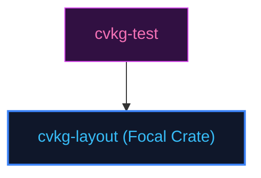

# cvkg-layout

## Purpose
Computes spatial bounds and flexbox positioning using Taffy constraints.

## Boundaries
- It does not draw vector lines or compile wgpu shader programs.
- It does not contain testing frameworks; quality checks are managed by `cvkg-test`.

## Dependency Graph


## Public API Overview
- `SizeProposal` — proposed layout bounds.
- `HStack` / `VStack` — layout containers.

## Usage Example
```rust
use cvkg_layout::{HStack, SizeProposal};
```

## Use Cases
- Mapped as a core component inside the standard framework dependency tree.

## Edge Cases and Limitations
- Under extreme scale or thread contention, ensure the host runtime balances cycles appropriately.

## Crate-Specific Build Flags
This crate has no custom feature flags or compile-time options. It compiles under standard cargo parameters.
