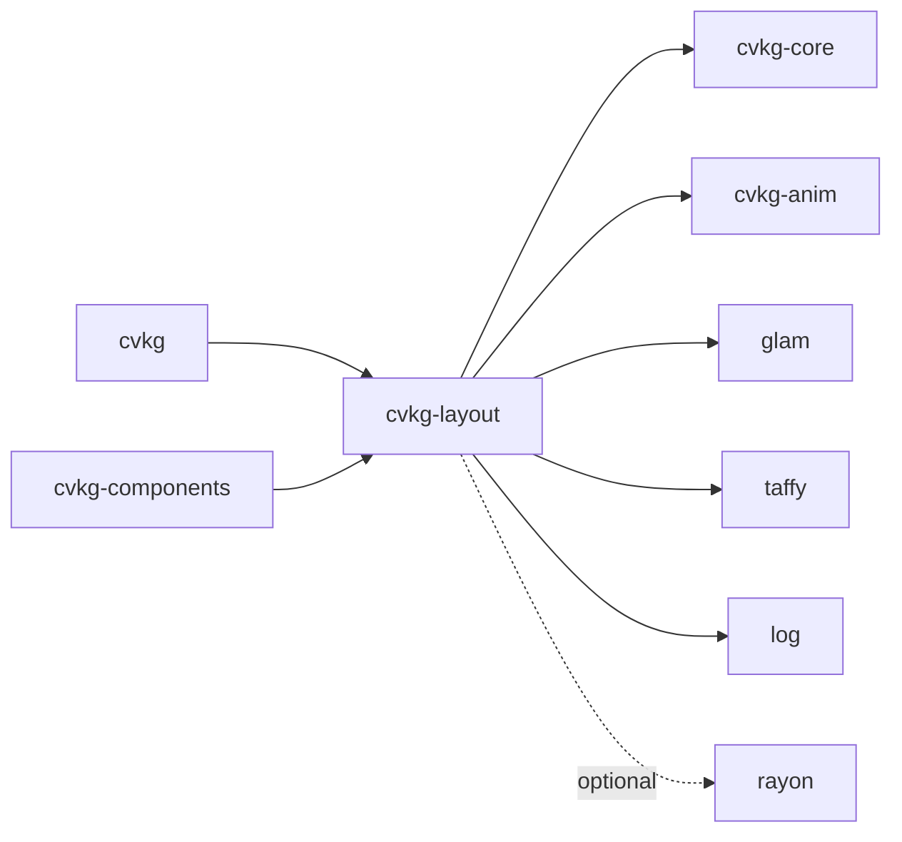

# cvkg-layout

## Purpose

`cvkg-layout` wraps the [Taffy](https://github.com/DioxusLabs/taffy) flexbox/grid layout engine and provides higher-level layout abstractions for the CVKG UI framework. It exposes stack primitives (`HStack`, `VStack`, `ZStack`), a `Grid` container with track definitions, a spatial index for hit-testing, focus-order computation, progressive (incremental) layout, animation integration, and modality-aware sizing.

## Boundaries

- **In scope:** Taffy-backed flexbox and grid layout computation, stack helpers, spatial indexing, focus ordering, progressive layout batching, animation-driven layout transitions, modality-aware tap-target enforcement, padding/safe-area/aspect-ratio primitives, cycle detection in recursive layout.
- **Out of scope:** Rendering, input event dispatch, accessibility tree construction, and platform window management. Those are handled by downstream crates (`cvkg`, `cvkg-components`).

## Dependency graph



## Public API overview

| Export | Kind | Source module | Description |
|---|---|---|---|
| `TaffyLayoutEngine` | struct | `taffy_engine` | Owns a `taffy::TaffyTree` and a `node_map` from view hash to Taffy node ID. Retrieved via `get_or_insert_engine`. |
| `HStack` | struct | `taffy_engine` | Horizontal stack; `compute_layout` and `place_subviews` with spacing, alignment, distribution. |
| `VStack` | struct | `taffy_engine` | Vertical stack; same interface as `HStack`. |
| `ZStack` | struct | `taffy_engine` | Overlapping stack; children occupy the same bounds. |
| `Grid` | struct | `taffy_engine` | Grid container built from column/row `GridTrack` definitions. |
| `GridTrack` | enum | `taffy_engine` | Track sizing: `Fixed(f32)`, `Flex(f32)`, `Auto`, `MinContent`, `MaxContent`. |
| `Spacer` | struct | `taffy_engine` | Expandable spacer with a flex weight. |
| `Flex` | struct | `taffy_engine` | Single-child flex container with configurable weight. |
| `AnimationEngine` | struct | `animation` | Manages `ViscousSpring` transitions keyed by view hash. Retrieved via `get_or_insert_engine`. |
| `LayoutSpatialEntry` | struct | `spatial` | Hash + rect pair stored in the spatial index. |
| `LayoutSpatialIndex` | struct | `spatial` | Axis-aligned quadtree over post-layout bounding boxes. |
| `compute_focus_order` | function | `focus` | Returns a `Vec<FocusCandidate>` sorted for keyboard/D-pad navigation. |
| `validate_reading_order` | function | `focus` | Checks that the visual order matches the logical order; returns a `Result`. |
| `LayoutModality` | enum | `focus` | `Pointer`, `Touch`, `AccessibilityZoom` — controls tap-target minimums and spacing multipliers. |
| `FocusCandidate` | struct | `focus` | `hash: u64`, `rect: Rect`, `reading_order: usize`. |
| `ProgressiveChild` | struct | `progressive` | `hash`, `laid_out`, `rect` — tracks incremental layout state. |
| `ProgressiveLayoutContext` | struct | `progressive` | Breaks a single layout pass into batches; stores partial results in `LayoutCache`. |
| `AspectRatio` | struct | `primitives` | Constrains a child's width:height ratio. |
| `Padding` | struct | `primitives` | Wraps a child with `EdgeInsets`. |
| `SafeArea` | struct | `primitives` | Insets a child by platform safe-area margins. |
| `SafeAreaEdges` | struct | `primitives` | Bitmask of edges to inset (`Top`, `Bottom`, `Leading`, `Trailing`, `All`). |
| `LayoutCapabilities` | struct | `lib` | Runtime capability flags: `flexbox`, `grid`, `absolute`, `container_queries`. |
| `layout_capabilities()` | function | `lib` | Returns the set of capabilities this engine supports (all `true`). |

Re-exported from `cvkg_core::layout`: `EdgeInsets`.

Internal helpers (also public): `with_layout_cycle_guard`, `with_layout_cycle_guard_void`, `size_views_parallel`, `LayoutCycleGuard`.

## Usage example

```rust
use cvkg_layout::{
    HStack, VStack, Grid, GridTrack, Padding, Spacer, AspectRatio,
    LayoutModality, compute_focus_order, layout_capabilities,
};
use cvkg_core::{Alignment, Distribution, LayoutCache, LayoutView, Rect, Size, SizeProposal};

// Check capabilities at runtime.
let caps = layout_capabilities();
assert!(caps.flexbox && caps.grid);

// Build a horizontal stack with 8px spacing, center-aligned.
let hstack = HStack::new(8.0, Alignment::Center, Distribution::Leading);

// Compute rects for subviews (subviews must implement LayoutView).
let bounds = Rect { x: 0.0, y: 0.0, width: 400.0, height: 200.0 };
let mut cache = LayoutCache::new();
let rects = hstack.compute_layout(bounds, &subviews, &mut cache);

// Use a 2×2 grid with fixed 100px tracks and 10px gap.
let grid = Grid::new(
    vec![GridTrack::Fixed(100.0), GridTrack::Fixed(100.0)],
    vec![GridTrack::Fixed(100.0), GridTrack::Fixed(100.0)],
    10.0, // column gap
    10.0, // row gap
);

// Wrap a child in uniform padding.
let padded = Padding::uniform(16.0);

// Enforce a 16:9 aspect ratio.
let aspect = AspectRatio::new(16.0 / 9.0);

// Adapt layout for touch (44pt minimum tap targets).
let touch_size = LayoutModality::Touch.adapt_size(Size { width: 20.0, height: 20.0 });
assert_eq!(touch_size.width, 44.0);
```

## Use cases

- **Responsive UI layouts** — `HStack`/`VStack`/`ZStack` cover the majority of list, toolbar, and overlay patterns.
- **Dashboard / grid UIs** — `Grid` with mixed `GridTrack::Fixed` and `GridTrack::Flex` tracks.
- **Hit-testing** — `LayoutSpatialIndex` enables O(log n) rect lookup for pointer events.
- **Keyboard / D-pad navigation** — `compute_focus_order` produces a sorted focus sequence; `validate_reading_order` catches mismatches.
- **Incremental layout** — `ProgressiveLayoutContext` batches layout work across frames to avoid jank in deep view trees.
- **Animated layout** — `AnimationEngine` drives spring-based rect transitions integrated with `cvkg-anim`.
- **Modality adaptation** — `LayoutModality` enforces touch minimums and spacing multipliers without changing view definitions.
- **Cycle safety** — `with_layout_cycle_guard` detects and breaks infinite recursion in `size_that_fits` / `place_subviews`.

## Edge cases and limitations

- **Cycle detection is hash-based.** Two distinct views with the same `view_hash` will falsely trigger the guard. Ensure unique hashes.
- **`size_views_parallel` falls back to sequential** when `views.len() <= 1` or when the `parallel` feature is disabled.
- **`LayoutSpatialIndex` is not incremental.** It is rebuilt from scratch each layout pass. Frequent rebuilds with many entries may cost more than a simpler flat Vec scan.
- **Taffy version pinned to 0.6.** Layout behavior (especially grid auto-placement and content sizing) follows Taffy 0.6 semantics, which may differ from the latest upstream.
- **`SafeArea` requires platform insets to be set externally.** The crate does not query the OS for safe-area values.
- **`AspectRatio` clamps to the proposal.** If the proposal is `unspecified` in both dimensions, the aspect ratio has no effect.
- **`validate_reading_order` is a heuristic.** It checks rect ordering against logical order but does not parse an accessibility tree.

## Build flags / features / env vars

| Feature | Default | Effect |
|---|---|---|
| `parallel` | off | Enables `rayon` as a dependency. `size_views_parallel` uses `rayon::iter` for parallel `size_that_fits` across independent subviews. |

No environment variables are read at build time or runtime.
