# cvkg-layout

```mermaid
graph TD
    cvkg-core["cvkg-core"]
    cvkg-vdom["cvkg-vdom"]
    cvkg-scene["cvkg-scene"]
    cvkg-layout["cvkg-layout"]
    cvkg-render-gpu["cvkg-render-gpu"]
    cvkg-render-native["cvkg-render-native"]
    cvkg-compositor["cvkg-compositor"]
    cvkg-themes["cvkg-themes"]
    cvkg-anim["cvkg-anim"]
    cvkg-flow["cvkg-flow"]
    cvkg-runic-text["cvkg-runic-text"]
    cvkg-svg-filters["cvkg-svg-filters"]
    cvkg-svg-serialize["cvkg-svg-serialize"]
    cvkg-components["cvkg-components"]
    cvkg-macros["cvkg-macros"]
    cvkg-cli["cvkg-cli"]
    cvkg-webkit-server["cvkg-webkit-server"]
    cvkg-test["cvkg-test"]
    cvkg-physics["cvkg-physics"]
    cvkg["cvkg (umbrella)"]

    cvkg-vdom --> cvkg-core
    cvkg-vdom --> cvkg-scene
    cvkg-layout --> cvkg-core
    cvkg-layout --> cvkg-anim
    cvkg-scene --> cvkg-core

    cvkg-render-gpu --> cvkg-core
    cvkg-render-gpu --> cvkg-compositor
    cvkg-render-gpu --> cvkg-svg-filters
    cvkg-render-gpu --> cvkg-svg-serialize
    cvkg-render-gpu --> cvkg-runic-text

    cvkg-render-native --> cvkg-core
    cvkg-render-native --> cvkg-render-gpu
    cvkg-render-native --> cvkg-vdom
    cvkg-render-native --> cvkg-themes

    cvkg-compositor --> cvkg-core

    cvkg-themes --> cvkg-core
    cvkg-themes --> cvkg-anim
    cvkg-anim --> cvkg-core
    cvkg-flow --> cvkg-core
    cvkg-flow --> cvkg-scene
    cvkg-flow --> cvkg-themes

    cvkg-runic-text --> cvkg-core
    cvkg-svg-filters --> cvkg-core

    cvkg-components --> cvkg-core
    cvkg-components --> cvkg-vdom
    cvkg-components --> cvkg-layout
    cvkg-components --> cvkg-themes
    cvkg-components --> cvkg-anim
    cvkg-components --> cvkg-runic-text

    cvkg-macros --> cvkg-core
    cvkg-cli --> cvkg-core
    cvkg-cli --> cvkg-physics
    cvkg-cli --> cvkg-anim
    cvkg-cli --> cvkg-macros
    cvkg-webkit-server --> cvkg-cli
    cvkg-physics --> cvkg-core
    cvkg-physics --> cvkg-scene

    cvkg --> cvkg-core
    cvkg --> cvkg-vdom
    cvkg --> cvkg-scene
    cvkg --> cvkg-layout
    cvkg --> cvkg-themes
    cvkg --> cvkg-anim
    cvkg --> cvkg-macros
    cvkg --> cvkg-components
    cvkg --> cvkg-render-gpu
    cvkg --> cvkg-render-native
```



`cvkg-layout` provides a high-performance, flexbox-inspired layout engine for CVKG, supporting complex hierarchical positioning with minimal overhead.

## Boundaries and Responsibilities

This crate handles the spatial arrangement of views. It does NOT perform drawing operations or manage state. Its responsibilities include:
- Implementing horizontal (`HStack`), vertical (`VStack`), and depth (`ZStack`) stacking.
- Calculating grid-based arrangements.
- Managing flexible space distribution via flex weights.
- Providing a cached layout pass to avoid redundant calculations.
- Enforcing temporal sub-pixel snapping to bypass pixel grid snapping during active motion (e.g. spring transitions) and only snapping to physical device pixels (`scale_factor`) when elements settle.

## Public API Overview

### Layout Containers
- `HStack`: Distributes children horizontally with configurable spacing, alignment, and distribution.
- `VStack`: Distributes children vertically.
- `ZStack`: Overlays children on top of each other.
- `Grid`: Arranges children in a fixed-cell 2D grid.

### Layout Logic
- `LayoutView`: The trait implemented by layout containers and views to participate in the layout pass.
- `SizeProposal`: Communicates available space and constraints to child views.
- `LayoutCache`: Stores computed sizes to optimize multi-pass layout algorithms.
- `snap_to_pixel_grid`: Function checking velocity flags to select sub-pixel rendering or exact pixel boundaries.

### Support Types
- `Alignment`: Controls positioning perpendicular to the stack axis (Top, Bottom, Leading, Trailing, Center).
- `Distribution`: Controls spacing along the stack axis (Leading, Trailing, Center, Fill, SpaceBetween, SpaceAround).

## Usage Example

```rust
use cvkg_layout::{HStack, VStack, Spacer};
use cvkg_core::{Alignment, Distribution};

// Create a vertical stack with horizontal leading alignment
let layout = VStack::new(10.0, Alignment::Leading, Distribution::Leading);

// In a real View, this is handled via the layout() method
// and placement happens during the render pass.
```

## Known Limitations
- Circular dependencies in layout (e.g., a parent sized by children that are sized by the parent) are resolved via the `SizeProposal` mechanism but may require explicit frame constraints.
- Grid layout currently assumes fixed-size cells.
- Sub-pixel snapping requires continuous motion velocity tracking from the animation engine (`cvkg-anim`).

