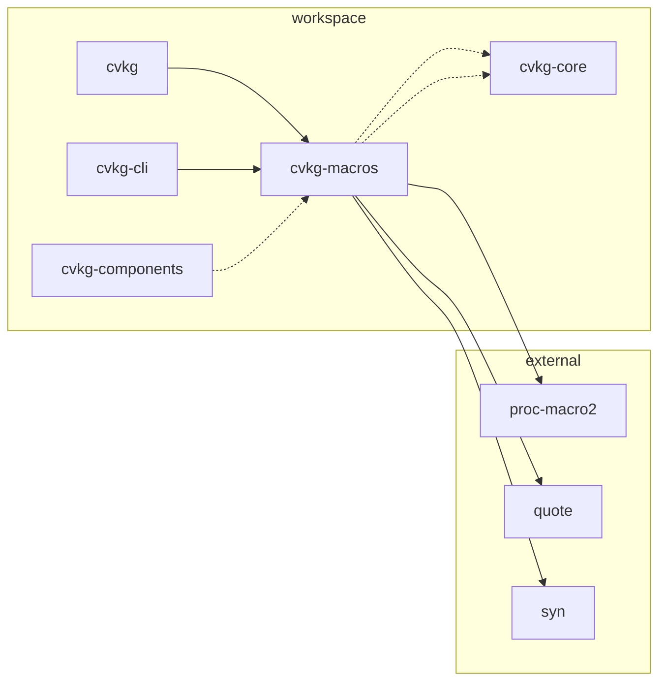

# cvkg-macros

Procedural macro crate for the CVKG framework. Provides attribute macros, derive macros, and function-like macros that eliminate boilerplate in state definitions, view implementations, component construction, and declarative UI.

## Boundaries

This crate only generates code via `proc_macro`, `proc_macro_derive`, and `proc_macro_attribute`. It has no runtime logic, no I/O, and no direct knowledge of the crate graph beyond what it emits. All generated code depends on `cvkg-core` traits (`View`, `Never`, `AnyView`) and `serde` traits — this crate itself depends only on `proc-macro2`, `quote`, and `syn`.

## Dependency graph



Solid arrows: compile-time dependencies. Dashed arrows: `cvkg` and `cvkg-cli` depend on `cvkg-macros`; `cvkg-components` uses it in dev/tests.

## Public API overview

### Attribute macros

| Macro | Target | What it does |
|---|---|---|
| `#[state]` | struct | Emits `#[derive(Clone, Debug, Default, serde::Serialize, serde::Deserialize)]` on the struct |
| `#[binding]` | struct | Emits `#[derive(Clone, Debug, serde::Serialize, serde::Deserialize)]` on the struct |
| `#[view_component]` | function | Generates a `<FnName>View` struct, implements `cvkg_core::View` with `Body = cvkg_core::AnyView`, and replaces the function with a constructor for that struct |
| `#[cvkg_component]` | struct | Generates a `<Name>Builder` struct with setter methods and a `build()` constructor; adds a `builder()` associated function to the original struct |

### Derive macros

| Macro | Target | What it does |
|---|---|---|
| `#[derive(View)]` | struct | Implements `cvkg_core::View` with `Body = cvkg_core::Never`; `body()` calls `unreachable!()` |

### Function-like macros

| Macro | Syntax | What it does |
|---|---|---|
| `hamr!` | `hamr! { Expr { child Expr { ... } } }` | DSL for declarative UI trees; each `Expr { ... }` block becomes `Expr.child(...)` chains |
| `cvkg_model!` | `cvkg_model! { struct ... }` | Derives `Clone, Debug, Default, Serialize, Deserialize` and adds a `vdom_id()` method |

## Usage example

```rust
use cvkg_macros::{state, view_component, cvkg_component, hamr};
use cvkg_core::View;

// State: derives Clone, Debug, Default, Serialize, Deserialize
#[state]
struct AppState {
    counter: i32,
    label: String,
}

// View: implements cvkg_core::View with Body = Never
#[derive(View)]
struct PrimitiveView;

// View component: function becomes a View struct constructor
#[view_component]
fn counter_display(value: i32, label: String) -> impl View {
    format!("{label}: {value}")
}

// Component: generates Builder with setters and build()
#[cvkg_component]
struct Card {
    title: String,
    body: String,
}

let card = Card::builder()
    .title("Hello".into())
    .body("World".into())
    .build();

// Declarative UI DSL
let tree = hamr! {
    VStack::new(16.0) {
        Text::new("Hello")
        Button::new("Click", || {})
    }
};
```

## Use cases

- **State structs**: Apply `#[state]` to application or component state to get `Clone`, `Debug`, `Default`, `Serialize`, `Deserialize` in one line.
- **Reactive bindings**: Apply `#[binding]` when you need serialization and debug but not `Default`.
- **Primitive views**: Use `#[derive(View)]` for views that have no body (e.g., layout containers that delegate to children).
- **Function-to-view conversion**: Annotate a view function with `#[view_component]` to get a named struct that implements `View` without manual boilerplate.
- **Component scaffolding**: Annotate a component struct with `#[cvkg_component]` to get a type-safe builder pattern.
- **Declarative UI trees**: Use `hamr!` to write nested UI hierarchies with brace-based nesting instead of chained method calls.
- **Data models with VDOM metadata**: Use `cvkg_model!` for data structs that need trait derives plus a `vdom_id()` identifier.

## Edge cases and limitations

- `#[state]` and `#[binding]` only accept `ItemStruct`. Enums and unit structs will fail with a `syn` parse error.
- `#[derive(View)]` always sets `Body = cvkg_core::Never`. It does not detect or use an existing `body` method — the doc comment mentions this intent but the implementation unconditionally emits `unreachable!()`.
- `#[view_component]` only handles `FnArg::Typed` arguments with `Pat::Ident` patterns. Destructured or wildcard arguments are silently ignored (no field generated).
- `#[view_component]` capitalizes the first character of the function name to form the struct name (`counter_display` → `CounterDisplayView`). Non-ASCII first characters are not specially handled.
- `#[cvkg_component]` supports named fields, tuple fields, and unit structs. Tuple fields are named `_0`, `_1`, etc. in the builder. All fields are required — `build()` panics with `expect()` if any field is missing.
- `hamr!` parses a custom `HamrNode` grammar, not standard Rust syntax. Errors come from `syn`'s expression parser and may have confusing spans.
- `cvkg_model!`'s `vdom_id()` uses `DefaultHasher::new().finish()` which produces a non-deterministic ID per call — it is not stable across runs or compilations.
- This crate depends on `serde` traits being available in the downstream crate's dependency tree. It does not add `serde` as its own dependency; the downstream crate must depend on `serde` with `derive` enabled.

## Build flags / features / env vars

This crate has no Cargo features, no `build.rs`, and no environment variable dependencies. It is compiled with `proc-macro = true` and requires a nightly or `proc_macro` stable toolchain (Rust 2024 edition).
