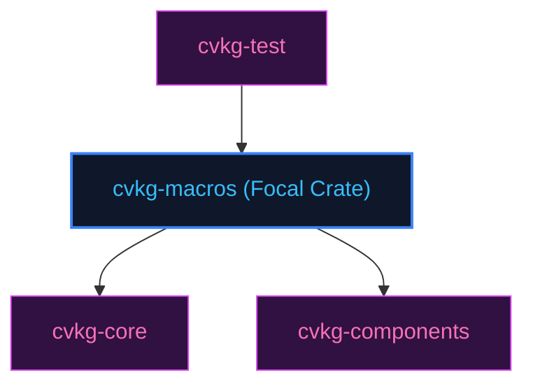

# cvkg-macros

## Purpose
Procedural macros scaffolding DSL view bodies and reactive state bindings.

## Boundaries
- It does not process dynamic runtime layout constraints.
- It does not contain testing frameworks; quality checks are managed by `cvkg-test`.

## Dependency Graph


## Public API Overview
- `#[derive(View)]` — Macro macro derivation.
- `hamr!` — View composition DSL.

## Usage Example
```rust
use cvkg_macros::View;
```

## Use Cases
- Mapped as a core component inside the standard framework dependency tree.

## Edge Cases and Limitations
- Under extreme scale or thread contention, ensure the host runtime balances cycles appropriately.

## Crate-Specific Build Flags
This crate has no custom feature flags or compile-time options. It compiles under standard cargo parameters.
