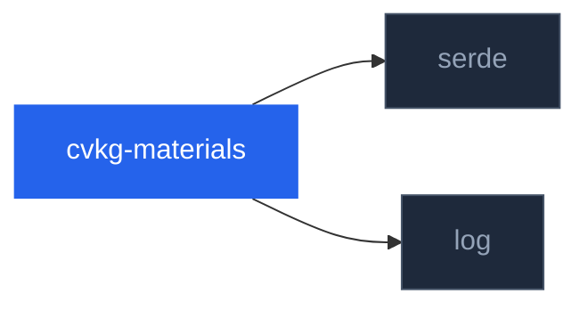

# cvkg-materials

## Purpose

Canonical data models for material parameters in CVKG: Glass, Mica, Acrylic, and Elevation effects.

Finding #7 from the crosscrate audit: material types were scattered across `cvkg-core` and `cvkg-flow` with no canonical shared definition. This crate centralizes them. Backend crates (`cvkg-render-gpu`, `cvkg-compositor`) consume these types to produce GPU resources and render operations. No other workspace crate depends on `cvkg-materials` directly yet — it exists to break circular dependency chains.

All types are pure data structs. No GPU code, no platform APIs, no rendering logic.

## Boundaries

**This crate provides:**

- Parameter bundles that define *what* a material looks like (colors, radii, opacities)
- A strictly limited elevation system shadow map (6 levels, derived values)
- Serde `Serialize`/`Deserialize` on every public type
- Builder methods with documented clamping contracts

**This crate does NOT:**

- Execute GPU rendering or shader compilation
- Access system APIs (e.g., `DwmSetWindowAttribute`, `NSVisualEffectView`)
- Perform backdrop sampling or multi-pass compositing
- Resolve OKLCH colors — that lives in `cvkg-flow::GlassNodeMaterial`
- Route draw calls — `cvkg-core::DrawMaterial` remains in `cvkg-core`

## Dependency graph



No workspace crate depends on `cvkg-materials` at this time. Downstream consumers are expected to be backend crates (`cvkg-render-gpu`, `cvkg-compositor`) once wiring is added.

## Public API overview

| Module | Type(s) | Re-exported | Description |
|---|---|---|---|
| `acrylic` | `AcrylicMaterial` | Yes | Blurred background with noise tint and fallback color |
| `glass` | `GlassMaterial` | Yes | Frosted glass backdrop (blur, refraction, frost, roughness, tint) |
| `mica` | `MicaMaterial` | Yes | System wallpaper sampling with tint, luminosity, and MicaAlt variant |
| `elevation` | `ElevationLevel`, `ElevationShadow` | Yes | 6-level (0–5) z-order shadow system with canonical shadow parameters |

All types implement: `Debug`, `Clone`, `Copy`, `PartialEq`, `Serialize`, `Deserialize`.

| Type | Key methods |
|---|---|
| `AcrylicMaterial` | `new()`, `with_blur_radius()`, `with_tint()`, `with_noise_opacity()`, `with_fallback_color()` |
| `GlassMaterial` | `new()`, `with_blur()`, `with_refraction()`, `with_frost()`, `with_tint()`, `with_roughness()` |
| `MicaMaterial` | `new()`, `with_tint_opacity()`, `with_tint()`, `with_luminosity()`, `alt()`, `standard()` |
| `ElevationLevel` | `shadow() -> Option<ElevationShadow>`, `z_depth() -> f32`, `all() -> [Self; 6]` |
| `ElevationShadow` | (plain struct; fields: `blur_radius`, `y_offset`, `spread`, `color`) |

## Usage example

```rust
use cvkg_materials::{
    AcrylicMaterial, ElevationLevel, GlassMaterial, MicaMaterial,
};

// Acrylic sidebar
let acrylic = AcrylicMaterial::new()
    .with_blur_radius(40.0)
    .with_tint([0.95, 0.95, 0.97, 0.7])
    .with_noise_opacity(0.03);

// Frosted glass panel
let glass = GlassMaterial::new()
    .with_blur(24.0)
    .with_frost(0.4)
    .with_tint([0.9, 0.92, 1.0, 0.15]);

// Mica title bar (Alt variant)
let mica = MicaMaterial::new()
    .with_tint_opacity(0.6)
    .alt();

// Elevation shadow for a modal dialog
let shadow = ElevationLevel::Level4
    .shadow()
    .expect("Level4 always has a shadow");

// Serialize to disk
let json = serde_json::to_string_pretty(&glass).unwrap();
```

## Use cases

- **Material theming**: Store material presets as JSON and load them at runtime
- **Cross-backend portability**: Pass the same `GlassMaterial` to Vulkan, Metal, or software compositor backends
- **Elevation enforcement**: Use `ElevationLevel::shadow()` to guarantee identical shadow parameters across all backends
- **Breakpoint serialization**: All types implement Serde; use them in save files, import/export pipelines, or IPC messages between compositor and renderer
- **Testing fixtures**: Construct deterministic material expectations in render tests via `Material::new().with_*()`

## Edge cases and limitations

- **`AcrylicMaterial::noise_opacity`**: Clamped to `[0, 1]` by the builder. The struct itself does not enforce this for direct field access.
- **`GlassMaterial::tint`**: Components are **not** clamped by `with_tint()`. Backends must handle out-of-range or HDR values if they accept them. Typical usage is `[0, 1]` per component.
- **`MicaMaterial::luminosity`**: Lower-bounded to `0.0` but has no upper bound. Standard pipelines should stay in `[0, 2]`; values above 2 are allowed for HDR experimentation.
- **`ElevationLevel::Level0`**: `shadow()` returns `None`. Callers must unwrap or match before accessing `ElevationShadow` fields.
- **Device pixel conversion**: All pixel-unit fields (`blur_radius`, `y_offset`, `spread`) are in **logical pixels**. Backends must multiply by the display scale factor before submitting to the GPU.
- **Mica wallpaper access**: On platforms without system wallpaper APIs, backends must silently fall back to a neutral tinted surface. This crate does not provide the fallback logic.
- **No `Eq` on float-containing types**: `AcrylicMaterial`, `GlassMaterial`, `MicaMaterial`, and `ElevationShadow` use `PartialEq` (not `Eq`) because of `f32` fields. `ElevationLevel` is `Eq` + `Hash` because it is a C-like enum with no fields.
- **`Clone` + `Copy` everywhere**: All types are `Copy`. There are no heap allocations, `Rc`, `Arc`, or interior mutability.

## Build flags, features, and environment variables

This crate has no Cargo features, no `cfg` flags, and no environment variable configuration.

Build with:

```bash
cargo build -p cvkg-materials
cargo test -p cvkg-materials
```

Required workspace dependencies are `serde` and `log`. The only dev-dependency is `serde_json` (used by the roundtrip tests).
