# cvkg-physics

`cvkg-physics` is the **Tyr** rigid body physics engine for CVKG — a 2D-oriented simulation crate with impulse-based constraint solving, spatial hashing broad-phase, and GJK/EPA narrow-phase collision detection.

## Boundaries and Responsibilities

This crate simulates forward-in-time physics for UI elements. It does NOT handle rendering, animation curves, or scene management. Its responsibilities include:

- Managing rigid bodies with mass, velocity, angular velocity, and restitution
- Collision detection via spatial hashing (broad-phase) and GJK/EPA (narrow-phase)
- Constraint solving via Gauss-Seidel impulse method (distance, pin, hinge, angular limit, spring)
- Semi-implicit Euler integration with sleep detection
- Bridging physics state to `cvkg-scene` transforms via `SceneBridge`

## Architecture

```
Application code
    │
    ▼
cvkg-physics (this crate)
    ├── world.rs          — PhysicsWorld: owns all bodies, runs simulation steps
    ├── body.rs           — RigidBody: mass, velocity, angular velocity, restitution
    ├── shape.rs          — Circle, AABB, ConvexHull, Capsule collision shapes
    ├── collider.rs       — Collider: binds a shape to a body with offset/rotation
    ├── constraint.rs     — Distance, Pin, Hinge, AngularLimit, Spring constraints
    ├── solver.rs         — Gauss-Seidel impulse constraint solver
    ├── broadphase.rs     — Spatial hash grid for coarse collision culling
    ├── narrowphase.rs    — GJK/EPA for convex-convex contact manifolds
    ├── integration.rs    — Semi-implicit Euler integrator with sleep detection
    └── scene_bridge.rs   — Reads/writes cvkg-scene NodeId transforms
```

## Relationship to cvkg-anim

When a physics body goes to sleep (velocity drops below threshold), `PhysicsWorld` fires an `on_sleep` callback per-body. Application code can use this to trigger a `cvkg-anim` Sleipnir spring animation to snap to grid/guide positions. The two crates remain independent — the coupling is in application code only.

## Public API Overview

### Core Types
- `PhysicsWorld`: Owns all bodies, colliders, and constraints. Call `step(dt)` each frame.
- `RigidBody`: Mass, velocity, angle, inertia, restitution, friction, gravity scale.
- `Shape`: Circle, AABB, Capsule, ConvexHull with support point computation for GJK.
- `Collider`: Binds a shape to a body with local offset and rotation.
- `Constraint`: Distance, Pin, Hinge, AngularLimit, Spring joints.
- `SceneBridge`: Maps `BodyId` → `cvkg-scene::NodeId` and syncs transforms each frame.

### Key Methods
- `PhysicsWorld::new(config)` — Create with `WorldConfig` (gravity, substeps, sleep delay).
- `PhysicsWorld::add_body(body)` — Add a rigid body, returns `BodyId`.
- `PhysicsWorld::add_collider(collider)` — Attach a collider to a body.
- `PhysicsWorld::add_constraint(constraint)` — Add a constraint between two bodies.
- `PhysicsWorld::step(dt)` — Advance simulation, returns `StepResult` (collision pairs, slept bodies).
- `SceneBridge::bind(body_id, node_id)` — Map a physics body to a scene graph node.
- `SceneBridge::sync_to_scene(body_positions, scene)` — Write transforms to the scene graph.

## Usage Example

```rust
use cvkg_physics::{PhysicsWorld, WorldConfig, RigidBody, Shape, Collider};
use cvkg_scene::{SceneGraph, NodeId};

let config = WorldConfig::default();
let mut world = PhysicsWorld::new(config);

// Create a falling circle
let body_id = world.add_body(RigidBody::new(1.0, &Shape::circle(16.0)));
world.add_collider(Collider::new(body_id, Shape::circle(16.0)));

// Create a static ground plane
let ground_id = world.add_body(RigidBody::static_body());
world.add_collider(Collider::new(ground_id, Shape::aabb(glam::Vec2::new(500.0, 10.0))));

// In your game loop:
let result = world.step(1.0 / 60.0);
println!("{} collision pairs, {} bodies slept", result.collision_pairs, result.slept_bodies.len());

// Sync to scene graph
let mut scene = SceneGraph::new();
let bridge = SceneBridge::new();
bridge.bind(body_id, NodeId(42));
bridge.sync_to_scene(&world.body_positions(), &mut scene);
```

## Known Limitations
- 2D only (no Z-axis simulation)
- Body removal is O(n) — requires adding `id` field to `RigidBody` for efficient swap_remove
- No continuous collision detection (CCD) — fast-moving objects may tunnel
- Friction model is Coulomb-based but simplified (no static/dynamic distinction)
- `SceneBridge` writes position via `local_rect` and rotation via `z_index` — proper transform support would require scene graph extensions

```mermaid
graph TD
    cvkg-core["cvkg-core"]
    cvkg-vdom["cvkg-vdom"]
    cvkg-scene["cvkg-scene"]
    cvkg-layout["cvkg-layout"]
    cvkg-render-gpu["cvkg-render-gpu"]
    cvkg-render-native["cvkg-render-native"]
    cvkg-compositor["cvkg-compositor"]
    cvkg-themes["cvkg-themes"]
    cvkg-anim["cvkg-anim"]
    cvkg-flow["cvkg-flow"]
    cvkg-runic-text["cvkg-runic-text"]
    cvkg-svg-filters["cvkg-svg-filters"]
    cvkg-svg-serialize["cvkg-svg-serialize"]
    cvkg-components["cvkg-components"]
    cvkg-macros["cvkg-macros"]
    cvkg-cli["cvkg-cli"]
    cvkg-webkit-server["cvkg-webkit-server"]
    cvkg-test["cvkg-test"]
    cvkg-physics["cvkg-physics"]
    cvkg["cvkg (umbrella)"]

    cvkg-vdom --> cvkg-core
    cvkg-vdom --> cvkg-scene
    cvkg-layout --> cvkg-core
    cvkg-layout --> cvkg-anim
    cvkg-scene --> cvkg-core

    cvkg-render-gpu --> cvkg-core
    cvkg-render-gpu --> cvkg-compositor
    cvkg-render-gpu --> cvkg-svg-filters
    cvkg-render-gpu --> cvkg-svg-serialize
    cvkg-render-gpu --> cvkg-runic-text

    cvkg-render-native --> cvkg-core
    cvkg-render-native --> cvkg-render-gpu
    cvkg-render-native --> cvkg-vdom
    cvkg-render-native --> cvkg-themes

    cvkg-compositor --> cvkg-core

    cvkg-themes --> cvkg-core
    cvkg-themes --> cvkg-anim
    cvkg-anim --> cvkg-core
    cvkg-flow --> cvkg-core
    cvkg-flow --> cvkg-scene
    cvkg-flow --> cvkg-themes

    cvkg-runic-text --> cvkg-core
    cvkg-svg-filters --> cvkg-core

    cvkg-components --> cvkg-core
    cvkg-components --> cvkg-vdom
    cvkg-components --> cvkg-layout
    cvkg-components --> cvkg-themes
    cvkg-components --> cvkg-anim
    cvkg-components --> cvkg-runic-text

    cvkg-macros --> cvkg-core
    cvkg-cli --> cvkg-core
    cvkg-cli --> cvkg-physics
    cvkg-cli --> cvkg-anim
    cvkg-cli --> cvkg-macros
    cvkg-webkit-server --> cvkg-cli
    cvkg-physics --> cvkg-core
    cvkg-physics --> cvkg-scene

    cvkg --> cvkg-core
    cvkg --> cvkg-vdom
    cvkg --> cvkg-scene
    cvkg --> cvkg-layout
    cvkg --> cvkg-themes
    cvkg --> cvkg-anim
    cvkg --> cvkg-macros
    cvkg --> cvkg-components
    cvkg --> cvkg-render-gpu
    cvkg --> cvkg-render-native
```


