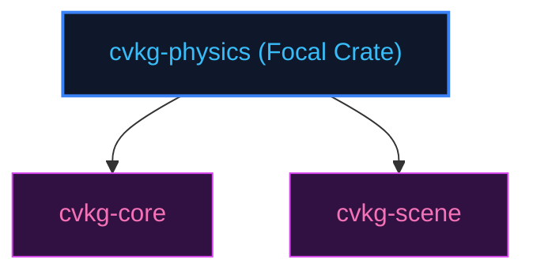

# cvkg-physics

## Purpose
Tyr rigid-body physics engine solving XPBD constraints and broadphase collisions.

## Boundaries
- It does not draw interactive UI controls or shape text spans.
- It does not contain testing frameworks; quality checks are managed by `cvkg-test`.

## Dependency Graph


## Public API Overview
- `PhysicsWorld` — Rigid-body solver manager.
- `RigidBody` — Mass-point dynamic bodies.

## Usage Example
```rust
use cvkg_physics::PhysicsWorld;
```

## Use Cases
- Mapped as a core component inside the standard framework dependency tree.

## Edge Cases and Limitations
- Under extreme scale or thread contention, ensure the host runtime balances cycles appropriately.

## Crate-Specific Build Flags
This crate has no custom feature flags or compile-time options. It compiles under standard cargo parameters.
