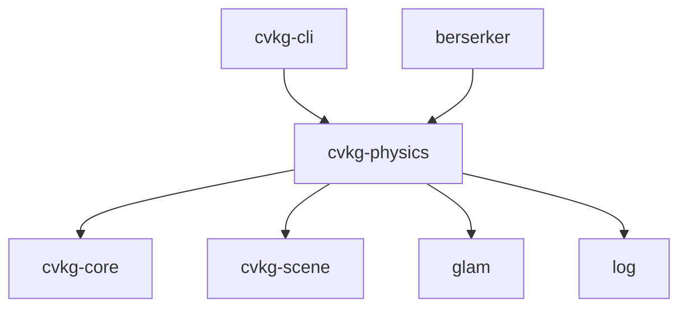

# cvkg-physics

2D-oriented rigid body simulation with impulse-based constraint solving, broad-phase culling via spatial hashing, and GJK/EPA narrow-phase collision.

## Boundaries

This crate owns: rigid body state, collision shapes, colliders, constraints, the impulse solver, spatial hash broadphase, GJK/EPA narrowphase, and the `PhysicsWorld` orchestrator.

This crate does **not** own: rendering, scene graph structure, animation blending, or asset loading. It reads/writes transforms through `scene_bridge` (cvkg-scene) and exposes `CollisionEvent` callbacks for application-side effects.

Coordinate system: 2D with y-axis pointing down, matching CVKG screen convention. Angles in radians, positive rotation clockwise. 3D mode uses standard right-handed coordinates.

## Dependency graph



## Public API overview

### Core types

| Type | Module | Purpose |
|------|--------|---------|
| `PhysicsWorld` | `world.rs` | Owns all bodies/colliders/constraints, runs simulation steps |
| `WorldConfig` | `world.rs` | Configuration: gravity, substeps, sleep, timestep mode |
| `StepResult` | `world.rs` | Per-step output: collision pair count, slept/woke bodies |
| `RigidBody` | `body.rs` | Mass, velocity, force, angle, angular velocity, damping, sleep state |
| `BodyId` | `body.rs` | Opaque body identifier (`struct BodyId(pub u64)`) |
| `Collider` | `collider.rs` | Binds a `Shape` to a `BodyId` with offset/rotation/category masks |
| `Shape` / `ShapeKind` | `shape.rs` | Collision geometry enum: `Circle`, `Aabb`, `Capsule`, `ConvexHull`, `Sphere`, `Box3D`, `Capsule3D`, `Compound2D`, `Compound3D`, `Heightmap` |
| `Constraint` / `ConstraintKind` | `constraint.rs` | Joint types: `Pin`, `Distance`, `Hinge`, `AngularLimit`, `Spring`, `Prismatic`, `Motor`, `Weld`, `BallSocket3D`, `Hinge3D`, `SixDof` |
| `ImpulseSolver` | `solver.rs` | Gauss-Seidel velocity-level constraint solver |
| `SpatialHash` | `broadphase.rs` | 2D spatial hash grid for broad-phase culling |
| `SpatialHash3D` | `broadphase.rs` | 3D spatial hash grid |

### Collision detection

| Type | Purpose |
|------|---------|
| `Contact` | Single contact point: `point`, `normal`, `depth` (2D) |
| `ContactManifold` | All contacts between two bodies: `body_a`, `body_b`, `contacts: Vec<Contact>` |
| `GjkResult` | GJK output: `overlapping`, `simplex`, `simplex_count` |
| `gjk()` | 2D GJK algorithm |
| `gjk_overlap()` | 2D overlap check (bool) |
| `epa()` | 2D EPA penetration depth from shapes |
| `epa_with_simplex()` | 2D EPA from pre-computed GJK result |
| `collide()` | Full 2D narrow-phase: GJK + EPA → `Option<ContactManifold>` |
| `gjk_3d()` | 3D GJK algorithm |
| `gjk_ccd()` | 2D continuous collision detection |
| `gjk_ccd_3d()` | 3D continuous collision detection |

### Queries

| Type | Purpose |
|------|---------|
| `RaycastHit` | 2D raycast result: `point`, `normal`, `distance`, `body_id`, `collider_index`, `user_data` |
| `RaycastHit3D` | 3D raycast result |
| `ShapeCastHit` | 2D shape cast result: adds `fraction` to raycast data |
| `ShapeCastHit3D` | 3D shape cast result |
| `OverlapHit` | Overlap query result |
| `QueryFilter` | Filter for spatial queries (category masks, body exclusion) |

### Events and callbacks

| Type | Purpose |
|------|---------|
| `CollisionEvent` | `event_type: CollisionEventType`, `body_a`, `body_b`, `manifold: Option<ContactManifold>` |
| `CollisionEventType` | `Enter`, `Stay`, `Exit` |
| `CollisionCallback` | `Box<dyn Fn(&CollisionEvent) + Send + Sync>` |
| `ConstraintBrokenCallback` | `Box<dyn Fn(BodyId, BodyId) + Send + Sync>` |
| `OnSleepCallback` | `Box<dyn Fn(BodyId) + Send + Sync>` |

### Key methods

`PhysicsWorld`:
- `new(config: WorldConfig) -> Self`
- `add_body(body: RigidBody) -> BodyId`
- `remove_body(id: BodyId)`
- `body(id: BodyId) -> Option<&RigidBody>` / `body_mut(...)`
- `add_collider(collider: Collider)`
- `add_constraint(constraint: Constraint)`
- `step(dt: f32) -> StepResult`
- `body_ids() -> Vec<BodyId>`, `body_count()`, `collider_count()`, `constraint_count()`
- `interpolation_alpha() -> f32`, `tick() -> u64`
- `snapshot() -> PhysicsSnapshot`, `restore(snapshot)`

`RigidBody`:
- `new(mass, &Shape) -> Self`, `new_3d(mass, &Shape) -> Self`
- `static_body() -> Self`, `static_body_3d() -> Self`
- `apply_force(force)`, `apply_force_at(force, world_point)`
- `apply_impulse(impulse)`, `apply_angular_impulse(impulse)`
- `local_to_world(point)`, `world_to_local(point)`
- `kinetic_energy() -> f32`

`Shape`:
- Constructors: `circle(radius)`, `aabb(half_extents)`, `capsule(radius, half_height)`, `convex_hull(vertices)`, `sphere(radius)`, `box3d(half_extents)`, `capsule3d(radius, half_height)`, `compound_2d(children)`, `compound_3d(children)`, `heightmap(...)`, `heightmap_flat(...)`
- `area() -> f32`, `moment_of_inertia(mass) -> f32`, `moment_of_inertia_3d(mass) -> Vec3`
- `support(dir) -> Vec2` (for GJK)

`Constraint`:
- Constructors: `pin()`, `distance()`, `hinge()`, `angular_limit()`, `spring()`, `prismatic()`, `motor()`, `weld()`
- Builder methods: `with_breaking_threshold()`, `with_prismatic_limits()`, `with_prismatic_motor()`
- 3D free functions: `ball_socket_constraint()`, `hinge_constraint_3d()`, `six_dof_constraint()`

`Collider`:
- `new(body_id, shape)`, `new_sensor(body_id, shape)`
- Builder methods: `with_offset()`, `with_rotation()`, `with_category()`, `with_collides_with()`, `with_sensor()`
- `can_collide_with(other) -> bool`, `world_aabb(body_pos, body_angle) -> (Vec2, Vec2)`

`ImpulseSolver`:
- `new()`, `with_iterations(n)`, `with_baumgarte(b)`
- `solve(constraints, bodies, body_id_map, dt) -> Vec<(BodyId, BodyId)>` (returns broken pairs)

## Usage example

```rust
use cvkg_physics::{
    PhysicsWorld, WorldConfig, RigidBody, Shape, Collider, Constraint,
};

let config = WorldConfig {
    gravity: glam::Vec2::new(0.0, 500.0),
    substeps: 4,
    ..Default::default()
};
let mut world = PhysicsWorld::new(config);

// Ground
let ground = world.add_body(RigidBody::static_body());
world.add_collider(Collider::new(ground, Shape::aabb(glam::Vec2::new(400.0, 10.0)))
    .with_offset(glam::Vec2::new(0.0, 300.0)));

// Dynamic circle
let ball = world.add_body(RigidBody::new(1.0, &Shape::circle(16.0)));
world.add_collider(Collider::new(ball, Shape::circle(16.0)));

// Distance constraint between two bodies
let anchor_a = glam::Vec2::new(0.0, 0.0);
let anchor_b = glam::Vec2::new(0.0, 0.0);
world.add_constraint(Constraint::distance(ball, ground, anchor_a, anchor_b, 100.0));

// Step
let result = world.step(1.0 / 60.0);
println!("Collisions: {}", result.collision_pairs);
```

## Use cases

- Platformer and top-down game physics
- Ragdoll simulation (via `ragdoll_bridge`)
- Vehicle and mechanical joint simulation (hinge, prismatic, motor constraints)
- Trigger/sensor zones for gameplay logic (pickup areas, kill zones)
- Destructible objects with breakable constraints (`with_breaking_threshold`)
- Terrain collision via heightmap shapes
- Spatial queries: raycasting for line-of-sight, shape casts for predictive collision, overlap tests for area effects
- Shatter/destruction effects via `mjolnir_bridge` (constraint-break and position-based shatter)

## Edge cases and limitations

- GJK/EPA only handles **convex** shapes. Concave geometry must be decomposed into convex hulls or use `Compound2D`/`Compound3D`.
- EPA can return `None` for near-degenerate contacts (very shallow overlap or nearly coincident shapes).
- The impulse solver is **not** a position-level solver. Baumgarte stabilization reduces drift but does not eliminate it. Stacked objects will slowly sink.
- Fixed timestep with `accumulator` pattern prevents spiral of death (capped by `max_steps_per_frame`), but large dt values will drop simulation time.
- `SpatialHash` cell size is global. Very large and very small colliders in the same world will degrade broadphase performance. Tune `cell_size` to your typical collider size.
- 2D and 3D bodies can coexist in the same world but are simulated on separate code paths (`is_3d` flag). Cross-dimensional collisions are not supported.
- Sleep detection uses kinetic energy threshold. Slow-drifting bodies may never sleep if damping is zero.
- `ConvexHull` vertices must be in counterclockwise order and reference `'static` data.
- `Heightmap` shape is stored as `Box<HeightmapShape>` inside `ShapeKind` due to its `Vec` data field.
- Constraint breaking is strain-based and checked per-iteration; a constraint may break mid-solve, which can cause one-frame impulse spikes.

## Build flags / features / env vars

This crate has **no features** and **no required environment variables**.

Dependencies are fixed: `cvkg-core`, `cvkg-scene`, `glam` (workspace), `log` (workspace). No optional feature gates.
