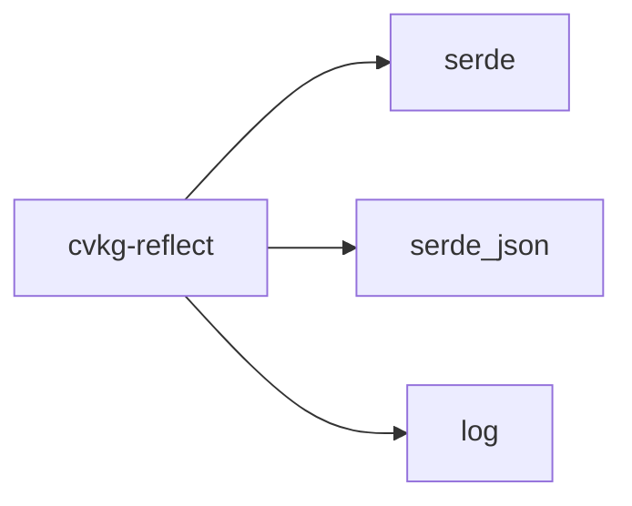

# cvkg-reflect

Runtime type metadata and property access for the CVKG workspace.

## Purpose

Finding #8 from the crosscrate audit: without reflection, property editors,
inspectors, and telemetry systems must hard-code every type they want to display
or serialize. This crate provides a lightweight runtime reflection model that is
explicit — types opt in via the `Reflected` trait. No proc-macros live here;
macros belong in `cvkg-macros`.

## Boundaries

- This crate defines the reflection trait, metadata types, error types, and a
  type registry. It does **not** provide derive macros.
- Property values pass through `serde_json::Value`. The crate does not define
  its own value type.
- The crate owns no I/O, no threading, and no async runtime.
- No other workspace crate depends on `cvkg-reflect` directly (as of this
  writing). Downstream crates opt in by implementing `Reflected`.

## Dependency graph



All three dependencies are workspace-level; no external crates are pulled in
beyond what the workspace already provides.

## Public API overview

| Symbol | Kind | Description |
|---|---|---|
| `Reflected` | trait | Core contract: `type_meta`, `get_field`, `set_field`, `snapshot` |
| `TypeMeta` | struct | Static schema: `type_name`, `fields` |
| `FieldMeta` | struct | Per-field metadata: `name`, `kind`, `doc`, `read_only` |
| `FieldKind` | enum | Semantic category: `Bool`, `Integer`, `Float`, `String`, `Color`, `Vec2`, `Vec3`, `Rect`, `Custom(&str)` |
| `ReflectError` | enum | Error variants: `FieldNotFound`, `ReadOnly`, `TypeMismatch`, `OutOfRange` |
| `ReflectRegistry` | struct | Runtime registry of `&'static TypeMeta` indexed by type name |
| `ColorStop` | struct | Example `Reflected` implementation (gradient color stop) |

### `Reflected` trait methods

- `type_meta() -> &'static TypeMeta` — static schema, must be `'static`.
- `get_field(&self, name: &str) -> Option<Value>` — read a field; returns
  `None` for unknown names.
- `set_field(&mut self, name: &str, value: Value) -> Result<(), ReflectError>` —
  write a field; returns structured errors for unknown, read-only, or
  type-mismatched writes.
- `snapshot(&self) -> HashMap<String, Value>` — default implementation
  iterates all fields via `get_field`.

### `ReflectRegistry` methods

- `new()` — empty registry.
- `register(&mut self, meta: &'static TypeMeta)` — idempotent insert.
- `get(&self, type_name: &str) -> Option<&&'static TypeMeta>` — lookup.
- `type_names() -> impl Iterator<Item = &&'static str>` — enumerate
  registered type names (order unspecified).

## Usage example

```rust
use cvkg_reflect::{Reflected, ReflectRegistry, FieldMeta, FieldKind, TypeMeta};
use serde_json::json;

// 1. Define a type and implement Reflected.
struct MyConfig {
    enabled: bool,
    threshold: f64,
}

impl Reflected for MyConfig {
    fn type_meta() -> &'static TypeMeta {
        static FIELDS: [FieldMeta; 2] = [
            FieldMeta { name: "enabled", kind: FieldKind::Bool, doc: "Toggle", read_only: false },
            FieldMeta { name: "threshold", kind: FieldKind::Float, doc: "Cutoff", read_only: false },
        ];
        static META: TypeMeta = TypeMeta { type_name: "MyConfig", fields: &FIELDS };
        &META
    }

    fn get_field(&self, name: &str) -> Option<serde_json::Value> {
        match name {
            "enabled" => serde_json::to_value(self.enabled).ok(),
            "threshold" => serde_json::to_value(self.threshold).ok(),
            _ => None,
        }
    }

    fn set_field(&mut self, name: &str, value: serde_json::Value) -> Result<(), cvkg_reflect::ReflectError> {
        match name {
            "enabled" => { self.enabled = value.as_bool().ok_or(/* ... */)?; Ok(()) }
            "threshold" => { self.threshold = value.as_f64().ok_or(/* ... */)?; Ok(()) }
            other => Err(cvkg_reflect::ReflectError::FieldNotFound(other.into())),
        }
    }
}

// 2. Register types at startup.
let mut registry = ReflectRegistry::new();
registry.register(MyConfig::type_meta());

// 3. Use the registry to look up schemas dynamically.
let meta = registry.get("MyConfig").unwrap();
for field in meta.fields {
    println!("{}: {:?}", field.name, field.kind);
}

// 4. Read/write properties without knowing the concrete type at compile time.
let mut config = MyConfig { enabled: true, threshold: 0.75 };
let val = config.get_field("threshold").unwrap();
config.set_field("threshold", json!(0.9)).unwrap();
```

The crate also ships a fully worked example: `ColorStop` (a gradient color stop)
implements `Reflected` with range-validated `position` and a `label` string.

## Use cases

- **Property editors / inspectors** — enumerate fields, read current values,
  and write validated values without hard-coding type knowledge.
- **Telemetry** — snapshot all fields of a type at a point in time for logging
  or network transport.
- **Serialization front-ends** — generic serializers that walk `TypeMeta` to
  produce JSON, binary, or UI representations.
- **Type discovery** — `ReflectRegistry` lets an application collect all
  reflectable types at startup for plugin or scripting surfaces.

## Edge cases and limitations

- **No proc-macros** — `Reflected` is implemented by hand. A future
  `#[derive(Reflect)]` in `cvkg-macros` will generate the boilerplate.
- **Field lookup is linear** — `TypeMeta::field` scans the `&[FieldMeta]`
  slice. This is intentional; field counts are expected to be small (≤ ~64).
- **`snapshot` skips `None` fields** — if `get_field` returns `None` for a
  field listed in `type_meta`, that field is silently omitted from the
  snapshot. A correct implementation should never trigger this.
- **`set_field` validation is the implementor's responsibility** — the trait
  contract requires returning the right error variants, but the crate does not
  enforce value-range checks. `ColorStop::position` demonstrates manual range
  validation.
- **`ReflectRegistry` is not thread-safe by default** — it uses a plain
  `HashMap`. Wrap it in a `Mutex` or `RwLock` for shared access.
- **No `Reflect` supertrait for serialization** — `serde::Serialize` /
  `Deserialize` are not required by the trait. Types that need both must
  implement both traits independently.

## Build flags / features / env vars

This crate has **no Cargo features**, **no required build flags**, and **no
environment variables**. It builds with a standard `cargo build`.
