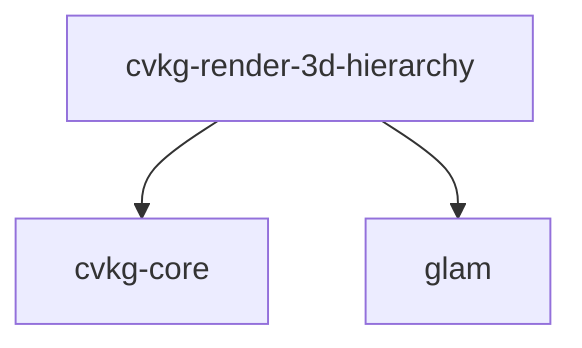

# cvkg-render-3d-hierarchy

3D scene-graph hierarchy — parent-child transform propagation.

## Purpose

This crate provides a minimal 3D transform hierarchy for CVKG. It stores local transforms per node and computes global (world-space) matrices through depth-first propagation. It is a standalone crate with no GPU or rendering dependencies — only `cvkg-core` and `glam`.

## Boundaries

This crate does NOT:
- Perform frustum culling (that's `cvkg-render-3d::FrustumCuller`)
- Render anything (no GPU code, no wgpu dependency)
- Load assets or parse file formats
- Handle animation or interpolation (those are in `cvkg-anim`)

It ONLY computes `global = parent.global * local` for a flat array of nodes where parents appear before children.

## Dependency graph



## Public API overview

### Types

- `TransformNode3D` — Single node in the hierarchy
  - `id: NodeId` — Unique identifier (from `cvkg_core`)
  - `parent: Option<NodeId>` — Parent node ID, `None` for roots
  - `children: Vec<NodeId>` — Children (order = traversal order)
  - `local: Transform3D` — Local-space transform (from `cvkg_core`)
  - `global: Mat4` — Computed world-space matrix (output)

### Functions

- `propagate_transforms(nodes: &mut [TransformNode3D])` — Computes global matrices in-place. Requires parents to appear before children in the slice.

## Usage example

```rust
use cvkg_render_3d_hierarchy::{TransformNode3D, propagate_transforms};
use cvkg_core::{NodeId, Transform3D};
use glam::Mat4;

let mut nodes = vec![
    TransformNode3D {
        id: NodeId(1),
        parent: None,
        children: vec![NodeId(2)],
        local: Transform3D::from_translation(Vec3::new(0.0, 1.0, 0.0)),
        global: Mat4::IDENTITY,
    },
    TransformNode3D {
        id: NodeId(2),
        parent: Some(NodeId(1)),
        children: vec![],
        local: Transform3D::from_rotation_y(45.0_f32.to_radians()),
        global: Mat4::IDENTITY,
    },
];

propagate_transforms(&mut nodes);
// nodes[0].global == translation(0, 1, 0)
// nodes[1].global == translation(0, 1, 0) * rotation_y(45°)
```

## Use cases

- Building a 3D scene graph for `cvkg-render-3d` render passes
- Computing world transforms for physics (`cvkg-physics`) or spatial queries
- Hierarchical transform propagation without a full ECS

## Edge cases and limitations

- Panics in debug if a `parent` ID is not found in the node list
- No cycle detection — caller must ensure DAG structure
- No dirty tracking — caller must re-run `propagate_transforms` after any local transform change
- Single-threaded; not lock-free (use `cvkg-core`'s `ArcSwap` patterns for concurrent access)

## Build flags / features

No Cargo features. Zero optional dependencies.