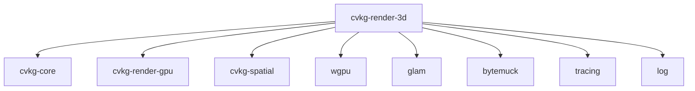

# cvkg-render-3d

3D rendering pipeline for CVKG — lights, shadows, frustum culling, and GPU pass orchestration.

## Purpose

This crate provides the 3D rendering infrastructure for CVKG: shadow mapping, PBR material rendering, frustum culling, and render graph nodes for 3D geometry. It sits between the core 3D types in `cvkg-core` and the GPU renderer in `cvkg-render-gpu`.

## Boundaries

This crate does NOT:
- Manage windowing or event loops (that's `cvkg-render-native`)
- Handle text shaping or 2D UI rendering (that's `cvkg-runic-text` + `cvkg-components`)
- Parse asset formats like glTF (that's `cvkg-gltf`)
- Define the scene graph hierarchy (that's `cvkg-render-3d-hierarchy`)

## Dependency graph



## Public API overview

### Types

- `DirectionalLight` — Sun-like light with cascade shadow maps
- `PointLight` — Local omnidirectional light
- `Light` — Enum unifying `Directional` and `Point`
- `GpuMesh3d` — GPU-ready mesh with vertex/index buffers
- `ShadowMap` — Depth texture array for cascade shadow maps
- `ShadowInstance` — Per-instance data for shadow pass
- `ShadowQuality` — Enum: `Low`, `Medium`, `High`, `Ultra` (controls cascade count/resolution)
- `FrustumCuller` — Camera frustum culling for mesh instances

### Pass nodes (re-exported for `cvkg-render-gpu`)

- `Opaque3dNode` — PBR opaque geometry pass
- `ShadowNode` — Depth-only pass for shadow map generation

## Usage example

```rust
use cvkg_render_3d::{DirectionalLight, FrustumCuller, ShadowQuality};
use cvkg_core::{Mesh, Material3D, Transform3D};
use glam::Vec3;

// Configure directional light with cascaded shadows
let light = DirectionalLight {
    direction: Vec3::new(-0.5, -1.0, -0.3).normalize(),
    color: Vec3::splat(1.0),
    intensity: 100_000.0,
    shadow_quality: ShadowQuality::High,
    cascades: 4,
    ..Default::default()
};

// Cull mesh instances against camera frustum
let culler = FrustumCuller::new(view_proj_matrix);
let visible_instances = culler.cull(&mesh_instances);
```

## Use cases

- Rendering 3D scenes with PBR materials in CVKG applications
- Cascaded shadow mapping for directional lights
- Frustum culling of large 3D scenes
- Integration point for `cvkg-gltf` loaded assets

## Edge cases and limitations

- Maximum 4 cascade splits for directional shadows (configurable via `ShadowQuality`)
- Shadow map resolution capped at 4096x4096 per cascade
- No support for spot lights or area lights yet (only `Directional` and `Point`)
- Requires `cvkg-render-gpu` for actual GPU execution; this crate only defines pass nodes and data types

## Build flags / features

No Cargo features. All dependencies are mandatory.

- `wgpu` = GPU API abstraction (workspace version 29.0.0)
- `cvkg-render-gpu` = Pass node integration
- `cvkg-spatial` = BVH/frustum culling acceleration
- `naga` (build-dep) = WGSL shader validation at compile time