# cvkg-render-gpu

```mermaid
graph TD
    cvkg-core["cvkg-core"]
    cvkg-vdom["cvkg-vdom"]
    cvkg-scene["cvkg-scene"]
    cvkg-layout["cvkg-layout"]
    cvkg-render-gpu["cvkg-render-gpu"]
    cvkg-render-native["cvkg-render-native"]
    cvkg-compositor["cvkg-compositor"]
    cvkg-themes["cvkg-themes"]
    cvkg-anim["cvkg-anim"]
    cvkg-flow["cvkg-flow"]
    cvkg-runic-text["cvkg-runic-text"]
    cvkg-svg-filters["cvkg-svg-filters"]
    cvkg-svg-serialize["cvkg-svg-serialize"]
    cvkg-components["cvkg-components"]
    cvkg-macros["cvkg-macros"]
    cvkg-cli["cvkg-cli"]
    cvkg-webkit-server["cvkg-webkit-server"]
    cvkg-test["cvkg-test"]
    cvkg-physics["cvkg-physics"]
    cvkg["cvkg (umbrella)"]

    cvkg-vdom --> cvkg-core
    cvkg-vdom --> cvkg-scene
    cvkg-layout --> cvkg-core
    cvkg-layout --> cvkg-anim
    cvkg-scene --> cvkg-core

    cvkg-render-gpu --> cvkg-core
    cvkg-render-gpu --> cvkg-compositor
    cvkg-render-gpu --> cvkg-svg-filters
    cvkg-render-gpu --> cvkg-svg-serialize
    cvkg-render-gpu --> cvkg-runic-text

    cvkg-render-native --> cvkg-core
    cvkg-render-native --> cvkg-render-gpu
    cvkg-render-native --> cvkg-vdom
    cvkg-render-native --> cvkg-themes

    cvkg-compositor --> cvkg-core

    cvkg-themes --> cvkg-core
    cvkg-themes --> cvkg-anim
    cvkg-anim --> cvkg-core
    cvkg-flow --> cvkg-core
    cvkg-flow --> cvkg-scene
    cvkg-flow --> cvkg-themes

    cvkg-runic-text --> cvkg-core
    cvkg-svg-filters --> cvkg-core

    cvkg-components --> cvkg-core
    cvkg-components --> cvkg-vdom
    cvkg-components --> cvkg-layout
    cvkg-components --> cvkg-themes
    cvkg-components --> cvkg-anim
    cvkg-components --> cvkg-runic-text

    cvkg-macros --> cvkg-core
    cvkg-cli --> cvkg-core
    cvkg-cli --> cvkg-physics
    cvkg-cli --> cvkg-anim
    cvkg-cli --> cvkg-macros
    cvkg-webkit-server --> cvkg-cli
    cvkg-physics --> cvkg-core
    cvkg-physics --> cvkg-scene

    cvkg --> cvkg-core
    cvkg --> cvkg-vdom
    cvkg --> cvkg-scene
    cvkg --> cvkg-layout
    cvkg --> cvkg-themes
    cvkg --> cvkg-anim
    cvkg --> cvkg-macros
    cvkg --> cvkg-components
    cvkg --> cvkg-render-gpu
    cvkg --> cvkg-render-native
```

`cvkg-render-gpu` is the "Surtr" pipeline: a high-performance, `wgpu`-powered GPU renderer designed for "Berserker" aesthetics and complex visual effects.

## Boundaries and Responsibilities

This crate is the authoritative drawing backend for CVKG. It does NOT handle windowing or higher-level layout. Its responsibilities include:
- Managing the Muspelheim multi-pass pipeline (Bloom, Blur, Composite).
- Tessellating 2D primitives and SVG strokes into GPU-ready meshes using `lyon`.
- Managing a Mega-Heim for high-efficiency text and image batching.
- Executing real-time parsing and evaluation of Animated SVGs via `roxmltree` and `usvg`.
- Propagating full 3x3 affine transformation matrices for complex nested scaling, skew, and rotation.
- Implementing advanced shader effects: Bifrost (frost), Gungnir (glow), and Mjolnir (geometric clipping/shattering).
- Color blindness simulation post-process (Protanopia, Deuteranopia, Tritanopia + anomalous variants) via Brettel/Viénot Daltonization matrices.
- Optimizing VRAM usage via LRU-based cache eviction and Sundr compaction.
- Implementing AgX Tonemapping utilizing logarithmic space conversions and a cubic contrast curve to prevent color shifting in highlights.
- Caching render graph execution plans inside `CachedGraphPlan` to bypass Kahn's topological sort calculations during steady-state frames.

## Public API Overview

### Core Types
- `SurtrRenderer`: The central GPU controller managing device state, pipelines, and buffers.
- `Vertex`: The unified vertex format supporting position, color, radius, and effect-specific metadata.
- `DrawCall`: Represents a batched GPU operation organized by texture and transparency layer.
- `CachedGraphPlan`: Holds cached execution sequences (ordered `PassId`/`NodeKey` lists) for the render graph.

### Systems
- **Muspelheim Passes**: Specialized pipelines for Gaussian blur and bloom extraction.
- **SundrPacker**: A high-speed skyline-based bin packing algorithm for real-time UI textures.
- **RunicTextEngine**: Integration with `cvkg-runic-text` for GPU-accelerated glyph rendering.
- **AgX Tonemapper**: High-fidelity color mapping stage protecting highlight hues from luminance shifts.
- **Render Graph Cache**: Execution sequencer that stores topological sorting results to reduce CPU overhead.

### Key Methods
- `SurtrRenderer::forge()`: Initializes the GPU device and pipelines for a target window.
- `SurtrRenderer::begin_frame()` / `SurtrRenderer::end_frame()`: Manages the command encoder lifecycle.

## Known Limitations
- Requires a GPU supporting `SAMPLED_TEXTURE_AND_STORAGE_BUFFER_ARRAY_NON_UNIFORM_INDEXING`.
- Mega-Heim texture size is currently fixed at 4096x4096px.
- Culling is hierarchical but relies on the `cvkg-scene` crate for complex queries.

