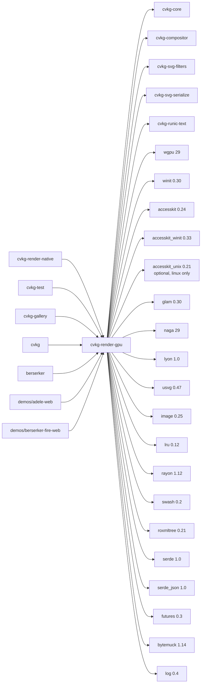

# cvkg-render-gpu

## Purpose

GPU-accelerated renderer for the CVKG UI framework. Translates scene graphs, SVG content, and compositor output into GPU draw calls via `wgpu`, targeting Vulkan, Metal, DX12, OpenGL, and WebGL2 from a single codebase.

## Boundaries

- Owns all GPU resource management: pipelines, buffers, textures, bind groups, and WGSL shader variants.
- Consumes scene data from `cvkg-core`, `cvkg-compositor`, and `cvkg-svg-serialize`; does not own layout or DOM logic.
- Exposes `GpuRenderer` as the primary entry point; callers provide a `winit` window/surface and a `RendererConfig`.
- Accessibility tree construction is delegated to the `accessibility` module via AccessKit; input routing is the caller's responsibility.
- The `material` module and its re-exports (`CompiledMaterial`, `MaterialCompiler`, `MaterialError`, `MaterialGraph`, `MaterialOp`) define the material graph that drives pipeline selection at draw time.
- The `subsystems` module groups self-contained concerns (config, geometry, text, SVG, particles) that can be tested and modified independently.
- WASM/WebGL2 is a first-class target; shader variants with `binding_array` are swapped for single-texture equivalents on `wasm32`.

## Dependency graph



## Public API overview

### Re-exports (top-level)

| Symbol | Source |
|---|---|
| `RendererConfig` | `subsystems` |
| `CompiledMaterial` | `material` |
| `MaterialCompiler` | `material` |
| `MaterialError` | `material` |
| `MaterialGraph` | `material` |
| `MaterialOp` | `material` |
| `SkylinePacker` | `heim` |
| `GpuRenderer` | `renderer` |
| `ColorBlindMode` | `color_blindness` |
| `ColorTheme`, `SceneUniforms` | `cvkg-core` |
| `SvgAnimation`, `SvgModel` | `types` |
| `Vertex`, `InstanceData` | `vertex` |
| `ActionHandler`, `ActionRequest`, `ActivationHandler`, `DeactivationHandler`, `Node`, `NodeId`, `Role`, `Tree`, `TreeId`, `TreeUpdate` | `accesskit` |
| `ShieldWallAdapter` | `accesskit_winit` |

### Modules

| Module | Responsibility |
|---|---|
| `accessibility` | AccessKit integration; builds and updates the accessibility tree via `ShieldWallAdapter`. |
| `ai` | AI-assisted rendering features (e.g. content-aware operations). |
| `draw` | Draw call generation, path tessellation via `lyon`, SVG animation parsing. |
| `filter` | SVG filter graph evaluation on GPU. |
| `passes` | Render pass definitions (opaque, transparent, bloom, tonemap, color-blind, particles). |
| `pyramid` | Mip-map and image pyramid generation. |
| `renderer` | `GpuRenderer` — device initialization, surface configuration, frame submission. |
| `types` | Shared types: `SvgAnimation`, `SvgModel`. |
| `vertex` | Vertex and instance data layouts (`Vertex`, `InstanceData`). |
| `subsystems` | Self-contained subsystems: config, geometry, text, SVG, particles. |

## Usage example

```rust
use cvkg_render_gpu::{
    GpuRenderer, RendererConfig,
    CompiledMaterial, MaterialCompiler,
    SkylinePacker,
};
use winit::event_loop::EventLoop;
use winit::window::Window;

fn main() {
    let event_loop = EventLoop::new().unwrap();
    let window = Window::new(&event_loop).unwrap();

    // Initialize the renderer (blocking; uses pollster internally)
    let config = RendererConfig::default();
    let renderer = GpuRenderer::new(&window, config).expect("renderer init");

    // The renderer now owns the wgpu device, queue, and surface.
    // Call renderer.render(&scene) each frame with updated scene data.

    // Material compilation (optional, for custom materials):
    let compiler = MaterialCompiler::new();
    // ... define a MaterialGraph, then:
    // let compiled: CompiledMaterial = compiler.compile(&graph).unwrap();

    // Atlas packing:
    let mut packer = SkylinePacker::new(2048, 2048);
    let pos = packer.pack(256, 128);
    assert!(pos.is_some());
}
```

## Use cases

- **Desktop and web UI rendering** — drives the full CVKG compositor pipeline on GPU, from SVG scene graphs to final composited frames.
- **SVG filter effects** — hardware-accelerated SVG filters (blur, color matrix, displacement) via the `filter` module.
- **Material-driven pipelines** — custom WGSL materials compiled through the material graph system (`MaterialCompiler` → `CompiledMaterial`).
- **Accessibility** — produces an AccessKit tree from the rendered scene so screen readers and assistive tech can navigate the UI.
- **Color-blind simulation** — `ColorBlindMode` applies Daltonization or simulation matrices in a tonemap pass.
- **Particle systems** — GPU-driven particle simulation and rendering via the `particles` subsystem.
- **Text rendering** — shaped and rasterized text via `cvkg-runic-text` and `swash`, packed into atlases with `SkylinePacker`.
- **Multi-platform deployment** — native (Vulkan/Metal/DX12) and web (WebGL2) from the same crate, with automatic shader variant selection on `wasm32`.

## Edge cases and limitations

- **WASM texture arrays** — `binding_array<texture_2d<f32>>` is not supported on WebGL2. Three shader files (`common`, `material_opaque`, `bloom`) have `_wasm` variants that use single textures instead. If you add new shaders that use binding arrays, you must also provide a WASM variant.
- **Surface format negotiation** — `GpuRenderer` requests a surface format from `wgpu`; if the adapter cannot provide a compatible format, initialization fails. Headless or offscreen rendering requires a surface-compatible target.
- **Atlas overflow** — `SkylinePacker::pack` returns `None` when a rectangle exceeds atlas dimensions. Callers must handle this (e.g. allocate a new atlas page).
- **Thread safety on WASM** — `wgpu` on `wasm32` requires the `fragile-send-sync-non-atomic-wasm` feature. Types that are `Send + Sync` on native are intentionally `!Send` / `!Sync` on WASM. Do not share `GpuRenderer` across web workers.
- **Rayon on WASM** — parallel iteration via `rayon` on `wasm32` requires `wasm-bindgen-rayon` and a `SharedArrayBuffer`-capable environment (COOP/COEP headers).
- **naga in build scripts** — `naga` is a build dependency used to validate/translate WGSL at compile time. Build failures in `build.rs` will surface as compile errors even if the Rust source is correct.
- **AccessKit platform backends** — on Linux/BSD, `accesskit_unix` is an optional dependency. Without it, the `accessibility` module cannot connect to AT-SPI; it will compile but tree updates are silently dropped.

## Build flags / features / env vars

| Name | Type | Default | Effect |
|---|---|---|
| `pillage` | Feature | off | Enables the `pillage` feature flag (crate-internal capability gate). |
| `RUST_LOG` | Env var | — | Controls `log` crate output. Set to `cvkg_render_gpu=debug` for renderer diagnostics, or `wgpu=error` for GPU validation warnings. |
| `WGPU_ADAPTER_NAME` | Env var | — | Non-wasm32 only. Case-insensitive substring match against adapter/driver name. Forces selection of a specific GPU adapter (e.g. `WGPU_ADAPTER_NAME=nvidia`). |
| `WGPU_BACKEND` | Env var | — | Passed through to `wgpu`; e.g. `WGPU_BACKEND=vulkan` forces a specific backend. |
| `naga` (build-dep) | Build dependency | — | Used in `build.rs` to validate WGSL shader source at compile time. No runtime effect. |
