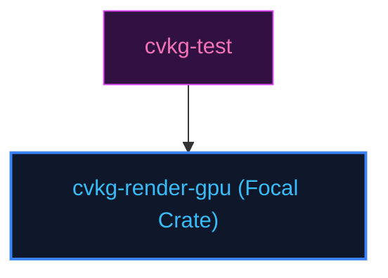

# cvkg-render-gpu

## Purpose
Drives wgpu-based rendering pipelines, shader compilations, and command buffers.

## Boundaries
- It does not run native desktop window loops; those are managed by cvkg-render-native.
- It does not contain testing frameworks; quality checks are managed by `cvkg-test`.

## Dependency Graph


## Public API Overview
- `SurtrRenderer` — Central pipeline controller.
- `Vertex` — Geometry vertex coordinates.

## Usage Example
```rust
use cvkg_render_gpu::SurtrRenderer;
```

## Use Cases
- Mapped as a core component inside the standard framework dependency tree.

## Edge Cases and Limitations
- Under extreme scale or thread contention, ensure the host runtime balances cycles appropriately.

## Crate-Specific Build Flags
This crate has no custom feature flags or compile-time options. It compiles under standard cargo parameters.
