# cvkg-render-native

```mermaid
graph TD
    cvkg-core["cvkg-core"]
    cvkg-vdom["cvkg-vdom"]
    cvkg-scene["cvkg-scene"]
    cvkg-layout["cvkg-layout"]
    cvkg-render-gpu["cvkg-render-gpu"]
    cvkg-render-native["cvkg-render-native"]
    cvkg-compositor["cvkg-compositor"]
    cvkg-themes["cvkg-themes"]
    cvkg-anim["cvkg-anim"]
    cvkg-flow["cvkg-flow"]
    cvkg-runic-text["cvkg-runic-text"]
    cvkg-svg-filters["cvkg-svg-filters"]
    cvkg-svg-serialize["cvkg-svg-serialize"]
    cvkg-components["cvkg-components"]
    cvkg-macros["cvkg-macros"]
    cvkg-cli["cvkg-cli"]
    cvkg-webkit-server["cvkg-webkit-server"]
    cvkg-test["cvkg-test"]
    cvkg-physics["cvkg-physics"]
    cvkg["cvkg (umbrella)"]

    cvkg-vdom --> cvkg-core
    cvkg-vdom --> cvkg-scene
    cvkg-layout --> cvkg-core
    cvkg-layout --> cvkg-anim
    cvkg-scene --> cvkg-core

    cvkg-render-gpu --> cvkg-core
    cvkg-render-gpu --> cvkg-compositor
    cvkg-render-gpu --> cvkg-svg-filters
    cvkg-render-gpu --> cvkg-svg-serialize
    cvkg-render-gpu --> cvkg-runic-text

    cvkg-render-native --> cvkg-core
    cvkg-render-native --> cvkg-render-gpu
    cvkg-render-native --> cvkg-vdom
    cvkg-render-native --> cvkg-themes

    cvkg-compositor --> cvkg-core

    cvkg-themes --> cvkg-core
    cvkg-themes --> cvkg-anim
    cvkg-anim --> cvkg-core
    cvkg-flow --> cvkg-core
    cvkg-flow --> cvkg-scene
    cvkg-flow --> cvkg-themes

    cvkg-runic-text --> cvkg-core
    cvkg-svg-filters --> cvkg-core

    cvkg-components --> cvkg-core
    cvkg-components --> cvkg-vdom
    cvkg-components --> cvkg-layout
    cvkg-components --> cvkg-themes
    cvkg-components --> cvkg-anim
    cvkg-components --> cvkg-runic-text

    cvkg-macros --> cvkg-core
    cvkg-cli --> cvkg-core
    cvkg-cli --> cvkg-physics
    cvkg-cli --> cvkg-anim
    cvkg-cli --> cvkg-macros
    cvkg-webkit-server --> cvkg-cli
    cvkg-physics --> cvkg-core
    cvkg-physics --> cvkg-scene

    cvkg --> cvkg-core
    cvkg --> cvkg-vdom
    cvkg --> cvkg-scene
    cvkg --> cvkg-layout
    cvkg --> cvkg-themes
    cvkg --> cvkg-anim
    cvkg --> cvkg-macros
    cvkg --> cvkg-components
    cvkg --> cvkg-render-gpu
    cvkg --> cvkg-render-native
```



`cvkg-render-native` provides platform-native windowing and event loop integration for CVKG desktop applications using `winit` and `AccessKit`.

## Boundaries and Responsibilities

This crate acts as the host environment for native applications. It does NOT implement low-level GPU drawing (delegated to `cvkg-render-gpu`). Its responsibilities include:
- Managing the OS window lifecycle and event loop via `winit`.
- Bridging the CVKG VDOM to the platform accessibility tree using `AccessKit`.
- Dispatching native input events (Keyboard, Mouse, IME) into the CVKG event system.
- Providing high-resolution frame timing and jitter telemetry for performance monitoring.
- Managing "Berserker Mode" OS-level scheduler priorities for high-priority rendering.

## Public API Overview

### Entry Points
- `NativeRenderer::run<V: View>(view: V)`: The primary entry point for launching a CVKG desktop application.

### Key Types
- `NativeRenderer`: Implements the `Renderer` trait by wrapping a GPU-accelerated Surtr instance.
- `App`: The internal `winit` application handler managing windows and GPU contexts.
- `NativeAssetManager`: A concrete asset loader for the local filesystem using `arc-swap` for lock-free reads.

### Critical Features
- **Kinetic Injection**: Translates window movement into "Rage" telemetry for dynamic UI effects.
- **ShieldWall Integration**: Automatic generation of accessibility trees from VNodes.

## Usage Example

```rust
use cvkg_render_native::NativeRenderer;
use cvkg_core::View;

fn main() {
    let app_view = MyApp::new();
    NativeRenderer::run(app_view);
}
```

## Known Limitations
- Multi-window support is implemented but experimental; focus management across windows is handled via the VDOM bridge.
- Wayland support requires specific system dependencies (see root README).
- Hardware verification is required; do not rely on mocks for this crate.
