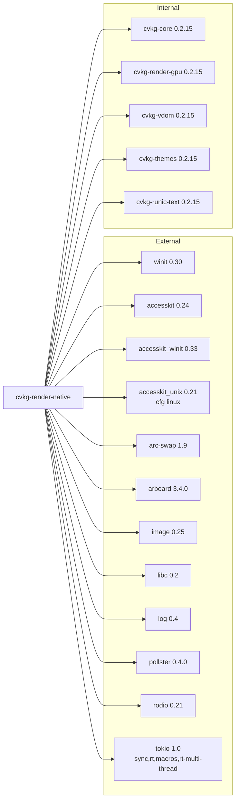

# cvkg-render-native

Desktop windowing and rendering backend for the CVKG UI framework. Uses `winit` for window and event handling, `accesskit` for accessibility tree integration, and `cvkg-render-gpu` for GPU-accelerated drawing.

## Purpose

This crate bridges CVKG's virtual DOM and rendering abstractions to native desktop platforms. It owns the event loop, window lifecycle, input translation, accessibility tree synchronization, asset loading from the local filesystem, audio playback via `rodio`, and the frame rendering pipeline that connects `cvkg-vdom` diffs to `cvkg-render-gpu` draw calls.

It is not a general-purpose windowing library. It exists solely to serve as the native target backend for CVKG applications.

## Boundaries

**In scope:**
- Winit event loop and window creation/management
- Keyboard, mouse, IME, focus, and file-drop event translation to CVKG events
- AccessKit accessibility tree integration and per-window adapter management
- GPU renderer lifecycle: initialization, resize, frame begin/end, draw-call forwarding
- Local filesystem asset loading with lock-free `ArcSwap` cache
- Audio playback via rodio (spatialized sound cues)
- Visual haptic feedback fallback
- Multi-monitor DPI awareness and safe-area inset computation
- Visual regression testing infrastructure (golden-image comparison)

**Out of scope:**
- Web or mobile targets (those have their own render backends)
- Widget toolkit implementation (CVKG widgets live in `cvkg-vdom` and `cvkg-core`)
- GPU backend implementation (lives in `cvkg-render-gpu`)
- Shader authoring or 3D scene graph (handled by the GPU renderer)
- Accessibility tree content (generated by `cvkg-vdom`; this crate only synchronizes it)

## Dependency graph



## Public API overview

### Re-exports (crate root)

| Name | Source module | Description |
|---|---|---|
| `RodioAudioEngine` | `audio` | Cross-platform audio engine using rodio. Implements `cvkg_core::AudioEngine`. |
| `VisualHapticEngine` | `audio` | Fallback haptic engine that records impact timestamps for visual micro-animation. Implements `cvkg_core::HapticEngine`. |
| `NativeAssetManager` | `asset_manager` | Filesystem-backed asset cache with lock-free reads via `ArcSwap`. Implements `cvkg_core::AssetManager`. |
| `WindowState` | `window` | Enum: `Normal`, `Minimized`, `Fullscreen`, `SplitView`, `Occluded`, `Hidden`. |
| `WindowStateDetector` | `window` | Tracks window lifecycle state from winit events; exposes `should_render()` and `control_flow()`. |
| `ResizeHitTest` | `window` | Hit-tests cursor position against rounded-corner resize regions. |
| `SafeAreaInsets` | `window` | Platform safe-area insets (menu bar, notch, Dock). Zero in fullscreen. |

### Module: `audio`

- `RodioAudioEngine` — opens the default audio output stream; plays named sound cues (`"nav_tick"`, `"success_chime"`, `"warning_tone"`) or raw PCM buffers. `new()` returns `None` if audio hardware is unavailable.
- `VisualHapticEngine` — records `Instant` of last haptic impact per intensity level. Used as cross-platform fallback.

### Module: `asset_manager`

- `NativeAssetManager` — `load_image(url)` reads from the local filesystem path given by `url`. Uses `ArcSwap::rcu()` for lock-free cache insertion. Spawns a background thread per unique URL on cache miss. `preload_image(url)` triggers the same background load without reading the result.

### Module: `window`

- `WindowState` — six-state enum for render-loop decisions.
- `WindowStateDetector` — updates state from `WindowEvent` or `Window` queries. `should_render()` returns `false` for `Occluded`, `Minimized`, `Hidden`. `control_flow()` returns `ControlFlow::Poll` or `ControlFlow::Wait`.
- `ResizeHitTest` — `new(window_size, corner_radius, expansion)` then `hit_test(pos, corner_radius)` for corner resize detection.
- `SafeAreaInsets` — `zero()` and `for_window_state(state)`. Returns `top: 24.0` on macOS in non-fullscreen; `0.0` elsewhere.
- `NativeWindowWrapper` — implements `cvkg_core::Window`. Delegates `close()`, `set_title()`, `set_size()`, `set_visible()`, `bring_to_front()` to the event loop proxy.
- `WindowManager` — owns all active windows, maintains a `window_stack` for Z-order, maps between winit `WindowId` and CVKG `CoreWindowId`. `create_window()` builds a winit window, AccessKit adapter, VDom, and `WindowData`.
- `WindowData` — per-window state: cursor position, velocity, frame history, drag state, focus manager, AccessKit adapter, VDom.
- `WindowType` — enum: `Document`, `Panel`, `Popover`, `Dialog`, `Tooltip`.
- `WindowCapabilityMatrix` — `for_current_platform()` returns supported window types and capabilities per OS.
- `MonitorConfig` — name, position, size, scale factor, refresh rate.
- `MultiMonitorManager` — `new(monitors)`, `current_monitor()`, `update_window_position()`, `scale_dimensions()`, `requires_dpi_adaptation()`.

### Module: `main_loop`

- `AppEvent` — custom event enum: `AccessibilityAction`, `CloseWindow`, `SetTitle`, `SetSize`, `SetVisible`, `BringToFront`, `AccessibilityInitialTreeRequested`. Implements `From<accesskit_winit::Event>`.
- `App<V: View>` — implements `ApplicationHandler<AppEvent>`. Owns the `WindowManager`, `GpuRenderer`, `NativeAssetManager`, audio/haptic engines, frame budget tracker. On `resumed()`: detects accessibility preferences, detects system theme, initializes audio, creates the main window, forges the GPU renderer, and pre-warms a text cache. On `window_event()`: runs VDom diff, synchronizes AccessKit tree, and renders the frame.

### Module: `events`

- `convert_keyboard_event(event, modifiers)` — maps `PhysicalKey::Code` to CVKG `KeyDown`/`KeyUp`. Returns `None` for non-physical keys.
- `convert_ime_event(event)` — maps `Ime::Commit` to CVKG `Ime`.
- `convert_mouse_event(state, position, button)` — maps press/release to `PointerDown`/`PointerUp`.
- `load_icon()` — searches CWD and executable directory for `icon.png`, decodes via `image`, and constructs a winit `Icon`.

### Module: `contracts`

- `RenderingMode` — enum: `Native`, `Custom`, `Hybrid`.
- `TranslationContract` — maps CVKG widget type to platform type name, rendering mode, and native accessibility flag.
- `TranslationContractRegistry` — pre-populated with `Button`, `TextInput`, `Canvas`, `TreeView` contracts. `find(cvkg_type)` for lookup.
- `SyncDirection` — enum: `CvkgToNative`, `NativeToCvkg`, `Bidirectional`.
- `StateSyncContract` — per-widget sync direction and debounce configuration.
- `StateSyncRegistry` — pre-populated with `Button`, `TextInput`, `Slider`, `Checkbox` contracts.
- `WidgetVirtualizationConfig` — `buffer_size`, `recycle_handles`, `max_active_handles`. Default: 5, true, 100.
- `SemanticRoleMapping` — maps `accesskit::Role` to macOS AXRole, Windows UIA ControlType, and Linux ATK Role strings.
- `SemanticRoleRegistry` — pre-populated with `Button`, `TextInput`, `CheckBox`, `Slider`, `Label` mappings.

### Module: `regression`

- `VisualRegressionTracker` — `new(reference_dir, pixel_tolerance, max_mismatched_percentage)`. `verify_frame(test_name, captured_png)` compares against a golden PNG. If no reference exists, writes the captured frame as the new reference and returns `true`. Comparison is per-pixel RGBA with absolute tolerance and a mismatched-pixel percentage threshold.

### Module: `renderer`

- `GPU_FRAME_PTR` — thread-local raw pointer to the locked `GpuRenderer`. Set only while `MutexGuard` is live on the call stack.
- `NativeRenderer` — implements `cvkg_core::Renderer` and `cvkg_core::ElapsedTime`. Forwards all draw calls to `cvkg_render_gpu::GpuRenderer` via the thread-local fast path or mutex fallback.
- `NativeRenderer::run(view, prewarm_assets)` — creates a winit event loop, constructs an `App`, and runs the application. Entry point for standalone native CVKG apps.
- `NativeRenderer::run_with_background(view, image_name, image_path)` — convenience wrapper that loads an image from disk and passes it as a pre-warm asset.

## Usage example

```rust
use cvkg::View;
use cvkg_render_native::renderer::NativeRenderer;

struct MyView;

impl View for MyView {
    fn changed(&self) -> bool { true }
    fn render(
        &mut self,
        renderer: &mut dyn cvkg_core::Renderer,
        rect: cvkg_core::Rect,
    ) {
        renderer.fill_rect(rect, [0.1, 0.1, 0.15, 1.0]);
    }
}

fn main() {
    // Run with a pre-warmed background image:
    NativeRenderer::run_with_background(MyView, "bg", "assets/background.png");

    // Or run without pre-warmed assets:
    // NativeRenderer::run(MyView, None);
}
```

## Use cases

- **Standalone CVKG desktop applications** — use `NativeRenderer::run()` or `run_with_background()` as the application entry point.
- **Multi-window apps** — use `WindowManager` directly to create, close, and reorder windows.
- **Accessibility-enabled UIs** — AccessKit adapters are created per window; semantic role mappings drive screen reader behavior.
- **Asset-heavy applications** — `NativeAssetManager` provides lock-free background loading with `ArcSwap` cache.
- **Visual regression testing** — `VisualRegressionTracker` captures frames and compares against golden references for CI pipelines.
- **Multi-monitor DPI-aware layouts** — `MultiMonitorManager` tracks monitor changes and scale factors for correct logical-to-physical coordinate conversion.

## Edge cases and limitations

- **Audio is best-effort.** `RodioAudioEngine::new()` returns `None` if the audio device is unavailable. No error is propagated to the caller.
- **Asset loading is filesystem-only.** `NativeAssetManager` treats `url` as a local file path. HTTP, HTTPS, and other URL schemes are not supported.
- **Spatial audio is a fallback.** `play_spatial()` ignores the position parameter and delegates to `play_sound()`. No positional attenuation is applied.
- **macOS-only safe-area insets.** `SafeAreaInsets::for_window_state()` returns `top: 24.0` only on macOS in non-fullscreen. All other platforms return zero insets.
- **Portal rendering is not implemented.** `enter_portal()` and `exit_portal()` log a warning and return without action.
- **GPU_FRAME_PTR safety.** The thread-local pointer is only valid while the `MutexGuard` is alive on the same thread's call stack. Do not store or send it across threads.
- **Single-threaded by design.** `App` must run on the main thread. `winit` event loops are platform-main-thread-bound. Audio engine is `Send + Sync` but only used from the main thread.
- **Linux accessibility requires AT-SPI.** `accesskit_unix` is only linked on `target_os = "linux"`. Without it, accessibility tree updates are silently skipped.
- **Icon search is heuristic.** `load_icon()` searches a fixed set of candidate paths relative to CWD and the executable. Custom icon paths must be handled externally.
- **Visual regression: recording mode.** If a golden reference does not exist, `verify_frame()` writes the captured image and returns `true`. First run always passes.
- **Window close is asynchronous.** `NativeWindowWrapper::close()` sends an event to the event loop proxy. The window is not destroyed synchronously.

## Build flags, features, and env vars

This crate has no optional Cargo features. All dependencies are always compiled.

**Platform-conditional dependencies:**
- `accesskit_unix` is only linked on `target_os = "linux"`.

**Notable dependency constraints:**
- `arboard = "=3.4.0"` — pinned to exact version 3.4.0.
- `image` enables the `jpeg` feature.
- `tokio` uses only `sync`, `rt`, `macros`, `rt-multi-thread` features (no `net`, `time`, `io-util`, etc.).
- `accesskit_unix` is compiled with `default-features = false`.

**Environment variables:** None. The crate does not read any environment variables at runtime.

**Build requirements:**
- Rust 2024 edition (`rustc` >= 1.85).
- `winit 0.30` requires a working display server on Linux (X11 or Wayland).
- `rodio 0.21` requires a working audio output device (gracefully degrades to `None` if unavailable).
