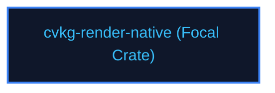

# cvkg-render-native

## Purpose
Manages desktop window states and event loop triggers using winit and AccessKit.

## Boundaries
- It does not write vector drawings or execute GPU fragment shaders directly.
- It does not contain testing frameworks; quality checks are managed by `cvkg-test`.

## Dependency Graph


## Public API Overview
- `NativeShell` — Desktop window state controller.
- `WindowStateDetector` — Multi-monitor adaptive scaler.

## Usage Example
```rust
use cvkg_render_native::NativeShell;
```

## Use Cases
- Mapped as a core component inside the standard framework dependency tree.

## Edge Cases and Limitations
- Under extreme scale or thread contention, ensure the host runtime balances cycles appropriately.

## Crate-Specific Build Flags
This crate has no custom feature flags or compile-time options. It compiles under standard cargo parameters.
