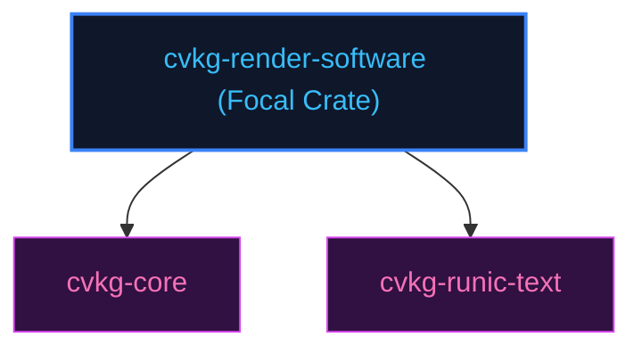

# cvkg-render-software

## Purpose
Provides a CPU-based software rendering fallback using standard text layouts.

## Boundaries
- It does not run wgpu bindings or compile pipeline graphics shaders.
- It does not contain testing frameworks; quality checks are managed by `cvkg-test`.

## Dependency Graph


## Public API Overview
- `SoftwareRenderer` — Software drawing interface.

## Usage Example
```rust
use cvkg_render_software::SoftwareRenderer;
```

## Use Cases
- Mapped as a core component inside the standard framework dependency tree.

## Edge Cases and Limitations
- Under extreme scale or thread contention, ensure the host runtime balances cycles appropriately.

## Crate-Specific Build Flags
This crate has no custom feature flags or compile-time options. It compiles under standard cargo parameters.
