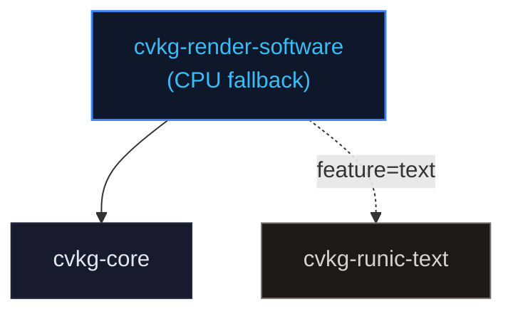

# cvkg-render-software

CPU-based software rendering fallback for CVKG. Used for headless and test environments where GPU access is unavailable.

## Purpose

Provides a minimal CPU rasterizer that can render CVKG view trees without a GPU. Useful for CI, headless servers, and fallback when no GPU adapter is available.

## Boundaries

- Does NOT implement full GPU feature set (no compute shaders, no multi-pass pipeline).
- Does NOT provide windowing or event loop -- combine with a software surface library if you need display.
- Text rendering requires the `text` feature (enables `cvkg-runic-text`).

## Dependency Graph



## Public API

- `Renderer` -- software rasterizer that processes draw commands into pixel buffers.
- Re-exports from `cvkg-core`: `Color`, `Rect`, `Renderer as RendererTrait` (the trait).

## Features

| Flag | Default | Effect |
|---|---|---|
| `text` | yes | Enables text shaping via `cvkg-runic-text` |

## Usage

```toml
[dependencies]
cvkg-render-software = { path = "../cvkg-render-software" }
```

```rust
use cvkg_render_software::Renderer;
use cvkg_core::{Color, Rect};

// Create a software renderer and issue draw commands.
```

## Use Cases

- Headless rendering in CI or server environments.
- Fallback when GPU adapter is unavailable.
- Visual regression testing (cvkg-test uses this path).

## Edge Cases

- Performance is significantly lower than GPU renderer. Not suitable for real-time UI.
- Without the `text` feature, text rendering is unavailable.
- Some advanced visual effects (blur, glass, glow) may not have CPU implementations.
