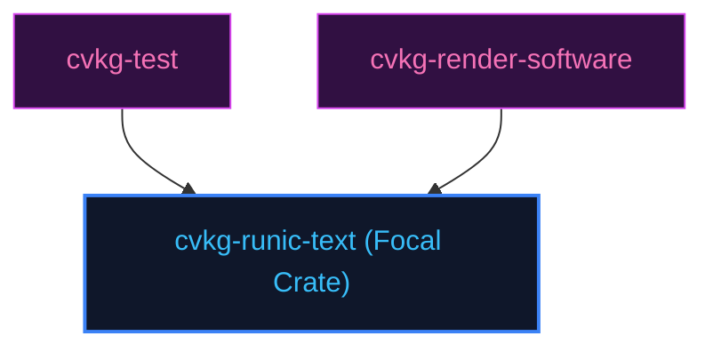

# cvkg-runic-text

## Purpose
Text shaping, layout, and font rasterization coordinates engine using HarfBuzz and Swash.

## Boundaries
- It does not allocate GPU memory or run desktop event loop windows.
- It does not contain testing frameworks; quality checks are managed by `cvkg-test`.

## Dependency Graph


## Public API Overview
- `RunicTextEngine` — Main shaper logic.

## Usage Example
```rust
use cvkg_runic_text::RunicTextEngine;
```

## Use Cases
- Mapped as a core component inside the standard framework dependency tree.

## Edge Cases and Limitations
- Under extreme scale or thread contention, ensure the host runtime balances cycles appropriately.

## Crate-Specific Build Flags
This crate has no custom feature flags or compile-time options. It compiles under standard cargo parameters.
