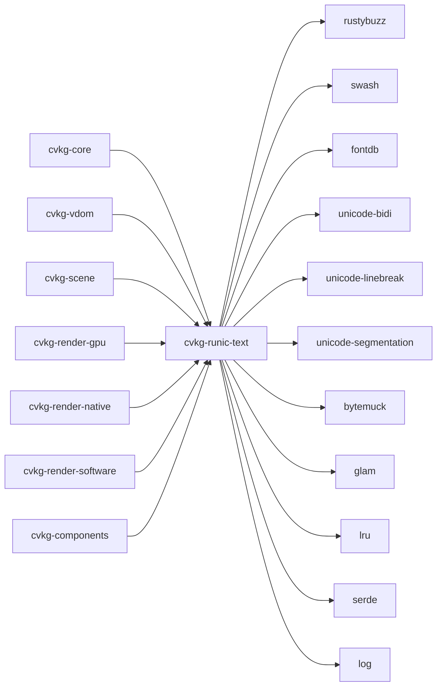

# cvkg-runic-text

Text shaping, layout, and rasterization engine for the CVKG UI framework. Wraps rustybuzz for OpenType shaping and swash for glyph rasterization, with BiDi resolution, font fallback, word wrapping, and an LRU shape cache.

## Boundaries

cvkg-runic-text owns everything between "raw font bytes" and "positioned glyphs ready to draw." It does not manage GPU textures, render pipelines, or scene graphs — those are handled by downstream crates (cvkg-render-gpu, cvkg-render-native, cvkg-render-software). It does not parse HTML or Markdown; callers must supply structured `TextSpan` input.

## Dependency graph



## Public API overview

### Top-level functions

| Item | Kind | Description |
|---|---|---|
| `load_font_file` | fn | Load a font from a file path, returns `FontHandle` |
| `load_font_bytes` | fn | Load a font from raw bytes, returns `FontHandle` |
| `test_engine` | fn | Returns a shared `Arc<TextEngine>` preloaded with bundled test fonts |
| `FontHandle` | struct | Opaque handle wrapping owned font data (`Vec<u8>`) |
| `FontLoadError` | enum | `Io(std::io::Error)` or `Parse(String)` |

### Re-exports from `types`

`ShapingError`, `FontAxisInfo`, `VariableAxis`, `GlyphInstance`, `RunicPathSegment`, `GlyphImage`, `LineInfo`, `FontMetrics`, `TextCapabilities`, `FontFallbackChain`, `FontMatchStrategy`, `SubpixelMode`, `HintingStrategy`, `AtlasDefragConfig`, `MultiAtlasConfig`, `ShapingCacheConfig`, `VerticalTextMode`

### Re-exports from `style`

`DEFAULT_FONT_SIZE`, `DEFAULT_LINE_HEIGHT`, `TextDecorations`, `LineHeight`, `TextOverflow`, `TextAlign`, `RenderMode`, `OpenTypeFeature`, `TextStyle`

### Re-exports from `path`

`TextPath`, `LayoutBoundary`

### Re-exports from `span`

`PortalAlignment`, `TextSpanKind`, `TextSpan`, `TextRun`, `SemanticKind`, `SemanticRange`, `Paragraph`

### Re-exports from `layout`

`ShapedText`

### Re-exports from `engine`

`TextEngine`, `CacheKey`

### Modules

| Module | Purpose |
|---|---|
| `global_cache` | Global LRU cache for shaped text |
| `emoji` | Emoji segmentation and color glyph handling |
| `knuth_plass` | Knuth-Plass line-breaking algorithm |
| `msdf` | Multi-channel signed distance field rasterization |
| `subpixel` | Subpixel positioning and rendering modes |
| `types` | Core types and error definitions |
| `style` | Text styling (weight, stretch, decorations, overflow, alignment) |
| `path` | Text-on-path layout |
| `span` | Text span and paragraph structures |
| `layout` | Text layout (word wrap, alignment, selection rects, hit testing) |
| `engine` | Main `TextEngine` — owns font database, cache, and shaping pipeline |

## Usage example

```rust
use cvkg_runic_text::{
    TextEngine, TextStyle, TextAlign, RenderMode,
    load_font_bytes, ShapingError,
};

fn main() -> Result<(), ShapingError> {
    // Create a text engine (discovers system fonts via fontdb)
    let mut engine = TextEngine::new();

    // Load a font from bytes
    let font_data = std::fs::read("Inter-Regular.ttf")?;
    let handle = load_font_bytes(&font_data)?;
    engine.load_font_data(handle.data);

    // Style the text
    let style = TextStyle {
        font_size: 16.0,
        line_height: 1.4,
        align: TextAlign::Start,
        render_mode: RenderMode::Subpixel,
        ..Default::default()
    };

    // Shape and layout
    let shaped = engine.shape_text("Hello, CVKG!", &style);
    println!("{} glyphs, {} lines", shaped.glyph_count(), shaped.lines().len());

    Ok(())
}
```

## Use cases

- **UI text rendering** — primary text backend for cvkg-components labels, buttons, and text fields
- **BiDi text** — mixed left-to-right and right-to-left scripts via unicode-bidi
- **Variable fonts** — OpenType variable axis control through `FontAxisInfo` / `VariableAxis`
- **Text on paths** — curve-following text via `TextPath` and `LayoutBoundary`
- **Emoji rendering** — color emoji segmentation and rasterization
- **MSDF glyph atlases** — precomputed multi-channel distance fields for GPU-scalable text
- **Subpixel rendering** — LCD subpixel positioning for crisp text on standard displays
- **Hit testing & selection** — cursor positioning and selection rectangle computation from pixel coordinates

## Edge cases and limitations

- **No system font access in `new_light()`** — `TextEngine::new_light()` skips fontdb system discovery; use `TextEngine::new()` for full system font enumeration
- **Font validation is shallow** — `load_font_bytes` only checks the 4-byte SFNT header; malformed fonts that pass the header check may still fail during shaping
- **Cache key determinism** — the LRU cache key is derived from text content, style, and font; identical inputs must produce identical cache keys across runs, but hash collisions are theoretically possible
- **BiDi performance** — shaping is done per-run after BiDi resolution; very long paragraphs with many direction changes may see measurable overhead
- **No async** — all shaping and layout is synchronous; callers must manage their own threading for large documents
- **Test engine is shared** — `test_engine()` returns a global `Arc<TextEngine>`; mutations in one test affect all others

## Build flags / features / env vars

This crate defines no custom `[features]` in Cargo.toml. All dependencies are always enabled. No environment variables are consulted at build time or runtime.
