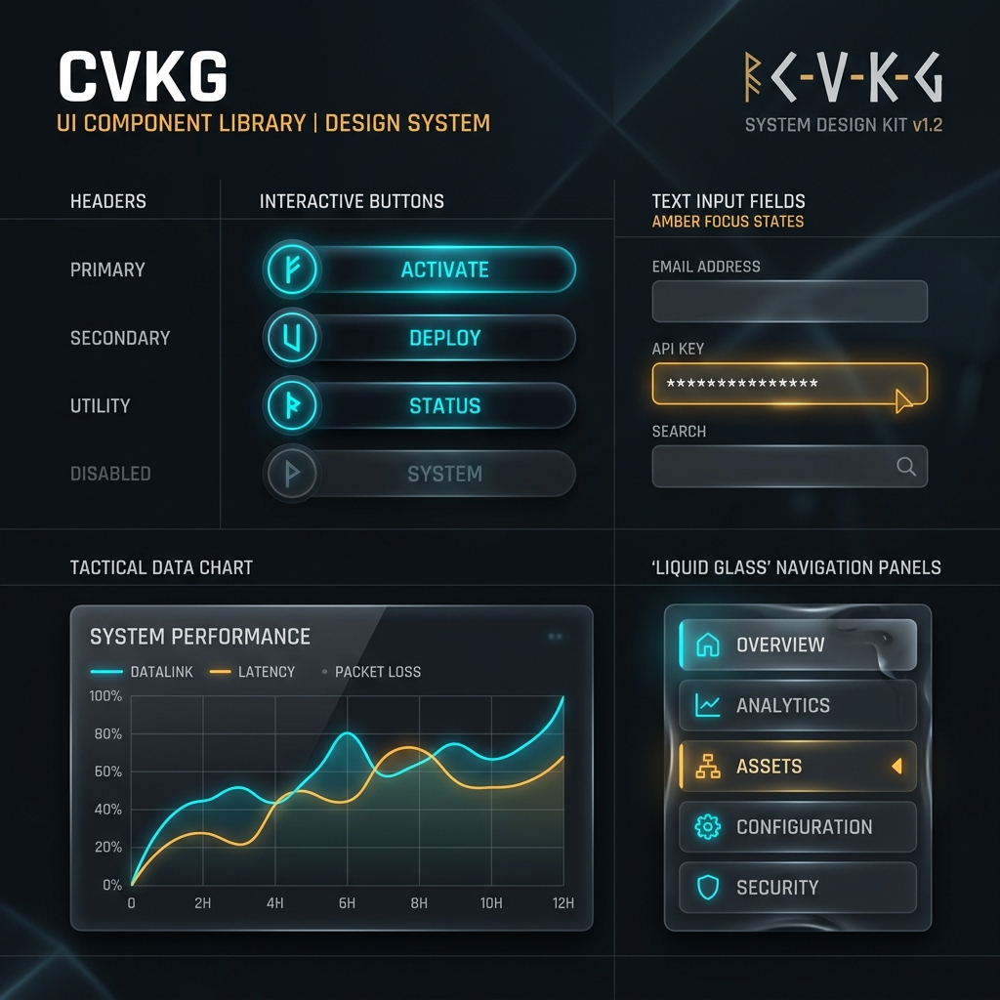
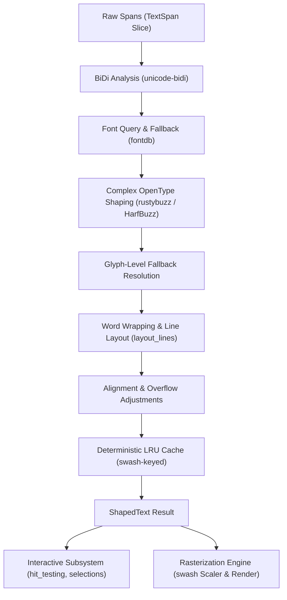

# cvkg-runic-text



`cvkg-runic-text` is the authoritative, high-performance text shaping, layout, and rasterization engine for the **Cyber Viking Kvasir Graph (CVKG)** framework. It bridges the gap between raw unicode strings and renderable GPU geometries, serving as a dedicated, stateless typography processor.

By isolating the heavy computational overhead of text shaping and system font database queries, `cvkg-runic-text` prevents operating system font-linking quirks and external HarfBuzz/Swash compilation cycles from impacting the compilation speed and safety of core CVKG subsystems.

---

## Core Architecture & Data Flow

`cvkg-runic-text` operates as a pure data-driven pipeline. It accepts styled character streams and viewport constraints, computes layout geometry, resolves glyph-level fallbacks, caches shaping results, and outputs rasterized bitmaps or positioned glyph indexes ready for direct drawing by the GPU renderer (`cvkg-render-gpu`).



---

## Key Capabilities & Features

### 1. Complex Script & OpenType Shaping
- Fully integrated with `rustybuzz` (HarfBuzz) to support ligatures, kerning, contextual alternates, and complex non-Latin scripts (Arabic, Devanagari, Hanzi, etc.).
- Custom OpenType feature activation (e.g., standard ligatures `liga`, kerning `kern`, contextual alternates `calt`, or discretionary ligatures `dlig`) via `OpenTypeFeature` tag/value tuples.

### 2. Variable Font Support
- Custom font axes setting via `VariableAxis`, enabling seamless rendering of variable fonts across dynamic weight (`wght`), width (`wdth`), italicization (`ital`), and slant (`slnt`) vectors.

### 3. Rich Multi-Span Text Layout
- Facilitates styling text blocks using a slice of `TextSpan`s, allowing distinct colors, font sizes, families, letter spacing, word spacing, and text decorations within a single line or paragraph.

### 4. Bidirectional (BiDi) Layout
- Automatic LTR (Left-To-Right) and RTL (Right-To-Left) paragraph/span categorization powered by `unicode-bidi`, enabling unified multi-lingual user interfaces.

### 5. Multi-Line Word Wrapping & Text Alignment
- Flexible text alignment modes: `Start`, `End`, `Center`, and `Justify`.
- Four distinct text overflow handling strategies:
  - `Clip`: Hard clip at boundaries.
  - `Ellipsis`: Truncates overflowing text with a contextual `...` marker.
  - `Visible`: Render text outside its constraints.
  - `WordWrap`: Wraps words to the next line dynamically when constraints are met.
- Line height scaling using relative multipliers (e.g., `1.2x`) or absolute pixel heights.

### 6. Robust Glyph-Level Font Fallback
- Dynamically falls back on a **character-by-character** level. If the primary font is missing a character (glyph ID `0`), the shaper checks system and user fallbacks sequentially to resolve the glyph, avoiding empty boxes or rendering breaks.

### 7. Interactive Caret Selection & Hit-Testing
- High-precision geometric mapping built directly into the layout result:
  - `hit_test(byte_index)`: Maps a logical byte offset to its corresponding shaped visual glyph and cluster.
  - `cursor_position(byte_index)`: Computes the precise caret coordinates `(x, line_index)` on the visual layout.
  - `selection_rects(start, end)`: Calculates bounding boxes spanning across lines/glyphs for flawless highlighting.

### 8. High-Performance LRU Shaping Cache
- Transparently speeds up consecutive frames with an LRU cache keyed by a deterministic, process-independent `CacheKey` (using `swash` font hashes rather than standard SlotMap `fontdb::ID`s which differ across runs).

### 9. High-Fidelity Swash Rasterization
- Leverages the `swash` outline scale renderer to generate RGBA premultiplied subpixel-offset glyph bitmaps. Supports falling back to fallback fonts during rasterization if a specific glyph cannot be rendered in the primary face.

---

## Public API Reference

### Core Types

| Struct / Enum | Description |
| :--- | :--- |
| `RunicTextEngine` | The central state container managing the loaded `fontdb` database, custom font binaries, the LRU shape cache, and the `ScaleContext` scaling/rasterization builder. |
| `TextStyle` | Rich text styling description. Supports a fluent, builder-like API. |
| `TextSpan` | Represents a styled slice of text with a logical `byte_offset` mapping. |
| `ShapedText` | The complete product of a layout pass, containing positioned `GlyphInstance`s, layout bounds, line lists, and font metrics. |
| `GlyphInstance` | Spatial details of a shaped glyph (advance width, cluster ID, absolute baseline coordinates). |
| `GlyphImage` | A rasterized RGBA bitmap output for direct GPU texture atlas uploading. |
| `LineInfo` | Bounding information for an individual visual line of text. |
| `FontMetrics` | Ascent, descent, and line gap values mapped in screen-space pixels. |

### Configuration Enums

- **`TextAlign`**: `Start` (Default), `End`, `Center`, `Justify`
- **`TextOverflow`**: `Clip`, `Ellipsis`, `Visible`, `WordWrap` (Default)
- **`LineHeight`**: `Multiple(f32)` (Default is `1.2`), `Fixed(f32)`
- **`TextDecorations`**: `underline`, `strikethrough`, `overline` boolean flags.

---

## Code Examples

### 1. Composing Rich Text & Building Styles

The `TextStyle` struct provides a fluent builder API for customizing typography:

```rust
use cvkg_runic_text::{TextStyle, TextDecorations, VariableAxis, OpenTypeFeature};

// Create a primary style with custom metrics, variable axis, and ligatures
let bold_accent_style = TextStyle::new("Jupiteroid", 18.0)
    .with_weight(700)                 // Bold weight
    .with_color(255, 100, 50, 255)    // Vibrant Amber RGBA
    .with_letter_spacing(1.5)         // Cyber-spaced kerning
    .with_line_height_multiple(1.4)   // Clean line vertical spacing
    .with_axis(VariableAxis::weight(700.0)) // Apply variable weight
    .with_feature(OpenTypeFeature::liga())  // Ensure standard ligatures
    .with_underline();                // Underline decoration
```

### 2. Multi-Line Layout with Alignment & Wrapping

Initialize the shaper engine, load custom fonts, and run a multi-span layout pass:

```rust
use cvkg_runic_text::{RunicTextEngine, TextSpan, TextStyle, TextAlign, TextOverflow};

fn main() -> Result<(), Box<dyn std::error::Error>> {
    let mut engine = RunicTextEngine::new();

    // Optionally load a custom font binary from memory/assets
    let custom_font = std::fs::read("assets/fonts/Jupiteroid.ttf")?;
    engine.load_font_data(custom_font);

    // Create rich text spans
    let style_default = TextStyle::new("Jupiteroid", 16.0);
    let style_accent = TextStyle::new("Lanix Ox", 16.0).italic().with_color(0, 255, 200, 255);

    let spans = vec![
        TextSpan::at("Welcome to the ", style_default.clone(), 0),
        TextSpan::at("Kvasir Core Dashboard", style_accent, 15),
        TextSpan::at(". Operations are fully active.", style_default, 36),
    ];

    // Compute layout: wrap at 400px width, center aligned, fallback with ellipsis
    let shaped_text = engine.shape_layout(
        &spans,
        Some(400.0),
        TextAlign::Center,
        TextOverflow::Ellipsis,
    )?;

    println!("Layout computed successfully: {}x{}px", shaped_text.width, shaped_text.height);
    println!("Total visual lines: {}", shaped_text.lines.len());
    
    Ok(())
}
```

### 3. Interactive Caret Selection & Hit-Testing

Map screen mouse clicks to character boundaries and draw selection highlights:

```rust
use cvkg_runic_text::ShapedText;

fn handle_mouse_click(shaped: &ShapedText, mouse_x: f32, mouse_y: f32) {
    // 1. Identify which line we are clicking on using the line heights
    let clicked_line_index = shaped.lines.iter().position(|line| {
        mouse_y >= (line.baseline_y - shaped.ascent) && mouse_y <= (line.baseline_y + line.height - shaped.ascent)
    }).unwrap_or(0);

    // 2. Perform a byte index hit-test
    // Let's assume we mapped mouse_x inside that line to a logical byte offset...
    let target_byte_index = 10; 
    let (glyph_idx, cluster) = shaped.hit_test(target_byte_index);
    println!("Clicked Glyph index: {}, Cluster boundary: {}", glyph_idx, cluster);

    // 3. Compute precise visual cursor coordinate
    let (caret_x, line_idx) = shaped.cursor_position(target_byte_index);
    println!("Caret should be rendered at X: {}px on Line: {}", caret_x, line_idx);

    // 4. Get precise selection bounding boxes for highlighting
    let selection_boxes = shaped.selection_rects(0, target_byte_index);
    for rect in selection_boxes {
        // Draw each rectangle: [x, y, width, height]
        println!("Highlight Rect: x={}, y={}, w={}, h={}", rect[0], rect[1], rect[2], rect[3]);
    }
}
```

### 4. Glyph Rasterization for Texture Atlases

Extract shaped glyph IDs and rasterize them into raw RGBA pixel arrays for GPU texturing:

```rust
use cvkg_runic_text::{RunicTextEngine, TextStyle};

fn upload_glyph_to_atlas(engine: &mut RunicTextEngine, glyph_id: u16, style: &TextStyle) {
    if let Ok(glyph_image) = engine.rasterize_glyph(glyph_id, style) {
        println!("Rasterized glyph ID: {}", glyph_image.glyph_id);
        println!("Dimensions: {}x{}px", glyph_image.width, glyph_image.height);
        println!("Offsets: x={}, y={}", glyph_image.x_offset, glyph_image.y_offset);
        
        // Upload `glyph_image.data` (Vec<u8> of RGBA pixel bytes) to the GPU Texture Atlas...
    }
}
```

---

## Backward Compatibility Mode

For backward compatibility with legacy `cvkg-render-gpu` versions, `RunicTextEngine` exposes single-span APIs that wrap the multi-span layout architecture transparently:

```rust
// Basic single-span shaping
let shaped = engine.shape("Quick brown fox", "Jupiteroid", 16.0);

// Basic glyph key lookup and rasterization
if let Some(rasterized) = engine.rasterize(cache_key) {
    // ...
}
```

---

## Known Limitations

- **System Font Fallback**: Font fallback relies on standard system locations; for consistent multi-platform UI branding (desktop/WASM), bundle and load critical branding fonts using `load_font_data`.
- **Large Document Chunking**: Large blocks of text (such as long documents or files) should be split into dynamic chunks rather than submitted as a single massive layouter pass to prevent shaping cache eviction overhead.
- **Glyph Hinting**: Visual rhythm is prioritized over absolute font alignment. Subpixel positioning is enabled, but standard hinting is disabled to maintain smooth fluid motion during layout scaling and scaling animations.