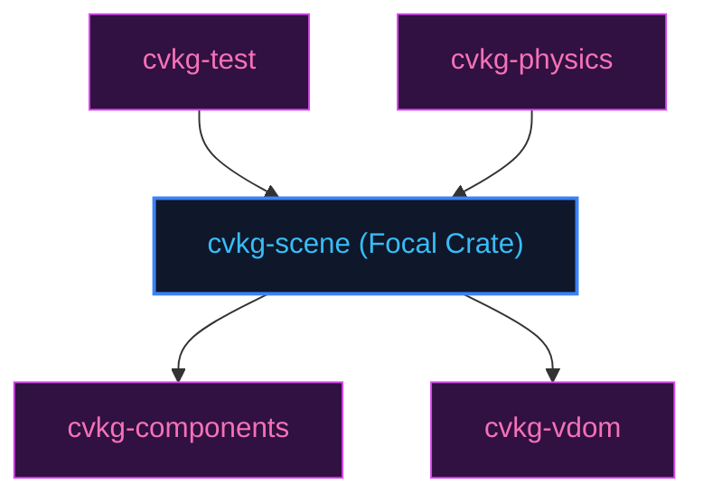

# cvkg-scene

## Purpose
Retained scene graph with spatial partitioning (QuadTree/BVH) for accelerated culling and hit-testing.

## Boundaries
- It does not compute layout dimensions or flexbox constraints.
- It does not contain testing frameworks; quality checks are managed by `cvkg-test`.

## Dependency Graph


## Public API Overview
- `SceneGraph` — Main visual tree buffer.
- `SceneNode` — Render-ready geometry nodes.

## Usage Example
```rust
use cvkg_scene::SceneGraph;
```

## Use Cases
- Mapped as a core component inside the standard framework dependency tree.

## Edge Cases and Limitations
- Under extreme scale or thread contention, ensure the host runtime balances cycles appropriately.

## Crate-Specific Build Flags
This crate has no custom feature flags or compile-time options. It compiles under standard cargo parameters.
